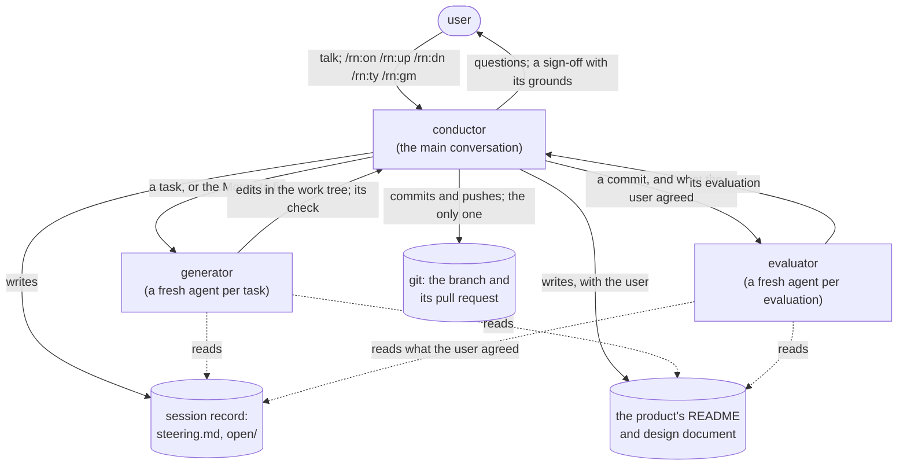
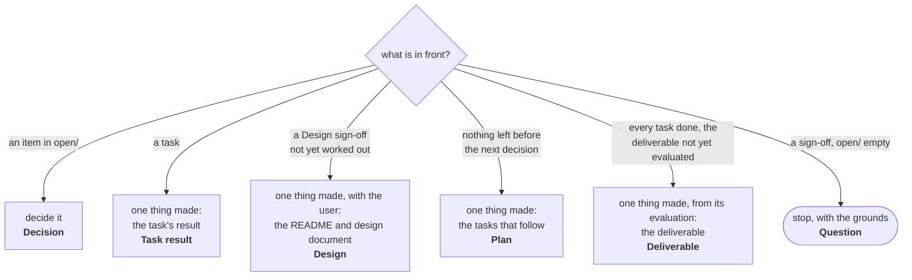
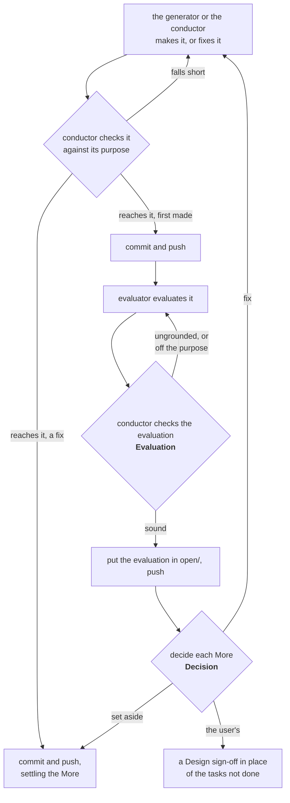
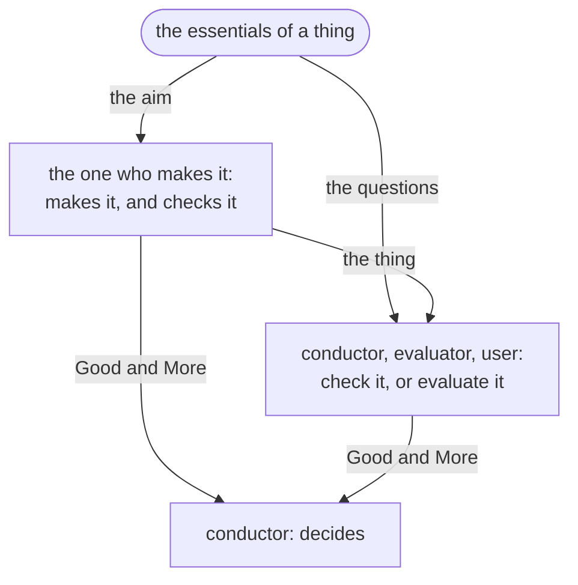

# rn design

How `rn` reaches what its [README](../README.md) says. Where `rn`'s prompts, or what they write,
differ from this document, this document is right.

## What rn holds to

- The goal is what the user really wants, not their first words.

  Every piece of work and every decision rests on it; a plan built on the first words reaches the
  wrong thing however well it is carried out.

- rn works by essentials, not by steps or rules.

  Everything made in a session is given what it must reach and the essential questions to judge it
  by, and the one who makes it finds the way there. Steps are kept to the letter and miss the point
  when the ground turns out different, and they cap the work at what their writer foresaw. So `rn`
  improves by refining its essentials, and gains as the models it runs on get better (hypothesis 1).

- What is made is checked by the one who asked for it, and evaluated by one who did not make it.

  The view of the one who made it leans toward its own reasons (hypothesis 2).

- Only the conductor decides what comes next, and only it records it.

  It asks for the work, so it answers for each thing reaching its purpose. A move taken on the
  letter of an evaluation redoes work that already serves the goal; a record written by several hands
  no longer says who decided what.

- The user decides only what is theirs.

  Taste, scope, cost against benefit, what the product should be, a way that does not settle, and
  whether the deliverable reaches the goal. Their attention is what a session spends most carefully;
  asked for more, they can no longer leave the work to it.

- The documents lead the work, and hold only what stands now.

  How the work proceeds is argued on the plan, how the product is built on its design document, and
  what it should be on its README; each changes before the work does. They say what stands and why,
  never how it came to be: that is in the commits, each carrying the discussion that led to it. A
  decision kept only in the session ends with it; history kept in the documents buries what stands.

- The plan reaches only as far as the user's next decision.

  Tasks planned past a decision not yet made rest on a guess of it (hypothesis 5).

## The parts, and what passes between them

```mermaid
flowchart TD
    U(["user"])
    C["conductor<br/>(the main conversation)"]
    I["generator<br/>(a fresh agent per task)"]
    E["evaluator<br/>(a fresh agent per evaluation)"]
    R[("session record:<br/>steering.md, open/")]
    D[("the product's README<br/>and design document")]
    G[("git: the branch and<br/>its pull request")]

    U -->|"talk; /rn:on /rn:up /rn:dn /rn:ty /rn:gm"| C
    C -->|"questions; a sign-off with its grounds"| U
    C -->|"a task, or the Mores to fix"| I
    I -->|"edits in the work tree; its check"| C
    C -->|"a commit, and what the user agreed"| E
    E -->|"its evaluation"| C
    C -->|"writes"| R
    C -->|"writes, with the user"| D
    C -->|"commits and pushes; the only one"| G
    I -.->|reads| R
    I -.->|reads| D
    E -.->|"reads what the user agreed"| R
    E -.->|reads| D
```

| Part | Does | Decides | Touches git |
|---|---|---|---|
| User | works out the goal and each design with the conductor; answers at a sign-off | the plan, each design, the deliverable | no |
| Conductor | aims at the goal: works out the goal and each design, writes the plan and the documents, asks for work and checks what comes back, keeps the record | every next move | the only one |
| Generator | makes one task's result in the work tree, and checks it | nothing | no |
| Evaluator | evaluates what was made: a commit, the plan, a design, or the deliverable | nothing | no |

A thing is anything made in a session: the goal as agreed, the plan, a design, a task's result, an
evaluation, a decision, a question to the user, and the deliverable. The plan is `steering.md`: the
goal, how it is known to be reached, and the tasks. The product is what the user's repository
builds; the deliverable is the product as the session leaves it.

## A turn of the conductor

Each turn takes what is in front, and turns follow until the session stops for the user. In bold,
the essentials each step is made and checked by.

```mermaid
flowchart TD
    F{"what is in front?"}
    F -->|"an item in open/"| D["decide it<br/><b>Decision</b>"]
    F -->|"a task"| T["one thing made:<br/>the task's result<br/><b>Task result</b>"]
    F -->|"a Design sign-off<br/>not yet worked out"| DT["one thing made, with the user:<br/>the README and design document<br/><b>Design</b>"]
    F -->|"nothing left before<br/>the next decision"| P["one thing made:<br/>the tasks that follow<br/><b>Plan</b>"]
    F -->|"every task done, the<br/>deliverable not yet evaluated"| FW["one thing made, from its evaluation:<br/>the deliverable<br/><b>Deliverable</b>"]
    F -->|"a sign-off, open/ empty"| A(["stop, with the grounds<br/><b>Question</b>"])
```

One thing made goes the same way, whatever it is. The generator makes a task's result, and the
conductor the plan and each design; the deliverable is not made on its own, and starts at its
evaluation.

```mermaid
flowchart TD
    M["the generator or the conductor<br/>makes it, or fixes it"]
    K{"conductor checks it<br/>against its purpose"}
    C["commit and push"]
    V["evaluator evaluates it"]
    KE{"conductor checks the evaluation<br/><b>Evaluation</b>"}
    O["put the evaluation in open/, push"]
    D{"decide each More<br/><b>Decision</b>"}
    S["commit and push,<br/>settling the More"]
    U["a Design sign-off in place<br/>of the tasks not done"]
    M --> K
    K -->|"falls short"| M
    K -->|"reaches it, first made"| C
    C --> V
    V --> KE
    KE -->|"ungrounded, or<br/>off the purpose"| V
    KE -->|"sound"| O
    O --> D
    D -->|"fix"| M
    K -->|"reaches it, a fix"| S
    D -->|"set aside"| S
    D -->|"the user's"| U
```

- `/rn:on` works out the goal and makes the plan, up to the Plan sign-off.

  The goal, then the plan as one thing made.

- `/rn:up` takes turns until the session stops for the user.

  A session from an earlier `rn` has its goal worked out again from its old record, up to a new
  Plan sign-off.

- `/rn:gm` fixes what the sign-off decides on by the user's words, and stops at the same sign-off.

  Its words go into `open/` whole; the conductor fixes by them and checks the fix, and the user
  answers it rather than an evaluator.

- `/rn:ty` closes the sign-off in front, and stops.

- `/rn:dn` puts where the work stands into `open/`, and pauses.

- Tasks added from the evaluation of the deliverable are made like any task, and the session then
  stops at the Deliverable sign-off.

## The essentials of each thing

An essential is a question of what a thing must reach. The one who makes the thing takes the
questions as the aim of its making and checks what it made by them; the conductor, the evaluator, and
the user check it or evaluate it by the same. Every check and every evaluation answers each question
with a Good, what serves the aim and must be kept, and a More, what falls short, what goes wrong for
its reader because of it, and how to fix it.

```mermaid
flowchart TD
    E(["the essentials of a thing"])
    M["the one who makes it:<br/>makes it, and checks it"]
    V["conductor, evaluator, user:<br/>check it, or evaluate it"]
    C["conductor: decides"]
    E -->|the aim| M
    E -->|the questions| V
    M -->|the thing| V
    M -->|Good and More| C
    V -->|Good and More| C
```

| Essentials of | The thing | Made by | Checked by | Must reach |
|---|---|---|---|---|
| Goal | the goal as agreed | conductor, with the user | user | what the user really wants, seen the same by both, with nothing they would decide assumed |
| Plan | `steering.md` | conductor | evaluator; user at the Plan sign-off | a way to the goal that rests on no decision the user has not made, each task's purpose telling on the real thing |
| Design | the README and design document | conductor, with the user | evaluator; user at a Design sign-off | the README: a user new to the product sees what it does for them, and can start. The design document: the one source every decision on how to build it starts from — its structure, what each part is for, and what passes between the parts, with no gap, in diagrams a person can follow. Both: only what stands now |
| Task result | a task's edits | generator | conductor, then evaluator | its purpose reached on the real thing, within the design |
| Evaluation | Good and More on a thing | evaluator | conductor | what goes wrong for the user, grounded on the thing, against its purpose |
| Decision | a decision line | conductor | user, on the pull request | the move that brings the thing closest to the goal and settles: nothing fixed that does not bring it closer, nothing of the user's decided without them, and the plan and the design still standing after it, or fixed first |
| Question | what the user is asked at a sign-off | conductor | user | a decision that is theirs, which they can make on the spot from what is shown |
| Deliverable | the product as the session leaves it | the session | evaluator; user at the Deliverable sign-off | the goal reached |

The questions themselves are kept in one place, apart from this document, since refining them is how
`rn` improves.

## How the conductor decides

A thing that comes back is checked against the purpose it was asked for, before anything else: a
result that falls short goes back to the generator at once, and so does an evaluation whose Mores
are not grounded on the thing or do not bear on its purpose.

For each More of a sound evaluation, the conductor asks, by the goal: does fixing it bring the thing
closer to its purpose; whose is it to fix; how; and does the fix keep the Goods. Two Mores that
contradict each other mean the goal, the essentials, or the documents leave something undecided;
the conductor finds it and settles it there, rather than picking one. A More is the user's when the
goal cannot decide it: taste, scope, cost against benefit; a fix that would change the README or
the design document; a way that does not settle, the same More coming back or each fix bringing a
new one. That becomes a Design sign-off in place of the tasks not done. A task is done when no More
is left that fixing would bring closer to its purpose.

How many times a thing is evaluated is the conductor's call, by whether another evaluation would
bring it closer. For now it is once: rounds of evaluation run by AI alone keep raising points that
are not essential and do not settle (hypothesis 4), so after one evaluation the conductor decides
each More, and what it cannot decide goes to the user. A fix is checked by the conductor and not
evaluated again, and neither is the deliverable after the tasks its evaluation added.

## What is kept, and who reads it

A session's directory `.rn/{date}-{slug}/` and its branch hold all it needs. The field names of
`steering.md` and the names in `open/` are an agreement with the outside: the user reads them on the
pull request, and every later `rn` reads them.

| What | Written by | Read by | Kept until |
|---|---|---|---|
| `steering.md`, the plan: `rn` (the version), `pr`, `design` (the design document), `status`; `Goal`, `Goal reached when`, `Assumptions`, `Rules` (the conventions the work must follow), and `Tasks` with their `Purpose` and `[x]` | conductor | everyone | the end, as it stands now |
| the README and the design document | conductor | everyone | beyond the session |
| `open/{NN}-{kind}-{about}.md`: what is not yet settled, kind being `check`, `evaluation`, `feedback`, or `notes` | the one it comes from; put there by the conductor | conductor | each item until a commit settles it; the file until it is empty |
| a commit message: the decision line, and the items of `open/` it settles | conductor | user, on the pull request | in the pull request's history |

## What always holds

1. After every command, resuming needs only the pushed branch.
2. No task past a sign-off the user has not approved is started or committed.
3. Only the conductor runs git, and every commit is one decision.

   Its message carries the items of `open/` it settles, which leave `open/` in the same commit.

4. `open/` is empty whenever the session stops at a sign-off.
5. The evaluator is given what the user agreed or said, and nothing of how the thing was made.

   It gets the commit or document to evaluate, the essentials, the goal, how it is known to be
   reached, the rules, the task's purpose, the README, the design document, and the user's
   feedback; not the reasons of the one who made it, commit messages, notes, or earlier evaluations.

6. No commit of the work goes beyond what the README and the design document on its branch say.
7. The documents hold only what stands now.

## What it costs, and the ways not taken

- A fresh agent for every task and every evaluation costs time and tokens.

  A new generator also starts without what the last one learned. It is paid for hypothesis 2, and
  what the next task needs is in the documents.

- Stopping for each design costs the user's time mid-session.

  It is paid for hypothesis 3.

- Planning only to the next decision means planning again after each.

  It is paid for hypothesis 5.

- Evaluating each thing once leaves a fix seen only by the one who made it and the conductor.

  It is paid for hypothesis 4; what a fix gets wrong is left to the evaluation of the deliverable
  and the user's sign-off.

- The conductor's own plan and designs are checked by no one else until an evaluator sees them.

  It is paid because the user also sees each at its sign-off.

- While a generator works, its edits are only in the work tree, since only the conductor runs git.

  A conversation that ends then resumes only on the same machine.

- How the work came to be is kept only in the pull request, on GitHub.

  The branch is squashed into one commit on `main`; the pull request keeps its commits after the
  branch is gone.

- The evaluator does not decide the next move.

  It would redo work that serves the goal over a point of wording.

- The user does not pick among prepared choices.

  A pick carries no reasons into the README and design document, and prepared choices hide what the
  user would have raised in talk.

- One evaluator reads the whole thing, not one evaluator per essential.

  An evaluator stands in for the reader, who reads the whole; one who sees a single question misses
  what contradicts across them. Where one evaluator goes shallow, the essentials are too many or too
  blunt, and are refined instead.

- Decisions are not kept as files of their own.

  They would pile up beside the documents and bury what stands; the commits already carry them.

Hypotheses, not yet checked:

1. The models `rn` runs on keep getting better at judging by purpose. Were they not, steps would
   serve better than essentials.
2. A check by the one who made a thing misses what it overlooked; one who did not make it, told only
   what the user agreed, finds what the user would find wrong.
3. A design settled without the user is what they most often find wrong only at the end.
4. Rounds of evaluation run by AI alone keep raising points that are not essential and do not
   settle; one round, with the conductor and then the user deciding from it, takes less time and
   costs less.
5. Tasks planned past an open decision are mostly rewritten once it is made.
