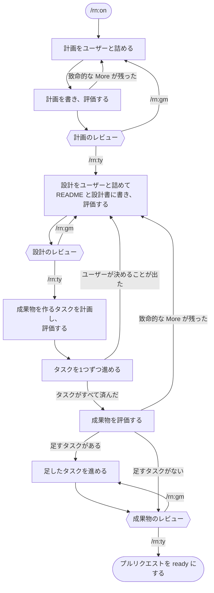
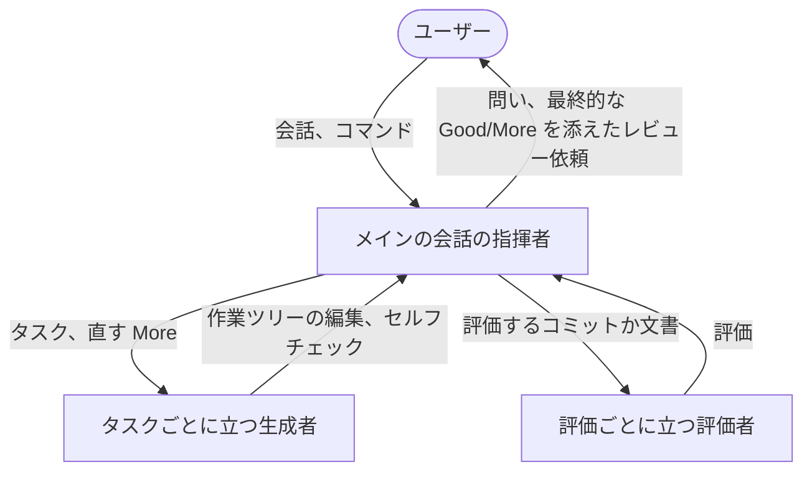
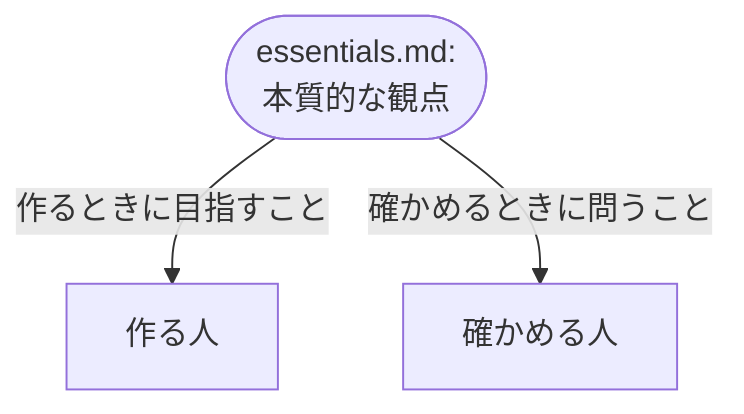
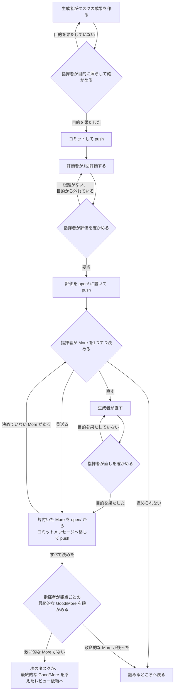

# rn 設計書

## rn が実現すること

- ざっくりしたゴールから、計画と設計を、調べながらユーザーと話して、認識が揃うまで詰める。
- そこから先はユーザー抜きで作り、作っていない評価者が、設計で決めた合格の基準で確かめる。
- ユーザーに聞くのは、計画、設計、成果物のレビューと、ユーザーが決めることだけ。
- 何をどう判断したかは、プルリクエストとコミットメッセージで読める。
- 会話を新しくしても、翌日でも、push 済みのブランチから止めたところの続きができる。

## セッションは、計画、設計、成果物の3つのレビューで区切られる


```mermaid
flowchart TD
    ON(["/rn:on"])
    W["計画をユーザーと詰める"]
    P["計画を書き、評価する"]
    PS{{"計画のレビュー"}}
    D["設計をユーザーと詰めて<br/>README と設計書に書き、評価する"]
    DS{{"設計のレビュー"}}
    P2["成果物を作るタスクを計画し、<br/>評価する"]
    T["タスクを1つずつ進める"]
    EV["成果物を評価する"]
    T2["足したタスクを進める"]
    FS{{"成果物のレビュー"}}
    END(["プルリクエストを ready にする"])
    ON --> W --> P --> PS
    P -->|"致命的な More が残った"| W
    PS -->|"/rn:gm"| W
    PS -->|"/rn:ty"| D
    D --> DS
    DS -->|"/rn:gm"| D
    DS -->|"/rn:ty"| P2
    P2 --> T
    T -->|"ユーザーが決めることが出た"| D
    T -->|"タスクがすべて済んだ"| EV
    EV -->|"足すタスクがある"| T2
    EV -->|"致命的な More が残った"| D
    T2 --> FS
    EV -->|"足すタスクがない"| FS
    FS -->|"/rn:gm"| T2
    FS -->|"/rn:ty"| END
```

ユーザーが `/rn:on` でゴールを渡すと、指揮者はまず計画を詰める。「このアプリを TypeScript に移して」なら、なぜ移したいのかを聞き、リポジトリや過去の不具合を調べながら、「型の間違いがあるとビルドが落ちること」がゴールだと1点ずつ確かめていく。ユーザーの答えで調べる先が変わるので、調べ終えてから聞くのではなく、話しながら調べる。認識が揃ったら計画を書いて評価し、計画のレビューで止まる。

承認されると、同じやり方で設計を詰める。型チェックをどれくらい厳しく始めるか、どの品質をどんなテストで確かめ、何を満たせば合格とするか。設計書を変えることがなくても、設計のレビューはいつもある。実装してから認識のずれに気づくと、手戻りが大きいからだ。

成果物を作るタスクは、設計が決まってから立てる。設計の前に立てたタスクは、設計が決まるとほとんど書き直しになる。タスクがすべて済むと成果物全体を評価し、足りないところのタスクを足して進めてから、成果物のレビューで止まる。途中でユーザーが決めることや、直さないとゴールを達成できない More が出たら、設計を詰めるところへ戻る。

レビューでは、ユーザーが `/rn:ty` で承認するか、`/rn:gm` でフィードバックを返す。どちらのあとも止まる。そこはユーザーが `/clear` で会話を新しくしてよい場所で、続きは「続けて」か `/rn:up` で始まる。フィードバックのあとは、そのレビューの前に戻る。計画と設計はユーザーと詰め直し、成果物はタスクを足して進める。言葉どおりに直すだけでは、フィードバックの裏にある認識のずれが残るからだ。

`/rn:dn` はいつでも中断でき、`/rn:up` はそこから次のレビューまで進める。以前の版の `rn` で始めたセッションでは、`/rn:up` が古い記録からゴールを詰め直し、新しい計画のレビューで止まる。

## 指揮者が決め、生成者が作り、作っていない評価者が評価する


```mermaid
flowchart TD
    U(["ユーザー"])
    C["メインの会話の指揮者"]
    G["タスクごとに立つ生成者"]
    E["評価ごとに立つ評価者"]
    U -->|"会話、コマンド"| C
    C -->|"問い、最終的な Good/More を添えたレビュー依頼"| U
    C -->|"タスク、直す More"| G
    G -->|"作業ツリーの編集、セルフチェック"| C
    C -->|"評価するコミットか文書"| E
    E -->|"評価"| C
```

指揮者は、ユーザーと話しているメインの会話で、セッションの間ずっと同じ。生成者はタスクごとに、評価者は評価ごとに新しく立ち、終われば消える。

次に何をするかを決めるのは、指揮者だけ。評価者が「src/cart の型が `any` のまま」と返しても、それを直すかどうかは指揮者が決める。評価の字面どおりに動くと、ゴールに役立っている作業までやり直すことになるので、タスクを頼んだ指揮者が、そのタスクが目的を果たすことに責任を持つ。コミットには判断が載るので、git を使うのも指揮者だけにする。生成者は作業ツリーを編集して返す。

評価者には、ユーザーが合意したことと、ユーザーが言ったことだけを渡し、どう作ったかは渡さない。作った人は自分の理由に沿って読んでしまう。作っていない人がユーザーの立場で読むと、ユーザーが困るところが見える。

ユーザーに聞くのは、ユーザーにしか決められないことだけ。好み、範囲、手間と安心のどちらを取るか、プロダクトのあるべき姿、何度直しても収まらないときのやり方、そして成果物がゴールを達成したか。それ以外は、調べるか、ゴールから決める。聞くことが増えるほど、ユーザーは作業を任せきれなくなる。

## 作るものはすべて、本質的な観点で作り、同じ観点で確かめる


```mermaid
flowchart TD
    E(["essentials.md:<br/>本質的な観点"])
    M["作る人"]
    V["確かめる人"]
    E -->|"作るときに目指すこと"| M
    E -->|"確かめるときに問うこと"| V
```

計画、設計書、タスクの成果のように、`rn` が作るものには、どれも目的がある。本質的な観点は、作ったか、やったかではなく、それで目的を果たせるかを問う。目的は、受け取った人がそれで何をできるようになるかで言う。README なら「初めての人が、自分に何をしてくれるかが分かり、使い始められるか」で、「インストール手順があるか」ではない。やったかは手順をなぞれば満たせてしまうが、果たせるかは実物を見ないと答えられない。

作るものごとの本質的な観点を essentials.md の1か所にまとめ、作る人はそれを目指して作り、確かめる人は同じ問いで確かめる。計画と設計は指揮者が作り、成果物は生成者が作る。確かめるのは、指揮者と評価者。

たとえば設計書の本質的な観点には「作る人が、読んで、どの品質をどう確かめ、何を満たせば合格かを決められるか」がある。指揮者はそれを満たすように書き、評価者は同じ問いで読む。目指すものと問うものが同じなので、作る側と確かめる側がずれない。

確かめた結果は Good と More に分けて、同じ重さで返す。どちらも、実物のどこかと、なぜそう言えるかの根拠を添える。Good には、直すときも守るべき理由を、More には、それでユーザーが何に困るかと改善案を添える。

手順ではなく本質的な観点を渡すのは、手順は想定していない状況で的を外すからだ。本質的な観点なら、状況に合うやり方を AI が選べ、モデルが賢くなるほどうまく選べる。だから `rn` を良くするときは、手順を足さずに essentials.md を磨く。

## 作ったものは、評価者が1回評価し、指揮者が直しを収めてから先へ進める


```mermaid
flowchart TD
    M["生成者がタスクの成果を作る"]
    K{"指揮者が目的に照らして確かめる"}
    C["コミットして push"]
    V["評価者が1回評価する"]
    KE{"指揮者が評価を確かめる"}
    O["評価を open/ に置いて push"]
    D{"指揮者が More を1つずつ決める"}
    F["生成者が直す"]
    FK{"指揮者が直しを確かめる"}
    S["片付いた More を open/ から<br/>コミットメッセージへ移して push"]
    J{"指揮者が観点ごとの<br/>最終的な Good/More を確かめる"}
    N["次のタスクか、<br/>最終的な Good/More を添えたレビュー依頼へ"]
    U["詰めるところへ戻る"]
    M --> K
    K -->|"目的を果たしていない"| M
    K -->|"目的を果たした"| C
    C --> V
    V --> KE
    KE -->|"根拠がない、<br/>目的から外れている"| V
    KE -->|"妥当"| O
    O --> D
    D -->|"直す"| F
    F --> FK
    FK -->|"目的を果たしていない"| F
    FK -->|"目的を果たした"| S
    D -->|"見送る"| S
    S -->|"決めていない More がある"| D
    S -->|"すべて決めた"| J
    D -->|"進められない"| U
    J -->|"致命的な More がない"| N
    J -->|"致命的な More が残った"| U
```

タスクでは、生成者が作ったものを、指揮者がまずタスクの目的に照らして確かめる。目的を果たしていればコミットして push し、評価者がそのコミットを評価する。

指揮者は評価を受け取ると、まず評価そのものを確かめる。根拠の無い指摘や、目的から外れた指摘は、評価者に評価し直させる。妥当な評価は `open/` に置いて push する。評価者が評価するのは1回だけで、その先は指揮者が生成者と直しを繰り返す。指揮者は More を1つずつ決める。直せば目的に近づき、直しても Good が保たれる More は、生成者が直し、指揮者が確かめてコミットする。直しても目的に近づかない More は、根拠を添えて見送る。決めるのが指揮者なので、繰り返しは「収まった」か「進められない」かのどちらかに必ず決まる。同じ More が繰り返し出る、直すたびに新しい More が出る、README や設計書を変えないと直せない、といったときは進められない。

More をすべて決めたら、指揮者は本質的な観点ごとの最終的な Good/More を確かめる。直さないとゴールを達成できず、ゴールからは直し方が決まらない致命的な More が残るとき、または進められないときは、レビューに進まず詰めるところへ戻り、その More を最初の論点としてユーザーと話す。そうでなければ次へ進み、レビューの前なら、最終的な Good/More をレビュー依頼に添える。ユーザーが見るのは途中の指摘と直しではなく最終形なので、全文を読み直さなくても、承認するかフィードバックを返すかを自分で言い切れる。致命的な More を抱えたままレビューに出さないのは、直さないと役に立たないものを承認させても、ユーザーの時間を使うだけだからだ。

互いに食い違う More が出たら、片方を選ばない。ゴール、本質的な観点、文書のどこかに決まっていないことがあるしるしなので、そこを決める。

評価のあとに直したところは、作っていない人の目を通らない。最終的な Good/More は、直しを決めた指揮者の判断になる。それでも評価を重ねないのは、AI だけで評価を回すと本質的でない指摘が続いて収まらないからだ。最終的な Good/More はどれも実物の場所と根拠を持つのでユーザーが確かめられ、もう一度評価させたいときは、ユーザーが `/rn:gm` で頼める。

計画と設計も同じ流れで、作って直すのが生成者ではなく指揮者になる。成果物全体は、タスクがすべて済んだあとに、評価者の評価から始まる。

## 文書が作業を先導し、今の状態だけを持つ


```mermaid
flowchart TD
    U(["ユーザー"])
    C["指揮者"]
    G["生成者"]
    E["評価者"]
    S["steering.md:<br/>進め方"]
    RD["README と設計書:<br/>あるべき姿と作り方"]
    O["open/:<br/>まだ片付いていない項目"]
    M["コミットメッセージ:<br/>判断の1行と、片付いた項目"]
    C -->|"書く"| S
    C -->|"ユーザーと詰めて書く"| RD
    G -->|"セルフチェック"| O
    E -->|"評価"| O
    U -->|"/rn:gm の言葉"| O
    C -->|"/rn:dn のメモ"| O
    O -->|"指揮者が決めて片付ける"| M
```

`rn` は、進め方、プロダクトのあるべき姿、作り方を、文書に書いてから作業する。進め方は `steering.md` に、あるべき姿と作り方は、プロダクトの README と設計書に書く。ユーザーとの議論もこれらの文書の上で行い、決まったら文書が先に変わり、作業はそれに従う。生成者はこの3つを読み、評価者はそのうちユーザーが合意したところを読む。ユーザーは全部をプルリクエストで読む。

文書には、今成り立っていることだけを書く。どう決まったかという経緯は、コミットメッセージが運ぶ。文書に経緯を残すと、今成り立っていることが埋もれる。

まだ片付いていないことは `open/` に置く。生成者のセルフチェック、評価者の評価、`/rn:gm` で受け取ったユーザーの言葉、`/rn:dn` で残すメモがそれにあたる。ファイル名は `{NN}-{kind}-{about}.md` で、kind は `check`、`evaluation`、`feedback`、`notes`。指揮者が1項目ずつ要るか要らないかを決め、片付いた項目はそのコミットで `open/` から消してメッセージに残す。だから何も漏れず、レビューで止まるときの `open/` はいつも空になる。

### セッションは .rn/ の下に1つのディレクトリを持つ

```
リポジトリ/
├── README.md                   使う人から見たあるべき姿
├── docs/
│   └── design.md               作り方
└── .rn/
    └── {yyyymmdd}-{slug}/      セッション1つ分
        ├── steering.md         進め方
        └── open/               まだ片付いていない項目
```

README と設計書は、ここに示したのが指定の無いときの場所で、計画を詰めるときにユーザーと別の場所に決められる。決めた場所は `steering.md` の `ux` と `design` に残る。`.rn/` の下の形は変えられない。

セッションが残すのは、このディレクトリと成果物だけ。README と設計書はプロダクトのもので、セッションが終わっても残り、次のセッションもそこから始まる。

### steering.md に、ゴールと計画を1か所にまとめる

どの役も、会話を新しくしたあとも、ここを読めば同じゴールと計画から動ける。TypeScript への移行で、設計が承認された直後の `steering.md` はこうなる。

```markdown
---
rn: 0.9.0
pr: https://github.com/you/repo/pull/42
status: running
ux: README.md
design: docs/design.md
---

# Goal

前の四半期に本番で出た、型の違う値による不具合を、出す前に止めたい。
型の間違いがあるとビルドが落ちるようにする。

# Goal achieved when

- 3件の不具合をそれぞれ再現するコードで、3件ともビルドが落ちる
- すべてのファイルが .ts になっている

# Assumptions

- **Fact**（不具合の記録で確かめた）: 3件は src/cart と src/checkout にある
- **Fact**（ユーザーが決めた）: 型チェックは最初から厳しくする
- **Assumption**: ビルドは CI の tsc で走る

# Rules

- 変更はすべてコミットして push する

# Tasks

### [x] #1: 計画のレビュー
### [x] #2: 設計のレビュー
### [ ] #3: src/cart を移す

**Purpose**: カートの金額計算で、型の違う値がビルドで落ちる

**Purpose achieved when**:

- カートの不具合を再現するコードで、ビルドが落ちる
```

| 項目 | なぜあるか |
|---|---|
| `rn` | 古い版で始めたセッションを見分け、`/rn:up` で今の形にするため |
| `pr` | ユーザーがすべてを読む場所を、会話が変わっても見失わないため |
| `status` | セッションが終わったかを、どのコマンドも同じに判断するため |
| `ux` | 使う人から見たあるべき姿を書く README を1つに決め、会話が変わっても、どの役も同じ文書を読むため |
| `design` | どう作るかを書く設計書を1つに決め、同じく、どの役も同じ文書を読むため |
| Goal | すべての判断の基準になる、ユーザーと合意した何が欲しいかとなぜ |
| Goal achieved when | 成果物のレビューで、ゴールを達成したかを判断する材料 |
| Assumptions | 確かめた事実と確かめていない仮定を分け、仮定の上に乗った判断を見分けるため |
| Rules | リポジトリの約束事のように、生成者がゴールからは分からないこと |
| Tasks | 目的と、目的を果たしたと分かる条件を持ち、指揮者が目的に照らして確かめるため。レビューもタスクとして並び、止まるたびに出る地図になる |
