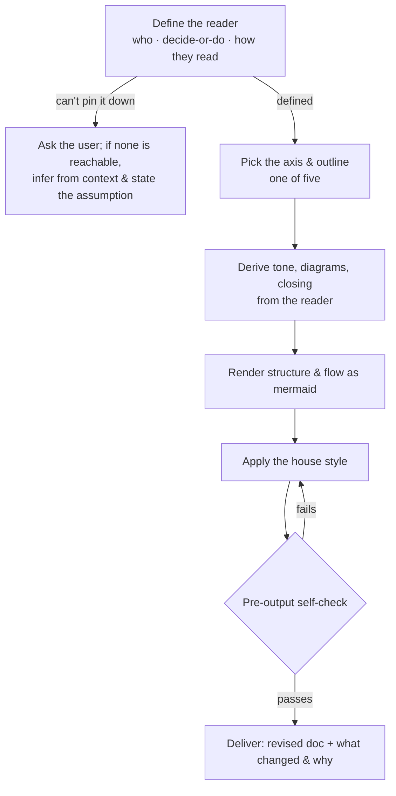

# /techting:up — Brush a technical document up

Raise a technical document a level by deriving everything from one decision: **who reads it.** Tone,
diagrams, closing, and outline are not memorized rules — they all follow from the reader. The same
procedure writes from scratch, but the primary mode is brushing up an existing draft.

- **Input**: an existing draft (the document to revise). When there is no draft, author from scratch
  through the same steps.
- **Output**: the revised document, plus a short note of **what was changed and why** — tie each
  change back to the reader definition or a house-style rule below.

## The procedure

### 1. Define the reader — everything starts here

Before writing, state each of these in one line. If you cannot pin them down, **do not guess — ask
the user.** When no user is reachable — the skill fired model-invocably, or a headless run — infer
the reader from the draft's own context and **state that assumption in one line at the top** before
writing. Never silently guess, and never stall: ask when you can, infer-and-declare when you can't.

- **Who** is the reader of this document?
- **What** must the reader be able to decide or do after reading?
- **How** does the reader read — top to bottom in one pass, or looking up the part they need?

These three decide the tone, diagrams, closing, and outline that follow. Derive the differences
between document types from this definition; do not memorize them as rules.

### 2. Pick the axis and outline

Use the outline that matches the reader you defined. **Give each document a single role — do not mix
axes;** mixing is the biggest cause of a confusing document. Adapt the headings to the content
(don't paste them verbatim), but don't add items that make the document heavier — push deep dives out
to a separate document. Exception for small documents: when a split would cost the reader more than
it saves, keep a minimal inline version (e.g. only the required fields) and link the exhaustive one
out, rather than spawning a separate file for a handful of entries.

- **Article / explanation** — for someone reading to understand.
  1. What you'll learn (subject and premise, in 1–2 sentences)
  2. The substance (one step at a time: stumbling point → why → what to do, each with its reason)
  3. In closing (what you gained, the limits, the next step)

  Don't cram in explanation. Link side-trips out to another article.

- **Guide / procedure** — for someone doing it right now.
  1. Goal and prerequisites (what gets accomplished, what you need)
  2. Steps (in order; each step states its expected result; show branches as a diagram)
  3. Verification and troubleshooting (confirm it worked; common snags)

  Don't mix in teaching-style explanation.

- **Reference** — for someone looking things up.
  1. The whole picture (a structure diagram: components and relationships)
  2. Each element (easy to look up, unique, exhaustive: input / output / constraints / defaults)
  3. Errors and terms (conditions and behavior; leave no ambiguity)

  No intro, no story. Structure it for lookup, not for reading through.

- **Record / ADR** — for someone tracing how a decision was reached.
  1. Background and the decision (what was decided, and why)
  2. The options considered (the rejected ones and the reasons are the main act)
  3. The outcome (both the good and the bad)

  Don't list only the good outcomes.

- **Evaluation / survey** — for someone making a call.
  1. Conclusion / recommendation (what to choose, what not to)
  2. Criteria (what is measured, and why those criteria)
  3. Comparison (measurements stated neutrally; don't collect only the facts favoring one side;
     separate fact from judgment)
  4. Evidence and the next step

### 3. Derive tone, diagrams, and closing from the reader

Don't fix these as rules — choose them for the reader you defined in step 1. Rough guide:

| Reader | Tone | Closing |
|---|---|---|
| Reads through (article / guide) | Warm and plain; put an easy motive before each term | What was learned, and the limits |
| Looks things up (reference) | Uniqueness and coverage first; drop warmth and intros | None needed — skip the closing generality |
| Traces the history (record / postmortem) | Separate fact from analysis; replace personal names with roles | Action items |
| Makes a call (evaluation / survey) | Separate measurements from judgment; lay them out neutrally | A recommendation |

### 4. Render structure and flow as mermaid

- Show **structure** (how components relate, hierarchy) and **flow** (order of steps, state
  transitions, dependencies) as a diagram so the reader grasps them at a glance — don't explain them
  in prose paragraph after paragraph.
- Write diagrams in **mermaid**. Don't repeat in prose what the diagram already shows — let the
  diagram carry it and keep the prose to supplements.
- Choose by what's faster for the reader: a diagram for anything with order or branching, prose for a
  simple fact.

### 5. Apply the house style

These hold across every axis — they are how the content is written, not what shape it takes.

- Write in Markdown.
- Order it so the reader understands reading top to bottom. Check that the **headings alone** carry
  the argument.
- Stay dry — don't explain the same thing twice.
- Cut anything the reader would feel as noise. If it isn't on the main line, remove it.
- Let the reader tell **fact from hypothesis and judgment.** Mark the unverified as unverified —
  don't fill gaps with guesses; show how far you confirmed.
- Avoid hedging ("it is thought that…", "generally…") and boilerplate AI phrasing. If you can't
  assert it, give the evidence or write `[unverified]`.
- Don't hide what doesn't work, the costs, the limits. Honesty over the appearance of polish.

### 6. Pre-output self-check

Run this before delivering. If any item fails, fix it and re-check — don't ship until all pass.

- [ ] Do the tone, diagrams, closing, and outline match the reader defined at the top?
- [ ] If the reader was inferred (no user to ask), is that assumption stated at the top?
- [ ] Do the headings alone carry the argument?
- [ ] Are structure and flow shown as diagrams, with no diagram/prose duplication?
- [ ] Can the reader tell fact from hypothesis, with the unverified marked?
- [ ] Are hedging, boilerplate vocabulary, and noise all gone?

### 7. Deliver

Hand back the revised document together with the **what changed and why** note. Each entry names the
change and ties it to the reader definition (step 1) or a house-style rule (step 5).
