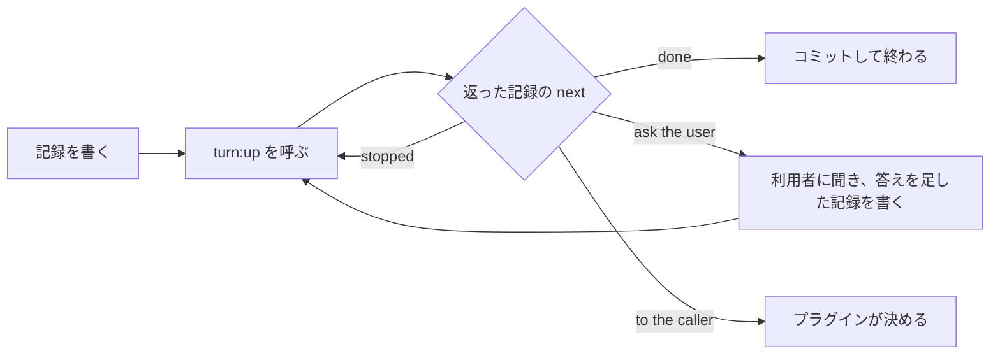

# turn

turn を使うと、AI に何かを作らせるプラグインが、作る、使ってみる、直す、をタスク1つ分まるごと任せられます。プラグインは、何を作るか、誰のためかを書いた記録を渡すだけです。返ってくるのは、すでに使われて直った成果物と、成果物を読まずに次の一手を決められる新しい記録です。

## プラグインにとって

- 作る、使ってみる、直す、の流れを自分のスキルに書かずに済みます。

    自分で書くと、作ったものを作った本人が見直すことになり、見直しが甘くなります。turn は、作ることと使ってみることを別々のエージェントに任せます。流れを直す時も、turn の1か所で済みます。

- 成果物を読まずに、返ってきた記録だけで次の一手を決められます。

    記録の `next` を見れば、終わったか、利用者に聞くことがあるか、プラグインが決めることがあるかが分かります。

## プラグインの利用者にとって

- 見せられる成果物は、すでに使われ、つまずいた所が直っています。

    やりとりを知らないエージェントが、受け手になりきって成果物を実際に使います。つまずいた所だけを直し、そこだけを使い直してから返ります。

- 聞かれるのは、利用者にしか決められないことだけです。

- 同じつまずきを、タスクの中で繰り返しません。

    使うたびに、なぜつまずいたかを進め方の決まりにして、タスクの残りで守ります。その決まりは記録に入って返るので、次のタスクにも渡せます。

- 途中で止めても、別のマシンでも、続きから進みます。

- 利用者のほかの作業に触れません。

    turn はリポジトリの外に書かず、コミットも push もしません。

## 必要なもの

- Python 3.9 以上。

    turn は、エージェントを呼ぶ前の確かめと、記録に事実を書くことを `python3` で行います。なければ止まり、入れるよう利用者に伝えてほしい、と返します。

- git のリポジトリ。

    turn は、成果物で何が変わったかを git から記録に書きます。記録と成果物をコミットしておけば、別のマシンでも続きから進められます。

## 入れる

プラグインの `.claude-plugin/plugin.json` で turn に依存します。turn と同じ lovaizu/ccpm のマーケットプレイスにあるプラグインなら、次のとおりです。

```json
"dependencies": ["turn"]
```

利用者がプラグインを入れると、turn も一緒に入ります。

ほかのマーケットプレイスにあるプラグインなら、`"turn@ccpm"` と書きます。そのうえで、自分のマーケットプレイスの `marketplace.json` に `"allowCrossMarketplaceDependenciesOn": ["ccpm"]` を足します。足さないと、Claude Code は turn を入れません。

## 使い方

例として、新人向けのセットアップ手順書を作るプラグインで、タスク1つを turn に任せます。



### 1. プラグインごとのことを書く

turn が知りえないこと、つまりプラグインが何を作り、それがどう使われるかを、プラグインの中のフォルダ（ここでは `domain/`）に置きます。

- `make.md` には、何をどう作るかを書きます。成果物を作る時と直す時に読まれます。

    ```markdown
    新しいクローンからアプリが動くまでを、打つコマンドと、それぞれで見えるものの番号つきの手順にする。どの手順も、今のリポジトリで実際に確かめたものにする。
    ```

- `use.md` には、受け手が成果物をどう使うかを書きます。成果物を使う時に読まれます。

    ```markdown
    クローンしたままのリポジトリで、手順を書かれたとおりに上から実行し、見えたものを手順書と比べる。
    ```

- `learn.md` には、使ったあと何に目を向けて学ぶかを書きます。使うたびに読まれます。

    ```markdown
    手順書と違うものが見えた手順ごとに、リポジトリの何がそれを起こしたか。
    ```

- `conductor.md` には、そのプラグインならではの判断の仕方を書きます。なくても構いません。

何も作らず、すでにある成果物を確かめるだけのプラグインは、`make.md` を置きません。turn は使うところから始め、何も直さずに、気づいた違いをすべてプラグインに返します。

### 2. タスクの記録を書く

```yaml
focal_entities:
  - work: "SETUP.md"
  - receiver: "今日入った新人。手順書だけでアプリを起動する"
goal_orientation:
  - acceptance: "新人が誰にも聞かずに、手順書どおりにアプリを起動できる"
  - use: "手順書を上から順に実行する"
constraints:
  - language: "日本語"
```

記録は YAML で、決まった名前の部分ごとに `種類: "値"` の行を並べます。名前は、記録の形の元にした論文のものです（Bousetouane「AI Agents Need Memory Control Over More Context」arXiv 2601.11653）。

- `work` は成果物の置き場所、`receiver` は受け手です。
- `acceptance` は、受け手が成果物で何をできれば合格か（受け入れ基準）です。
- `use` は、受け手が成果物を何に使うかです。
- `language` は、成果物と記録を書く言葉です。

この5つは欠かせません。成果物の元にする資料があれば `retrieved_artifacts` の `source` に、前のタスクで学んだ進め方の決まりがあれば `constraints` の `rule` に足します。

### 3. turn を呼ぶ

プラグインのスキルに、次のように書きます。

````markdown
`turn:up` のスキルを、次の3行を引数にして呼ぶ。

```
in: .myplugin/setup/1.yaml
out: .myplugin/setup/2.yaml
domain: ${CLAUDE_PLUGIN_ROOT}/domain
```
````

- `in` は、いま書いた記録です。
- `out` は、turn が新しい記録を書く場所で、まだないファイルにします。
- `domain` は、1で書いたフォルダです。

turn は同じ会話の中で動き、タスクが終わるか止まった時に戻ります。記録の置き場所と名前はプラグインが決めます。turn は記録を書き換えないので、呼ぶたびに新しいファイルを `out` にします。

### 4. 返ってきた記録で次の一手を決める

返ってきた記録には、渡したものに加えて次のものが入っています。

- `predictive_cue` の `next` は、次にすることです。

    | `next` | プラグインがすること |
    |---|---|
    | `done` | 成果物と記録をコミットして終わります。 |
    | `ask the user` | `uncertainty_signal` の `gap` を利用者に聞きます。答えを `constraints` の `answer` として足した記録を新しいファイルに書き、それを `in` にもう一度呼びます。 |
    | `to the caller: <理由>` | 受け入れ基準や `make.md` を見直すなど、プラグインが決めます。 |
    | `stopped: <どこから>` | 利用者が会話で止めた時です。返ってきた記録をそのまま `in` にして呼べば、そこから続きます。 |

    turn が記録を返さずに途中で切れた時は、同じ `in` でもう一度呼べば、そのタスクを始めからやり直します。

- `goal_orientation` の `difference` は、使ってみて受け入れ基準と違った所ごとに、どう終わったかです。

    終わり方は、直した（`→ fixed`）、理由を添えて見送った（`→ let go: <理由>`）、理由を添えてプラグインに任せた（`→ to the caller: <理由>`）のどれかです。

- `semantic_gist` の `process` は、このタスクで学んだ進め方の決まりです。次のタスクに渡す時は、`constraints` の `rule` として写します。

- `episodic_trace` は、turn の中の各エージェントが実際に何を読み、何を書き、何を実行したかと、git で変わったファイルです。

## プラグインに残ること

turn が受け持つのはタスク1つです。次のことは、呼ぶプラグインがします。

- タスクの前に、利用者と何を合意するか決めること。
- どのタスクを、どの順に、どれを同時に回すか決めること。
- 返ってきた `gap` を利用者に聞くこと。
- 記録と成果物をコミットし、必要なら push すること。
- 学んだ進め方を、プラグインの開発者に送るかを利用者に聞くこと。
