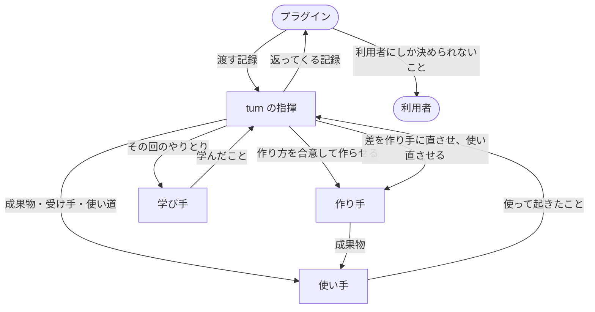

# turn

turn を使うと、AI に何かを作らせるプラグインが、作る、使ってみる、直す、をタスク1つ分まるごと任せられます。プラグインは、何を作るか、誰のためかを書いた記録を渡すだけで、直したあとの成果物と、成果物を読まずに次の一手を決められる新しい記録を受け取ります。

## プラグインが得ること

- 作る、使ってみる、直す、の流れを自分で書かずに済みます。

    人なら1人で、作って、使ってみて、直します。turn も同じ一続きの仕事を受け持ちます。中では、作る、使う、学ぶを別々のエージェントが受け持ち、turn を呼んだ会話がそれを指揮します。作ったものを作った本人が確かめると甘くなるからです。この流れはどのプラグインにも共通なので、直す時も turn の1か所で済みます。

- 成果物を読まずに、返ってきた記録だけで次の一手を決められます。

    記録には、使ってみて受け入れ基準とどこが違ったか、それがどう終わったか、利用者にしか決められないこと、次にすることが入っています。

## プラグインの利用者が得ること

- 見せられるものは、すでに使われ、足りない所が直っています。

    利用者とプラグインのやりとりを知らないエージェントが、成果物の受け手になりきって実際に使います。つまずいた所だけを直し、そこだけを使い直してから、プラグインに返します。同じ所が2度直らなければ、作り方か受け入れ基準が違うので、直し続けずにプラグインに返します。

- 聞かれるのは、自分が決めることだけです。

    turn は利用者に何も聞きません。利用者にしか決められないことは、記録に入れてプラグインに返し、プラグインが聞きます。

- 同じつまずきを、タスクの中で2度しません。

    turn は使うたびに進め方を学び、そのタスクの残りで守ります。学んだ進め方は記録に入れて返すので、プラグインは次のタスクにも渡せます。

- 途中で止めても、別のマシンでも、続きから進みます。

    利用者が止めると、turn は終わった所までと次にすることを記録に書いて返します。急に切れても、渡した記録は変わっていないので、そこからやり直せます。

- ほかの作業に触れません。

    turn は、自分のエージェントと渡されたタスクにだけ働きます。リポジトリの外には書かず、push もしません。

## 必要なもの

- 利用者のマシンに Python 3.9 以上。

    turn がエージェントを呼ぶ前の確かめを `python3` で行うためです。なければ turn は止まり、入れるよう利用者に伝えてほしい、とプラグインに返します。

1回の turn は、作る、使う、学ぶのエージェントを何度か走らせるので、AI に1回頼むより時間とトークンがかかります。

## turn に依存する

プラグインの `.claude-plugin/plugin.json` で turn に依存します。利用者がプラグインを入れると、turn も一緒に入ります。

```json
"dependencies": ["turn"]
```

turn は lovaizu/ccpm のマーケットプレイスにあります。プラグインが別のマーケットプレイスにある時は `"turn@ccpm"` と書き、そのマーケットプレイスの `marketplace.json` の `allowCrossMarketplaceDependenciesOn` に `"ccpm"` を足します。足さないと、turn は入らず、プラグインは読み込まれません（[公式の文書](https://code.claude.com/docs/en/plugins/dependencies#depend-on-a-plugin-from-another-marketplace)）。

## 流れ



turn の指揮は、プラグインと同じ会話で動きます。作る、使う、学ぶは、指揮が呼ぶ別々のエージェントが受け持ちます。

## プラグインごとの部分を置く

turn が知りえないこと、つまりプラグインが何を作り、それがどう使われるかを、1つのフォルダに置きます。新人向けの手順書を書くプラグインなら、次のようになります。

```
domain/
  make.md    手順書をどう書くか。前提を先に書き、コマンドはそのまま貼れる形にする
  use.md     受け手として上から順に実行し、止まった所とそこで探したものを返す
  learn.md   止まった所から、手順書について学んだことと、進め方について学んだことを出す
```

- `make.md` は作り手が、`use.md` は使い手が、`learn.md` は学び手が最初に読みます。

    書くのは、そのプラグインならではのことだけです。作る、使う、学ぶの進め方そのものは turn が持ちます。

- `conductor.md` には、エージェントに何を渡し、どう判断するかの、そのプラグインならではのことを書きます。

    turn の指揮が最初に読みます。なくても構いません。

- 何も作らず、すでにある成果物を確かめるだけのプラグインは、`make.md` を置きません。

    その turn は、今ある成果物を使い手が使うところから始まり、学び、何も直しません。違いはすべて `→ to the caller:` で返り、学んだことも返ります。

## turn を呼ぶ

プラグインのスキルから、`turn:up` のスキルを呼び、引数に次の3行をそのまま1つの文字列として渡します。turn はタスクが終わるか止まった時に戻ります。

```
in: .myplugin/setup/1.yaml
out: .myplugin/setup/2.yaml
domain: ${CLAUDE_PLUGIN_ROOT}/domain
```

- `in` は、タスクの今の状態を書いた記録です。turn はこれを書き換えません。
- `out` は、turn が新しい記録を書く場所です。turn が戻った時に、プラグインのものになります。フォルダがなければ turn が作ります。
- `domain` は、プラグインごとの部分を置いたフォルダです。

記録の置き場所と名前は、プラグインが決めます。

### 渡す記録

記録は YAML で、決まった部分ごとに `種類: "値"` の行を並べます。

```yaml
focal_entities:
  - work: "SETUP.md"
  - receiver: "今日入った新人。手順書だけでアプリを起動する"
goal_orientation:
  - acceptance: "新人が誰にも聞かずにアプリを起動できる"
  - use: "手順書を上から順に実行する"
constraints:
  - language: "日本語"
```

- `work` は成果物の置き場所、`receiver` は受け手、`acceptance` は受け手が成果物で何をできれば合格かという受け入れ基準、`use` は受け手が何に使うか、`language` は言語です。どれも欠かせません。
- 成果物の元にする資料は `retrieved_artifacts` の `source` に、前のタスクで学んだ進め方は `constraints` の `rule` に、利用者が決めたことは `constraints` の `decision` に、あれば足します。

### 返ってくる記録

返ってくる記録には、渡したものに加えて、次のような行が入ります。

```yaml
goal_orientation:
  - difference: "待ち受けるポートが書かれておらず止まった → fixed"
  - difference: "社内 VPN が要るか分からない → to the caller: 利用者の環境による"
uncertainty_signal:
  - gap: "新人は社内 VPN に入れるか"
semantic_gist:
  - process: "手順書は、起動の前に待ち受けるポートを書く"
predictive_cue:
  - next: "利用者に gap を聞く"
```

- `goal_orientation` の `difference` は、使ってみて受け入れ基準と違った所ごとに、どう終わったかを書いたものです。

    終わり方は、直した（`→ fixed`）、理由を添えて見送った（`→ let go:`）、理由を添えてプラグインに任せた（`→ to the caller:`）のどれかです。

- `uncertainty_signal` の `gap` は、利用者にしか決められないことです。

- `semantic_gist` の `process` は、学んだ進め方です。

- `predictive_cue` の `next` は、次にすることです。

- `episodic_trace` は、各エージェントが何を読み、何を書き、何を実行したかです。

    エージェントの言い分でなく、Claude Code の会話の記録と git から機械が書きます。返ってきた記録を疑った時に、実際に何が起きたかをここで確かめられます。

### 返ってきた記録で次を決める

- `next` が `done` なら、タスクは終わりです。

    `process` があれば、次のタスクに渡す記録の `constraints` に `rule` として写します。

- `gap` か `→ to the caller:` があれば、プラグインが決める番です。

    `gap` は利用者に聞きます。答えで変わる所を書き換え（受け入れ基準が変わるなら `acceptance`、そうでなければ `constraints` の `decision` に足し）、`gap` の行を消した記録を、次の番号の新しいファイル（ここでは `3.yaml`）に書いて、それを `in` にもう一度 `turn:up` を呼びます。

- どちらでもなく `done` でもなければ、turn が途中で止まっています。

    返ってきた記録をそのまま `in` に、次の番号のファイルを `out` にして呼べば、`next` に書かれた所から続きます。

- 利用者は、turn の途中で Esc を押して割り込み、止めるよう伝えれば止められます。

    turn は終わった所までを記録に書いて戻ります。

- 急に切れて記録が返らなかった時は、同じ `in` でもう一度呼びます。

    turn は渡された記録からやり直します。

渡した記録も返ってきた記録も、あとから書き換えません。どの記録も、ある turn が始めた時か終えた時の状態のままなので、やり直しも、あとで読むことも、それを頼りにできます。

### プラグインに残ること

- タスクの前に、利用者と何を合意するか。

- どのタスクを、どの順に、どれを同時に回すか。

- 各タスクの記録を持ち、返ってきたものを今の状態として採り、コミットすること。

- 学んだ進め方を開発者に送るか利用者に聞くこと、push すること。

    プラグインがそれをする場合です。

## 作り方と確かめ方

turn の上にプラグインを作る考え方と作り方、それを確かめる方法は、同じマーケットプレイスの [ben](../ben/README.md) にあります。
