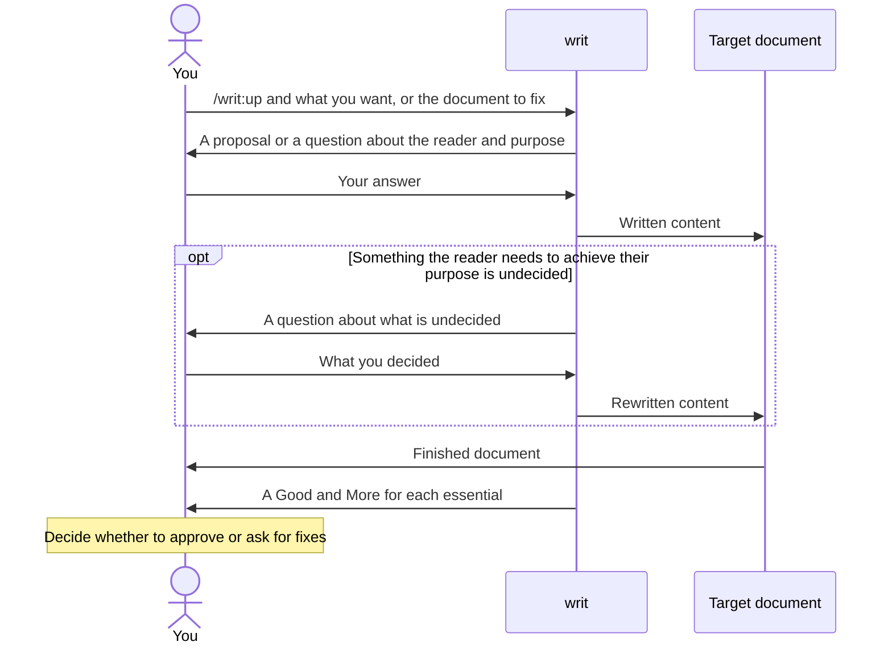

# writ

writ finishes the documents AI writes, whether new or fixed, so they read as easily as if a person wrote them.

- Your reader understands the document in one reading and knows what to do when they finish.
- You can hand the document over as it is, without reading and fixing it yourself.
- You can judge the result from the report writ gives in the conversation when it finishes, without rereading the whole document.
- writ asks you about what is undecided instead of glossing over it, so you never hand over a document with a hole you did not notice.

## Call `/writ:up`, answer what it asks, and you get the finished document with a Good and More for each essential



writ does not start writing until it is settled who reads the document and what they decide and do when they finish, because how good a document is can only be measured once its reader and purpose are settled. You answer only what your request and the repository do not tell; where writ can infer something, it proposes it, and you just say whether it is right. Before returning the document, writ checks it through the eyes of a reader who does not know the discussion so far, and fixes what it can.

## Example: writing a TypeScript migration plan for your team

Say your app written in JavaScript is moving to TypeScript, and you are writing the plan for the engineers on your team.

```console
> /writ:up Write the TypeScript migration plan for the engineers on my team

● When the engineers finish reading, what should they decide and do?

> Agree on which directory to move first, and each take on a part.

● Design documents sit in docs/, so I plan to put it in docs/migration-plan.md. Is that all right?

> Yes.
```

writ looks into the repository's directory layout and code, then writes the plan into docs/migration-plan.md.

```markdown
# TypeScript migration plan

We move src/api/ first, then go on to src/ui/. src/api/ is what the rest of the code calls, so once it has types, mistakes in the calling code show up right away too.

## Owners

- The owner for moving src/api/ is not decided yet.
- The owner for moving src/ui/ is not decided yet.
```

The report opens with writ's view on whether the document can be handed over as it is. As its grounds, each essential it used follows word for word, with a Good, a More, or both. An essential is a question that checks whether a document is good, and each kind of document has its own set. A Good is a part that helps, with what the reader gains from it. A More is a shortfall writ left unfixed, with what the reader struggles with and why it was left; for something left undecided, it also carries writ's proposal, so you settle it by saying whether it is right. Both say where in the document they point to, and give their evidence.

```console
● I wrote docs/migration-plan.md. Only the owners are undecided; I think it can go to the team as it is.
  My grounds are the answers to each essential for every document (doc.md).

  Essential: Can the reader take it in the way they read it, straight through or skimming, without going back or ahead?
    Good: The first sentence says which directory moves first.
      Location: line 3 (the sentence after the heading)
      Gain: The reader gets what they need to agree on in the first sentence.
      Evidence: The first sentence reads "We move src/api/ first, then go on to src/ui/."

  Essential: Is every part something this reader needs in order to decide and do what they came for?
    More: The owners are not decided.
      Location: the "Owners" section
      Struggle: Until owners are decided, readers do not know what they are taking on.
      Evidence: Both items say "not decided yet".
      Why left: Who owns what is for you and your team to decide, so it was left visibly undecided.
      Proposal: Each engineer who takes a part writes their name under "Owners" in a pull request, since the plan already lives in the repository.
```

A real report answers every essential in doc.md this way. Since each answer names its essential, you can also tell from the report alone that no essential went unanswered. The owners can be left undecided, since readers can take parts on and settle them.

To fix a document you already have, hand it over. Say you have collected the rules for adding types to moved code in docs/typing-guide.md. writ reads the document and asks only what it cannot tell from it.

```console
> /writ:up docs/typing-guide.md

● I read this document as the rules the team's engineers follow when adding types to moved code.
  I tried to fix it, but I cannot return it as finished, because it is not decided whether any may be used.
  May any be used? If so, when?
```

When you answer what you decided, writ writes it in, and a Good and More for each essential come back the same way. You do not get back a document that blurs any with wording that can be read either way, such as "avoid it where possible", because readers cannot follow a rule that can be read either way. That is how it differs from the owners, which can be handed over undecided.

## When Claude Code writes a document in the middle of its work, it may choose writ on its own

writ comes with a description saying it is for writing and fixing documents. When Claude Code is about to write a README or a design doc in the middle of its work and judges that this description fits, it uses writ. If the conversation tells it the reader and purpose, it writes right away; it asks you only when it cannot tell, and adds a Good and More for each essential to its report.

Whether Claude Code chooses writ is its judgment in the moment, so it will not always choose it. If a report comes without a Good and More for each essential, hand that document over and call `/writ:up`.

## Documents are checked against the essentials for their kind

- [Every document](references/essentials/doc.md) is checked on whether the reader grasps the whole by reading from top to bottom and, when they finish, can do what they need to do.
- A [README](references/essentials/readme.md) is also checked on whether someone meeting the product for the first time learns the benefits it gives them, decides whether to use it, and can start using it.
- A [design doc](references/essentials/design.md) is also checked on whether builders and maintainers learn which features give the README's benefits and how, and can explain whether a given change fits the design.
- A [prompt for an AI to read](references/essentials/prompt.md) is also checked on whether the AI can choose for itself a way of acting that achieves the purpose, even in situations the writer did not foresee.
- An [essentials file](references/essentials/essentials.md) is also checked on whether the producing role and the checking role can judge any part, including parts no one foresaw, by whether the one who receives the finished work needs it.

## Get it and start using it

writ is a Claude Code plugin, so you need Claude Code.

writ is available from the plugin marketplace `lovaizu/ccpm`. In Claude Code, add the marketplace, then install writ.

```console
> /plugin marketplace add lovaizu/ccpm
> /plugin install writ@ccpm
```

Now `/writ:up` is ready to use.

## License

MIT License. The full text is in [LICENSE](../LICENSE) at the repository root.
