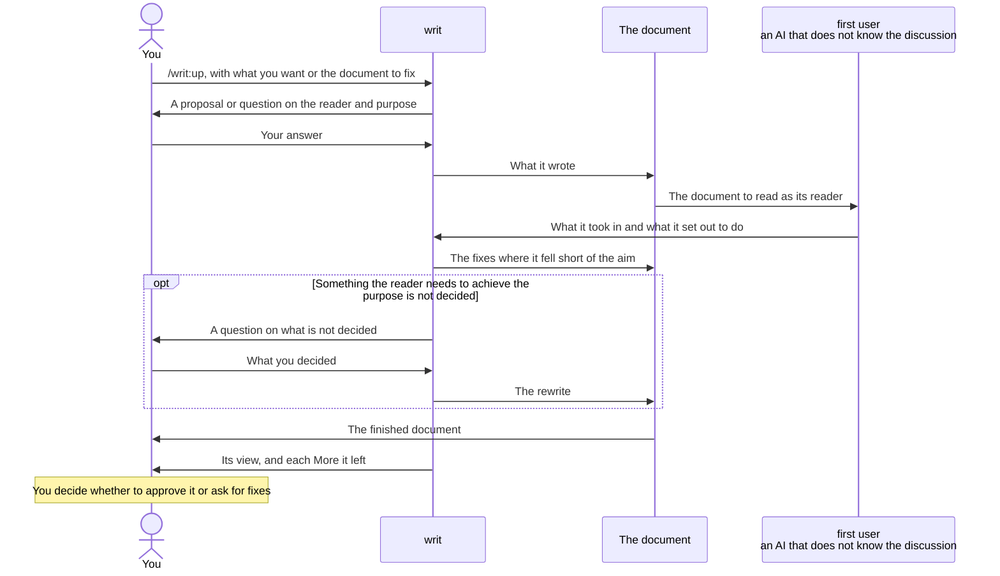

# writ

When writ writes a document for you, you get the following, whether the document is new or one you already have and want fixed.

- Your reader understands it in one reading, and knows what to do once they finish.
- You can hand the document you get back straight to your reader, without reading it over and fixing it yourself.
- You can judge the result from the final report alone, without reading the whole document again.
- When something your reader needs to achieve their purpose is not decided, it comes back to you as a question instead of being covered over. What your reader can decide for themselves is left so that they can see it is not decided, so you never hand on a document with a hole no one has noticed.

You get these because writ uses the finished document as your reader would, and checks it, before returning it.

The check is pith's, a plugin that comes with writ. To check what you make besides documents, such as prompts, code, tests or a plugin, call pith yourself, as [pith's README](../pith/README.md) tells.

## Call `/writ:up` and answer what it asks, and you get the finished document and a report you decide from



writ checks with a Good or More for every question in the essentials it used. A Good is a place that comes across as the aim intends; a More is a place that falls short of the aim. The report gives you only what you decide; every Good and More is in the full file.

writ does not start writing until it is settled who reads the document and what they decide and do once they have read it. How good a document is can be measured only once its reader and purpose are set. You answer only what your request and the repository do not tell. What writ can infer, it puts to you as a proposal, so you only say whether it is right.

Before returning the document, writ has a first user use it. The first user is a separate AI that does not know the discussion so far. It reads the document as its reader and reports what it took in and what it set out to do. writ lays that report beside the aim and fixes where the document falls short before returning it. Where a reader trips cannot be seen by the one who wrote the document, however often they read it over. It shows only when someone who does not know the discussion actually uses it.

## Example: writing a TypeScript migration plan for the team

Your app is written in JavaScript and is moving to TypeScript, and you want a plan for the team's engineers to read.

```console
> /writ:up Write a TypeScript migration plan for the team's engineers

● Once the engineers have read it, what should they decide and do?

> Agree on which directories to move first, and each take one on.

● The design documents are in docs/, so I plan to put it at docs/migration-plan.md. Is that right?

> Yes.
```

writ looks up the repository's directory layout and code, and writes the plan to docs/migration-plan.md.

```markdown
# TypeScript migration plan

We move src/api/ first, then go on to src/ui/. Other code calls src/api/, so once it has types, mistakes in the calling code show up at once.

## Owners

- No one owns moving src/api/ yet.
- No one owns moving src/ui/ yet.
```

The report opens with writ's view of whether the document can be handed on as it is. Then comes each More writ left, under the question it answers, with the first user's report and why it was left, because what you decide is whether to accept that More. Nothing else is in it, so it stays short however long the document or however many questions were asked.

```console
● I wrote docs/migration-plan.md. Only the owners are not decided, and I think you can hand it to the team as it is.

  The More I left
    In trying to decide or act, what was not in the document, so that you could only guess or ask someone?
      The first user's report: who takes which part is not decided, so I cannot act until someone volunteers
      What the reader struggles with: until owners are set, readers do not know what they will take on.
      Why I left it: who owns what is for you and your team to decide. Readers can settle it by volunteering, so I left it where they can see it is not decided.

  Full text: .writ/open/01-report-migration-plan.md
```

To see what lies behind any question, ask about it and writ answers from the full file.

The full file holds the first user's report for every question and every Good and More, each with its place and evidence. The first user's report is how it took in the document and what it set out to do. A Good says what the reader gains, and a More says what the reader struggles with. writ puts the file in `.writ/open/`, commits only that file to the current branch, and pushes if the branch has an upstream. There is one file per document, and checking again overwrites it.

Once you decide whether to accept the Mores that were left, the result is cleared. writ copies the full text into a commit message and deletes the file in that commit. The record stays in the git history, and in the end only the document remains. A file left in `.writ/open/` is the sign that something still waits for your decision.

To fix a document you already have, hand writ that document. Say you keep the rules for adding types to moved code in docs/typing-guide.md. writ reads it and asks only what the document does not tell.

```console
> /writ:up docs/typing-guide.md

● I read this as the rules the team's engineers follow when they add types to moved code.
  I tried to fix it, but whether `any` is allowed is not decided, so I cannot return it as finished.
  Is `any` allowed? If so, when?
```

When you answer with what you decided, writ writes it in, and the report comes back in the same form. You never get back a document that blurs `any` with words that read either way, such as "avoid where possible". Readers cannot decide a team rule themselves, and they cannot follow a rule that reads either way. That is the difference from the owners, which readers can settle by volunteering.

## When Claude Code writes a document during other work, it may choose writ itself

writ comes with a description saying it is for writing and fixing documents. When Claude Code is about to write a README or a design document during other work and judges that this description fits, it uses writ. If the conversation tells the reader and purpose, it writes at once, and asks you only when it cannot tell.

Whether to choose writ is Claude Code's judgment at the moment, so it does not always choose it. If a document comes back without a report and its full file, call `/writ:up` with that document.

## Essentials

Documents are checked with the essentials for their kind.

- The essentials for [every document](../pith/references/essentials/doc.md) check whether readers understand it in one reading and know what to do once they finish.
- For a [README](../pith/references/essentials/readme.md), they also check whether a newcomer learns what they gain, decides whether to use the product, and can start using it.
- For a [design document](../pith/references/essentials/design.md), they also check whether those who build and maintain the product know which feature brings which benefit, and can judge whether a change fits the design.
- For a [prompt an AI reads](../pith/references/essentials/prompt.md), they also check whether the AI can act toward the purpose even in situations the writer did not foresee.

The essentials are pith's, so an improvement to them reaches writ's writing and pith's checking at once.

## Getting started

writ is a Claude Code plugin, so you need Claude Code. The checks pith runs need Python 3.9 or later. On a Mac, it comes in the same developer tools as git. Without it, pith stops instead of skipping its check, and tells you to install it. You can use writ without Node.js. With it, writ also checks what a machine can decide about the writing, such as sentence length, with lint tools fetched by npx (Vale and textlint).

writ is in the plugin marketplace `lovaizu/ccpm`. In Claude Code, add the marketplace, then install writ; pith comes with it.

```console
> /plugin marketplace add lovaizu/ccpm
> /plugin install writ@ccpm
```

Now you can use `/writ:up`, and `/pith:up` to check what you made yourself.

## How it is built

Who makes, who uses and who decides, and why writ is built that way, are in the [design document](docs/design.md).

## License

MIT. The full text is in [LICENSE](../LICENSE) at the root of the repository.
