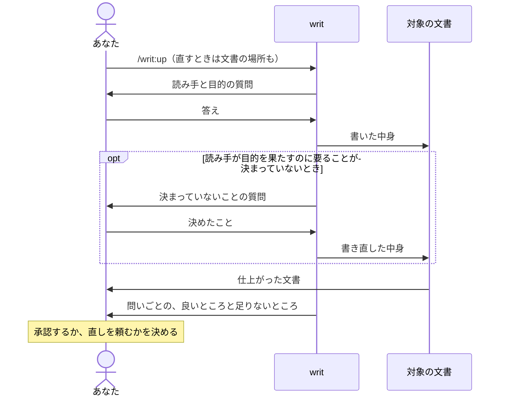

# writ

AI が書いた文書を、人が書いたように読みやすい文書に仕上げます（新しく書くときも、今ある文書を直すときも）。

- 読み手は、一度読めば分かり、読み終えたら何をすればいいかが分かります。
- あなたは、自分で読んで直さずに、そのまま渡せます。
- あなたは、全文を読み直さなくても、書き終えたときに writ が会話に出す報告を見るだけで仕上がりを判断できます。
- あなたは、決まっていないことはごまかさずに聞いてくれるので、中身の穴に気づかないまま渡すことがありません。

## `/writ:up` を呼んで聞かれたことに答えると、仕上がった文書と、その良いところと足りないところが返ってきます



writ は、誰が読み、読み終えて何を決め何をするのかが定まるまで書き始めません。文書の良し悪しは、読み手とその目的が決まって初めて測れるからです。書いた文書は、ここまでの話し合いを知らない読み手の目で確かめ、直せるところを直してから返します。[なぜこの形なのか](docs/design.md)は設計書に書いています。

## 例：TypeScript への移行計画をチームに向けて書く

JavaScript で書かれたアプリを TypeScript に移すことになり、その計画書をチームに向けて書くとします。

```console
> /writ:up

● この文書は誰が読みますか。

> チームのエンジニア。

● 読み終えたとき、チームのエンジニアは何を決め、何をしますか。

> どのディレクトリから移すかに合意して、それぞれ担当を引き受けてほしい。

● docs/ に設計の文書が並んでいるので、docs/migration-plan.md に置きます。よいですか。

> それで。
```

writ はリポジトリのディレクトリ構成やコードを調べてから計画書を書き、docs/migration-plan.md に書き込みます。

```markdown
# TypeScript 移行計画

最初に src/api/ を移し、次に src/ui/ に進みます。src/api/ はほかのコードから呼ばれる側なので、ここに型が付くと、呼ぶ側の誤りもすぐ見つかるようになります。

| ディレクトリ | 担当 |
| --- | --- |
| src/api/ | （未定） |
| src/ui/ | （未定） |
```

報告には、使った観点の問いが1つずつそのまま並び、それぞれに Good か More、あるいは両方が付きます。観点とは、文書の種類ごとに、良い文書かを問いの形で並べたものです。Good は、役立っているところで、読み手がそれで何を得るかが付きます。More は、writ が直さずに残した足りないところで、読み手が何に困るかと、なぜ残したかが付きます。どちらにも、文書のどこの話かと、その根拠が付きます。

```console
● docs/migration-plan.md に書きました。すべての文書の観点（doc.md）の問いごとの答えです。

  問い: 読み手は、最初の1文から中身を受け取れるか。
    Good: 冒頭の1文で、最初に移すディレクトリが分かる。
      場所: 3行目（見出しの次の1文）
      得ること: 読み手は、合意すべき点を最初の1文で受け取れる。
      根拠: 冒頭の1文が「最初に src/api/ を移し、次に src/ui/ に進みます」になっている。

  問い: 読み手は、必要なことをこの文書だけから受け取れ、要らない文を読まずに済むか。
    More: 担当の欄が空いている。
      場所: 担当の表
      困ること: 読み手は、空欄が埋まるまで自分が何を引き受けるのか分からない。
      根拠: 表の2行とも、担当が「（未定）」になっている。
      残した理由: 誰が担当するかはあなたとチームが決めることなので、空欄の形で残した。
```

実際の報告では、doc.md のすべての問いに、この形で答えが並びます。どの問いへの答えかが分かるので、答えのない問いがないことも報告だけで確かめられます。担当の欄は、読み手が担当を引き受けて埋めればよいので、空欄のまま渡せます。

すでにある文書を直すときは、その文書を渡します。たとえば、移したコードに型を付けるときの決まりを、以前に書いた docs/typing-guide.md にまとめてあるとします。writ は文書を読んだうえで、そこから分からないことだけを聞きます。

```console
> /writ:up docs/typing-guide.md

● この文書は、チームのエンジニアが、移したコードに型を付けるときに従う決まりと読みました。
  直そうとしましたが、any を使ってよいかが決まっていないため、仕上がったものとしては返せません。
  any は使ってよいですか。使ってよいなら、どんなときですか。
```

決めたことを答えると、writ はそれを入れて書き直し、同じように問いごとの Good と More が返ってきます。「できるだけ避ける」のような、どちらとも取れる言い回しで any をぼかした文書は返ってきません。どちらとも取れる決まりでは、読み手は決まりに従って書けないからです。空欄のまま渡せる担当の欄とは、ここが違います。

## 作業の途中で Claude Code が文書を書くときは、Claude Code が writ を選んで使うことがあります

writ には「文書を書くときや直すときに使うもの」という説明が付いていて、Claude Code は、作業の途中で README や設計書を書こうとするとき、この説明に当てはまると判断すれば writ を使います。会話から読み手と目的が分かればそのまま書き、分からないときだけあなたに聞いて、問いごとの Good と More を報告に添えます。

Claude Code が writ を選ぶかどうかはその場の判断なので、毎回選ばれるとは限りません。報告に問いごとの Good と More が添えられていなければ、その文書を渡して `/writ:up` を呼んでください。

## 文書は、種類ごとの観点で確かめられます

- [どの文書も](references/essentials/doc.md)、読み手が上から順に読むだけで全体をつかみ、読み終えたときにすべきことができるかで確かめます。
- [README](references/essentials/readme.md) はさらに、製品を初めて知った人が、自分にとっての利点を知り、使うかどうかを決め、使い始められるかで確かめます。
- [設計書](references/essentials/design.md)はさらに、作る人と直す人が、README に挙げた利点をどの機能がどう届けるかを知り、ある変更が設計に合うかどうかを説明できるかで確かめます。
- [AI に読ませるプロンプト](references/essentials/prompt.md)はさらに、AI が、書き手の想定していなかった場面でも、目的を果たせる動き方を自分で選べるかで確かめます。

## 入手して使い始める

writ は Claude Code のプラグインなので、Claude Code が必要です。

writ はプラグインマーケットプレイス `lovaizu/ccpm` から入手できます。Claude Code で、マーケットプレイスを追加してから writ を入れてください。

```console
> /plugin marketplace add lovaizu/ccpm
> /plugin install writ@ccpm
```

これで `/writ:up` が使えるようになります。

## ライセンス

MIT ライセンスです。条文はリポジトリ直下の [LICENSE](../LICENSE) にあります。
