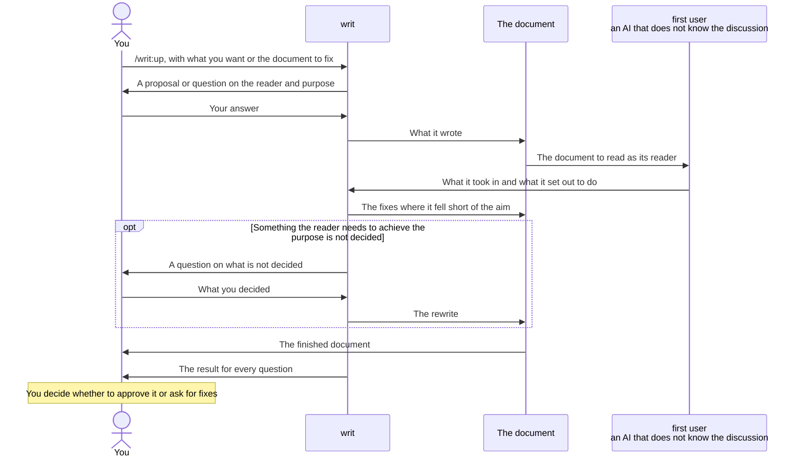

# writ

When writ writes a document for you, you get the following, whether the document is new or one you already have and want fixed.

- Your reader understands it in one reading, and knows what to do once they finish.
- You can hand the document you get back straight to your reader, without reading it over and fixing it yourself.
- You can judge the result from the final report alone, without reading the whole document again.
- When something your reader needs to achieve their purpose is not decided, it comes back to you as a question instead of being covered over. What your reader can decide for themselves is left so that they can see it is not decided, so you never hand on a document with a hole no one has noticed.

You get these because writ uses the finished document as your reader would, and checks it, before returning it.

You can also use it to check what you make besides documents, such as prompts, code and tests.

- You check what you made by what happened when it was used as its user would use it. What you meant while making it does not get in.
- You can write the essentials for what you make, that is, questions that ask whether it achieved its purpose, worked back from that purpose. You try the essentials on a real work before you use them.

## Call `/writ:up` and answer what it asks, and you get the finished document and the result for every question



The report gives a Good or More for every question in the essentials writ used. A Good is a place that comes across as the aim intends; a More is a place that falls short of the aim.

writ does not start writing until it is settled who reads the document and what they decide and do once they have read it. How good a document is can be measured only once its reader and purpose are set. You answer only what your request and the repository do not tell. What writ can infer, it puts to you as a proposal, so you only say whether it is right.

Before returning the document, writ has a first user use it. The first user is a separate AI that does not know the discussion so far. It reads the document as its reader and reports what it took in and what it set out to do. writ lays that report beside the aim and fixes where the document falls short before returning it. Where a reader trips cannot be seen by the one who wrote the document, however often they read it over. It shows only when someone who does not know the discussion actually uses it.

## Example: writing a TypeScript migration plan for the team

Your app is written in JavaScript and is moving to TypeScript, and you want a plan for the team's engineers to read.

```console
> /writ:up Write a TypeScript migration plan for the team's engineers

● Once the engineers have read it, what should they decide and do?

> Agree on which directories to move first, and each take one on.

● The design documents are in docs/, so I plan to put it at docs/migration-plan.md. Is that right?

> Yes.
```

writ looks up the repository's directory layout and code, and writes the plan to docs/migration-plan.md.

```markdown
# TypeScript migration plan

We move src/api/ first, then go on to src/ui/. Other code calls src/api/, so once it has types, mistakes in the calling code show up at once.

## Owners

- No one owns moving src/api/ yet.
- No one owns moving src/ui/ yet.
```

The report opens with writ's view of whether the document can be handed on as it is. Then comes every question in the essentials it used, each with one line under it: Good or More, what the reader gains or struggles with, and where. There are essentials for each kind of document. Only for a More that writ left does the report also give, under the question it answers, the first user's report and why it was left, because what you decide is whether to accept that More.

```console
● I wrote docs/migration-plan.md. Only the owners are not decided, and I think you can hand it to the team as it is.

  Essentials for every document (doc.md)
    Once you finished reading, what did you take it you should decide and do?
      Good: readers agree to move src/api/ first, then src/ui/, and each take one on (line 3 and "Owners")
    In trying to decide or act, what was not in the document, so that you could only guess or ask someone?
      More: readers cannot tell who takes which directory until someone volunteers ("Owners")
    (every other question gets a line the same way)

  The More I left
    In trying to decide or act, what was not in the document, so that you could only guess or ask someone?
      The first user's report: who takes which part is not decided, so I cannot act until someone volunteers
      What the reader struggles with: until owners are set, readers do not know what they will take on.
      Why I left it: who owns what is for you and your team to decide. Readers can settle it by volunteering, so I left it where they can see it is not decided.

  Full text: .writ/open/01-report-migration-plan.md
```

Since every question gets its own line, the report alone also shows that none was left unanswered. To see what lies behind a Good, ask about that question and writ answers.

The full file holds the first user's report for every question and every Good and More, each with its place and evidence. The first user's report is how it took in the document and what it set out to do. A Good says what the reader gains, and a More says what the reader struggles with. writ puts the file in `.writ/open/`, commits only that file to the current branch, and pushes if the branch has an upstream. There is one file per document, and checking again overwrites it.

Once you decide whether to accept the Mores that were left, the result is cleared. writ copies the full text into a commit message and deletes the file in that commit. The record stays in the git history, and in the end only the document remains. A file left in `.writ/open/` is the sign that something still waits for your decision.

To fix a document you already have, hand writ that document. Say you keep the rules for adding types to moved code in docs/typing-guide.md. writ reads it and asks only what the document does not tell.

```console
> /writ:up docs/typing-guide.md

● I read this as the rules the team's engineers follow when they add types to moved code.
  I tried to fix it, but whether `any` is allowed is not decided, so I cannot return it as finished.
  Is `any` allowed? If so, when?
```

When you answer with what you decided, writ writes it in, and the Good and More for every question come back in the same form. You never get back a document that blurs `any` with words that read either way, such as "avoid where possible". Readers cannot decide a team rule themselves, and they cannot follow a rule that reads either way. That is the difference from the owners, which readers can settle by volunteering.

## When Claude Code writes a document during other work, it may choose writ itself

writ comes with a description saying it is for writing and fixing documents. When Claude Code is about to write a README or a design document during other work and judges that this description fits, it uses writ. If the conversation tells the reader and purpose, it writes at once, and asks you only when it cannot tell. The report gives a Good or More for every question.

Whether to choose writ is Claude Code's judgment at the moment, so it does not always choose it. If a report comes without a Good or More for every question, call `/writ:up` with that document.

## Checking what you made, and writing essentials: pith

pith checks a work against essentials. It is the part of writ that `/writ:up` uses, and you can also use it directly, by calling `/writ:pith` or by asking for it in words. It checks not only documents but also prompts, code and tests.

### Checking what you made

Say you wrote a prompt at .github/prompts/pr-review.md for the Claude that reviews pull requests in CI. The aim is to catch API changes that break src/ui/api-client.js.

```console
> /writ:pith Check .github/prompts/pr-review.md.
  The receiver is Claude running in CI, which reads each pull request's diff with this prompt and writes comments.
  The aim is to miss no API change that breaks api-client.js, and to comment on nothing else.

● I checked it with pith. Finding API changes works as the aim intends, but one thing falls short of it.

  More: it missed a renamed field (line 12, "Look at added or removed endpoints and changed arguments")
    Question: when given a situation no step covers, what did the AI do?
    The first user's report: given a diff that only renamed a field in a response without changing the API, it judged "not an API change" and made no comment
    What the receiver struggles with: when a field is renamed, the pull request is merged with the UI broken.

  Full text: .writ/open/01-report-pr-review.md
```

The first user actually gives the prompt to an AI and runs it in situations no step covers. It does not judge; it reports what happened. Laying the report beside the aim and giving each Good and More is the work of a separate role inside pith, the conductor, which judges. Only the conductor receives the aim you wrote out; the first user never sees it. Knowing the aim, it would use the work looking for it, and fill what is missing in its head.

Write out the aim and hand it over before the check, because an aim that was not written out cannot be compared with. If a question cannot be compared with anything in the aim you handed over, pith returns before any first user runs, naming that question and asking you to add to the aim.

### Writing essentials

Say your team builds an internal CLI tool, and there is no set way to check its release notes. The readers are the developers in the company who use the CLI, and they read the notes to decide whether to upgrade to the new version now.

```console
> /writ:pith Write essentials for our CLI's release notes. Put them at docs/essentials/release-notes.md.
  The readers are the developers in the company who use this CLI, reading to decide whether to upgrade now.

● I wrote these three questions as the essentials in docs/essentials/release-notes.md.
    Having read it, what did you take it would change when you upgrade, and what would you have to do?
    What did you take it you would miss if you did not upgrade?
    Once you finished reading, how did you decide whether to upgrade now?
  Tried on the latest release notes (docs/releases/1.4.md), all three could be answered from what happened in use,
  and from those answers you could decide whether to upgrade.
```

Essentials are worked back from the purpose. If the purpose of release notes is to let readers decide whether to upgrade now, a question looks like "Having read it, what did you take it would change when you upgrade, and what would you have to do?". It never asks about form, as in "Are the changes in a bulleted list?". pith tries the essentials it wrote on real release notes. If no real work of that kind exists yet, they are tried the first time a real one is checked.

## Essentials

Documents are checked with the essentials for their kind.

- The essentials for [every document](references/essentials/doc.md) check whether readers understand it in one reading and know what to do once they finish.
- For a [README](references/essentials/readme.md), they also check whether a newcomer learns what they gain, decides whether to use the product, and can start using it.
- For a [design document](references/essentials/design.md), they also check whether those who build and maintain the product know which feature brings which benefit, and can judge whether a change fits the design.
- For a [prompt an AI reads](references/essentials/prompt.md), they also check whether the AI can act toward the purpose even in situations the writer did not foresee.

There are no essentials for code or tests. To check them, first write essentials with `/writ:pith`.

The essentials themselves are checked with the [essentials for essentials files](references/essentials/essentials.md): whether they were worked back from the purpose, whether each question can be answered from what happened when a first user used the work, and so on.

## Getting started

writ is a Claude Code plugin, so you need Claude Code. The script that checks the form of the report needs Python 3.9 or later. On a Mac, it comes in the same developer tools as git. Without it, writ stops instead of skipping the check, and tells you to install it. You can use writ without Node.js. With it, writ also checks what a machine can decide about the writing, such as sentence length, with lint tools fetched by npx (Vale and textlint).

writ is in the plugin marketplace `lovaizu/ccpm`. In Claude Code, add the marketplace, then install writ.

```console
> /plugin marketplace add lovaizu/ccpm
> /plugin install writ@ccpm
```

Now you can use `/writ:up` and `/writ:pith`.

## How it is built

Who makes, who uses and who decides, and why writ is built that way, are in the [design document](docs/design.md).

## License

MIT. The full text is in [LICENSE](../LICENSE) at the root of the repository.
