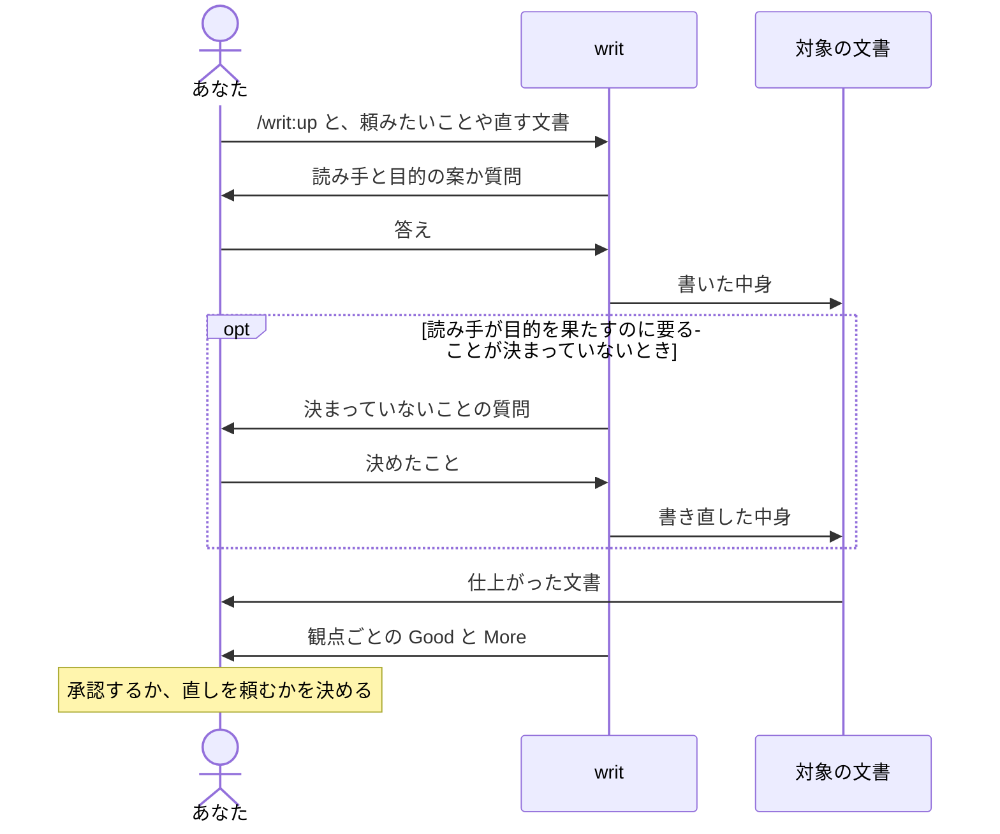

# writ

AI が書く文書を、新しく書くときも今ある文書を直すときも、人が書いたように読みやすく仕上げます。

- 読み手は、一度読めば分かり、読み終えたら何をすればいいかが分かります。
- あなたは、自分で読んで直さずに、そのまま渡せます。
- あなたは、全文を読み直さなくても、書き終えたときに writ が会話に出す報告を見るだけで仕上がりを判断できます。
- あなたは、決まっていないことはごまかさずに聞いてくれるので、中身の穴に気づかないまま渡すことがありません。

## `/writ:up` を呼んで聞かれたことに答えると、仕上がった文書と、観点ごとの Good と More が返ってきます



writ は、誰が読み、読み終えて何を決め何をするのかが定まるまで書き始めません。文書の良し悪しは、読み手とその目的が決まって初めて測れるからです。あなたが答えるのは、頼んだときの言葉やリポジトリから分からないことだけで、推し量れることには writ が案を示すので、よいかどうかを答えれば済みます。書いた文書は、ここまでの話し合いを知らない読み手の目で確かめ、直せるところを直してから返します。

## 例：TypeScript への移行計画をチームに向けて書く

JavaScript で書かれたアプリを TypeScript に移すことになり、その計画書をチームに向けて書くとします。

```console
> /writ:up TypeScript への移行計画を、チームのエンジニアに向けて書いて

● 読み終えたとき、チームのエンジニアは何を決め、何をしますか。

> どのディレクトリから移すかに合意して、それぞれ担当を引き受けてほしい。

● docs/ に設計の文書が並んでいるので、docs/migration-plan.md に置こうと考えています。よいですか。

> それで。
```

writ はリポジトリのディレクトリ構成やコードを調べてから計画書を書き、docs/migration-plan.md に書き込みます。

```markdown
# TypeScript 移行計画

最初に src/api/ を移し、次に src/ui/ に進みます。src/api/ はほかのコードから呼ばれる側なので、ここに型が付くと、呼ぶ側の誤りもすぐ見つかるようになります。

## 担当

- src/api/ を移す担当は、まだ決まっていません。
- src/ui/ を移す担当は、まだ決まっていません。
```

報告は、このまま渡せるかについての writ の考えから始まり、その根拠として、使った観点が1つずつそのまま並び、それぞれに Good か More、あるいは両方が付きます。観点とは、文書が良いかを確かめる項目で、文書の種類ごとに決まっています。Good は、役立っているところで、読み手がそれで何を得るかが付きます。More は、writ が直さずに残した足りないところで、読み手が何に困るかと、なぜ残したかが付きます。どちらにも、文書のどこの話かと、その根拠が付きます。

```console
● docs/migration-plan.md に書きました。担当だけ決まっていませんが、このままチームに渡せると考えます。
  根拠は、すべての文書の観点（doc.md）ごとの答えです。

  観点: 読み手は、通して読むにも拾い読むにも、戻ったり先を見たりせずに受け取れるか。
    Good: 冒頭の1文で、最初に移すディレクトリが分かる。
      場所: 3行目（見出しの次の1文）
      得ること: 読み手は、合意すべき点を最初の1文で受け取れる。
      根拠: 冒頭の1文が「最初に src/api/ を移し、次に src/ui/ に進みます」になっている。

  観点: どの部分も、この読み手が決めて行うことのために要るものか。
    More: 担当が決まっていない。
      場所: 「担当」の節
      困ること: 読み手は、担当が決まるまで自分が何を引き受けるのか分からない。
      根拠: 2つの項目とも「まだ決まっていません」になっている。
      残した理由: 誰が担当するかはあなたとチームが決めることなので、決まっていないと分かる形で残した。
```

実際の報告では、doc.md のすべての観点に、この形で答えが並びます。どの観点への答えかが分かるので、答えのない観点がないことも報告だけで確かめられます。担当は、読み手が引き受けて決めればよいので、決まっていないまま渡せます。

すでにある文書を直すときは、その文書を渡します。たとえば、移したコードに型を付けるときの決まりを、以前に書いた docs/typing-guide.md にまとめてあるとします。writ は文書を読んだうえで、そこから分からないことだけを聞きます。

```console
> /writ:up docs/typing-guide.md

● この文書は、チームのエンジニアが、移したコードに型を付けるときに従う決まりと読みました。
  直そうとしましたが、any を使ってよいかが決まっていないため、仕上がったものとしては返せません。
  any は使ってよいですか。使ってよいなら、どんなときですか。
```

決めたことを答えると、writ はそれを入れて書き直し、同じように観点ごとの Good と More が返ってきます。「できるだけ避ける」のような、どちらとも取れる言い回しで any をぼかした文書は返ってきません。どちらとも取れる決まりでは、読み手は決まりに従って書けないからです。決まっていないまま渡せる担当とは、ここが違います。

## 作業の途中で Claude Code が文書を書くときは、Claude Code が writ を選んで使うことがあります

writ には「文書を書くときや直すときに使うもの」という説明が付いていて、Claude Code は、作業の途中で README や設計書を書こうとするとき、この説明に当てはまると判断すれば writ を使います。会話から読み手と目的が分かればそのまま書き、分からないときだけあなたに聞いて、観点ごとの Good と More を報告に添えます。

Claude Code が writ を選ぶかどうかはその場の判断なので、毎回選ばれるとは限りません。報告に観点ごとの Good と More が添えられていなければ、その文書を渡して `/writ:up` を呼んでください。

## 文書は、種類ごとの観点で確かめられます

- [どの文書も](references/essentials/doc.md)、読み手が上から順に読むだけで全体をつかみ、読み終えたときにすべきことができるかで確かめます。
- [README](references/essentials/readme.md) はさらに、製品を初めて知った人が、自分にとっての利点を知り、使うかどうかを決め、使い始められるかで確かめます。
- [設計書](references/essentials/design.md)はさらに、作る人と直す人が、README に挙げた利点をどの機能がどう届けるかを知り、ある変更が設計に合うかどうかを説明できるかで確かめます。
- [AI に読ませるプロンプト](references/essentials/prompt.md)はさらに、AI が、書き手の想定していなかった場面でも、目的を果たせる動き方を自分で選べるかで確かめます。
- [観点のファイル](references/essentials/essentials.md)はさらに、書く役と確かめる役が、誰も想定していなかった部分についても、受け取る人に要るかどうかで判断できるかで確かめます。

## 入手して使い始める

writ は Claude Code のプラグインなので、Claude Code が必要です。

writ はプラグインマーケットプレイス `lovaizu/ccpm` から入手できます。Claude Code で、マーケットプレイスを追加してから writ を入れてください。

```console
> /plugin marketplace add lovaizu/ccpm
> /plugin install writ@ccpm
```

これで `/writ:up` が使えるようになります。

## ライセンス

MIT ライセンスです。条文はリポジトリ直下の [LICENSE](../LICENSE) にあります。
