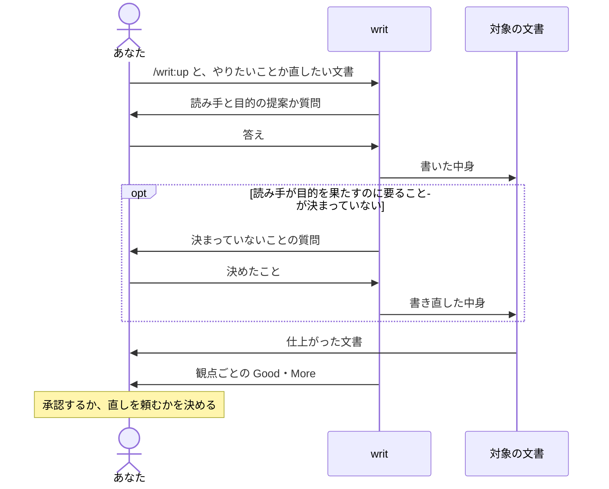

# writ

writ は、AI が書く文書を、人が書いたように読みやすく仕上げます。新しく書く文書も、今ある文書を直すときも同じです。仕上げた文書は、読み手と同じ立場で実際に使ってみて確かめてから返します。

- 読み手は一度読めば分かり、読み終えて何をすればよいかも分かります。
- 返ってきた文書を、自分で読み直して直さずに、そのまま読み手に渡せます。
- 最後の報告を読むだけで、文書全体を読み直さずに結果を判断できます。
- 決まっていないことは、ごまかされずにあなたへの質問として返ります。気づかない穴のある文書を渡すことはありません。

文書だけでなく、プロンプトやコード、テストなど、自分の作ったものを確かめるのにも使えます。

- 作ったものを、その利用者として実際に使った事実で確かめられます。作った側の思い込みが入りません。
- 自分の作るものに合った観点を、目的から逆算して作れます。作った観点は、実物で試してから使えます。

## `/writ:up` を呼んで聞かれたことに答えると、仕上がった文書と観点ごとの Good・More が返ります



writ は、誰が読み、読み終えて何を決めて何をするかが決まるまで、書き始めません。文書の良し悪しは、読み手と目的が決まって初めて測れるからです。あなたが答えるのは、頼んだ言葉とリポジトリから分からないことだけです。writ が推し量れることは提案として出すので、合っているかを答えるだけで済みます。

返す前に、writ は first user（最初の利用者）に文書を使わせます。first user は、これまでの話し合いを知らない別の AI です。読み手として文書を読み、何を受け取って何をしようとしたかを報告します。writ はその報告を狙いと比べ、狙いからずれた所を直してから返します。読み手がつまずく所は、書いた側が読み直しても見えません。話し合いを知らない目で実際に使って、初めて見えます。

## 例：チームのために TypeScript への移行計画を書く

JavaScript で書いたアプリを TypeScript に移すことになり、チームのエンジニアが読む計画を書くとします。

```console
> /writ:up チームのエンジニア向けに、TypeScript への移行計画を書いて

● エンジニアは読み終えて、何を決めて何をすればよいですか？

> どのディレクトリから移すかに合意して、それぞれ担当を引き受ける。

● 設計の文書は docs/ にあるので、docs/migration-plan.md に置くつもりです。よいですか？

> はい。
```

writ はリポジトリのディレクトリ構成とコードを調べ、docs/migration-plan.md に計画を書きます。

```markdown
# TypeScript への移行計画

src/api/ から先に移し、そのあと src/ui/ に進みます。src/api/ はほかのコードから呼ばれる側なので、先に型が付けば、呼ぶ側の間違いもすぐ見つかります。

## 担当

- src/api/ を移す担当は、まだ決まっていません。
- src/ui/ を移す担当は、まだ決まっていません。
```

報告は、文書をこのまま渡せるかの writ の見立てから始まります。続いて、使った観点ごとに、Good か More かとその場所が1行ずつ並びます。観点は、成果物が目的を果たしたかを確かめる問いで、文書の種類ごとにあります。Good は狙いどおりに伝わった所、More は狙いからずれている所です。writ が残した More だけは、読み手が何に困るかと、残した理由まで書かれます。あなたが決めるのは、その More を受け入れるかどうかだからです。

```console
● docs/migration-plan.md を書きました。担当だけ決まっていませんが、このままチームに渡せると考えます。

  どの文書にも使う観点（doc.md）
    一度読んで、何をすればよいと受け取ったか ……… Good（3行目と「担当」の節）
    読み終えてすぐ動こうとしたとき、何が足りなかったか ……… More（「担当」の節）
    （ほかの観点も同じように1行ずつ）

  残した More
    担当が決まっていません（「担当」の節）
      first user の報告：誰がどこを担当するかが決まっていないので、名乗り出るまで動けない
      困ること：担当が決まるまで、読み手は自分が何を引き受けるか分かりません。
      残した理由：誰が何を担当するかは、あなたとチームが決めることです。読み手が名乗り出て決められるので、決まっていないと分かる形で残しました。

  全文：.writ/open/01-report-migration-plan.md
```

どの観点にも1行ずつ答えるので、答え漏れがないことも報告だけで分かります。Good の中身を確かめたいときは、その観点について聞けば答えます。

全文のファイルには、観点ごとの first user の報告と、Good・More のすべてが、場所と根拠付きで入っています。first user の報告は、文書をどう受け取り、何をしようとしたかです。Good には読み手が何を得るか、More には読み手が何に困るかが付きます。writ はこのファイルを `.writ/open/` に置いてコミットし、push します。対象の文書ごとに1つで、確かめ直すと上書きされます。

残した More をあなたが受け入れるか決めると、その結果は片付きます。writ は全文をコミットメッセージに写し、ファイルを消してコミットします。記録は git の履歴に残り、最後に残るのは文書だけです。`.writ/open/` にファイルが残っていれば、まだあなたの判断を待っているものがあるという印です。

今ある文書を直すときは、その文書を渡します。移したコードに型を付けるときの決まりを、docs/typing-guide.md にまとめてあるとします。writ は文書を読み、文書から分からないことだけを聞きます。

```console
> /writ:up docs/typing-guide.md

● この文書は、チームのエンジニアが移したコードに型を付けるときに従う決まりだと読みました。
  直そうとしましたが、any を使ってよいかが決まっていないので、仕上がったものとしては返せません。
  any は使ってよいですか？ 使ってよいなら、どんなときですか？
```

決めたことを答えると、writ はそれを書き入れ、観点ごとの Good・More が同じ形で返ります。「できるだけ避ける」のように、どちらとも読める言い方で any をぼかした文書は返ってきません。チームの決まりは読み手が自分では決められず、どちらとも読める決まりには従えないからです。読み手が名乗り出て決められる担当とは、ここが違います。

## 作業の途中で Claude Code が文書を書くとき、自分で writ を選ぶことがあります

writ には、文書を書いたり直したりするためのものだという説明が付いています。Claude Code が作業の途中で README や設計書を書こうとして、この説明が当てはまると判断すると、writ を使います。会話から読み手と目的が分かればすぐに書き、分からないときだけあなたに聞きます。報告には、観点ごとの Good・More が付きます。

writ を選ぶかは、その場の Claude Code の判断なので、いつも選ぶとは限りません。観点ごとの Good・More が付いていない報告が来たら、その文書を渡して `/writ:up` を呼んでください。

## 作ったものを確かめる、観点を作る：pith

pith は、成果物を観点で確かめる仕組みです。writ の中で `/writ:up` が使っているものを、あなたが直接使うこともできます。文書に限らず、プロンプトやコード、テストも確かめられます。

### 作ったものを確かめる

CI で PR を見る Claude のために、.github/prompts/pr-review.md にプロンプトを書いたとします。狙いは、src/ui/api-client.js を壊す API の変更を見つけることです。

```console
> pith で .github/prompts/pr-review.md を確かめて。
  受け手は CI で動く Claude で、PR ごとにこのプロンプトで差分を見て、コメントを書く。
  狙いは、api-client.js を壊す API の変更を見逃さないことと、それ以外ではコメントしないこと。

● pith で確かめました。API の変更を見つける所は狙いどおりですが、1つ狙いからずれています。

  More：項目名の変更を見逃しました（12行目「エンドポイントの追加・削除・引数の変更を見る」）
    観点：手順にない場面を与えたとき、AI は何をしたか
    first user の報告：API を変えずにレスポンスの項目名だけを変えた差分を与えたら、「API の変更ではない」としてコメントしなかった
    困ること：項目名が変わったとき、UI が壊れたまま PR がマージされます。

  全文：.writ/open/01-report-pr-review.md
```

first user は、プロンプトを実際に AI に渡し、手順にない場面で動かしてみます。良し悪しは付けず、起きたことを報告します。報告を狙いと比べて Good・More を付けるのは、first user とは別の、狙いを知る側です。first user に狙いは見せません。狙いを知ると、それを探しながら使い、足りない所を頭の中で補ってしまうからです。

狙いは、確かめる前に書き出して渡します。書き出さなかった狙いは比べられないので、観点に対して狙いが足りないときは、確かめる前にそう返ってきます。

### 観点を作る

チームのリリースノートには、決まった確かめ方がないとします。読み手は taskboard を入れているチームで、今すぐ上げるかを決めるために読みます。

```console
> pith で、うちのリリースノートの観点を作って。docs/essentials/release-notes.md に置いて。
  読むのは taskboard を入れているチームで、今すぐ上げるかを決めるために読む。

● docs/essentials/release-notes.md に観点を書き、一番新しいリリースノート（docs/releases/1.4.md）で試しました。
  3問とも、使って起きたことで答えられ、その答えから上げるかを決められました。
```

観点は、目的から逆算して作ります。リリースノートの目的が「今すぐ上げるかを決められる」なら、観点は「読んで、上げると何が変わり、何をしなければならないと受け取ったか」のような問いになります。「変更点が箇条書きか」のような、形を問う観点にはなりません。作った観点は、実際のリリースノートに当てて確かめてみます。その種類の実物がまだなければ、最初に実物を確かめるときに試します。

## 観点

文書は、種類ごとの観点で確かめます。

- [どの文書にも](references/essentials/doc.md)使う観点です。読み手が一度読んで、読み終えて何をすればよいか分かるかを確かめます。
- [README](references/essentials/readme.md) は、初めての人が得るものを知って使うかを決め、使い始められるかも確かめます。
- [設計書](references/essentials/design.md) は、作る人と保守する人が、どの機能がどのベネフィットを生むかを知り、変更が設計に合うかを判断できるかも確かめます。
- [AI が読むプロンプト](references/essentials/prompt.md) は、書いた人が想定していない場面でも、AI が目的に沿って動けるかも確かめます。

観点そのものは、[観点の観点](references/essentials/essentials.md)で確かめます。観点が目的から逆算されているか、first user が使って起きたことで答えられる問いになっているか、などです。

## 入手して使い始める

writ は Claude Code のプラグインなので、Claude Code が要ります。報告の形を確かめるスクリプトに、Python 3.9 以降が要ります。Mac では、git と同じ開発者ツールに入っています。Node.js は無くても使えます。あれば、文の長さのような機械で判断できる書き方を、npx で取ってくる lint（Vale と textlint）でも確かめます。

writ はプラグインのマーケットプレイス `lovaizu/ccpm` から入手できます。Claude Code でマーケットプレイスを足してから、writ を入れます。

```console
> /plugin marketplace add lovaizu/ccpm
> /plugin install writ@ccpm
```

これで `/writ:up` と pith を使えます。

## どう作られているか

誰が作り、誰が使い、誰が決めるのか、なぜ writ をそう作ったのかは、[設計書](docs/design.md)にあります。

## ライセンス

MIT ライセンスです。全文は、リポジトリのルートの [LICENSE](../LICENSE) にあります。
