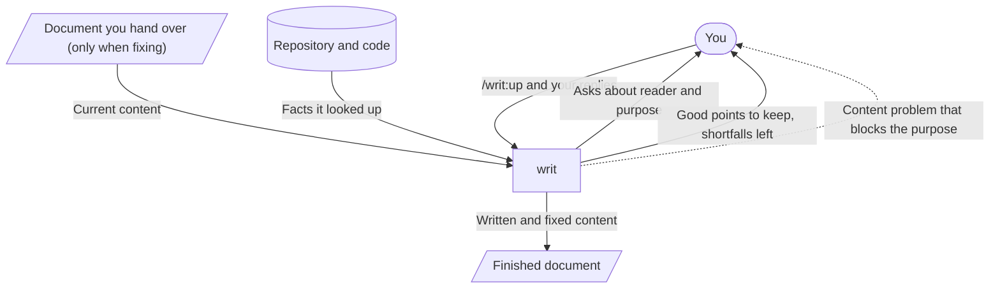

# writ

With writ, the documents Claude Code writes read as if a person wrote them, and come finished in a shape that lets the reader take in their content with the least effort. You no longer have to read and fix documents that leave you unsure what you are supposed to do, sentences that repeat the same thing in other words, or preambles that say nothing.

## Call `/writ:up`, just answer what it asks, and a finished document comes back



writ does not start writing until it is decided who reads the document and what they decide and do when they finish. The quality of a document can only be measured once its reader and purpose are decided.

Before returning the document, writ checks it through the eyes of a reader who does not know the discussion so far, and fixes what it can. Remarks along the way and how the fixes went are not returned. [Why it takes this shape](docs/design.md) is in the design doc.

## Example: writing a TypeScript migration plan for your team

Say your app written in JavaScript is moving to TypeScript, and you are writing the plan for your team.

```console
> /writ:up

● Before I write, tell me three things.
  1. Who reads this document?
  2. When they finish, what do they decide and what do they do?
  3. Where should it go?

> The engineers on the team. I want them to agree on which directory to move first and each take on a part.
  Put it in docs/migration-plan.md.
```

writ looks into the repository's directory layout and code, then writes the plan into docs/migration-plan.md.

```markdown
# TypeScript migration plan

We move src/api/ first, then go on to src/ui/. src/api/ is what the rest of the code calls, so once it has types, mistakes in the calling code show up right away too.

| Directory | Owner |
| --- | --- |
| src/api/ | (undecided) |
| src/ui/ | (undecided) |
```

The reply comes with Good and More. Good is what helps and should be kept from now on. More is a shortfall writ left unfixed, with what the reader struggles with and why it was left. Both say where in the document they point to, and give their evidence.

```console
● Good (Every document): The first sentence says which directory moves first.
    Location: line 3 (the sentence after the heading)
    Evidence: The reader gets what they need to agree on in the first sentence.

  More (Every document): The owner column is empty.
    Location: the owner table
    Reader's problem: Until the blanks are filled, readers do not know what they are taking on.
    Why left: Who owns what is for you and your team to decide, so it was left as blanks.
```

To fix a plan you already have, hand over the document. writ reads it and asks only what it cannot tell from it.

```console
> /writ:up docs/migration-plan.md

● I read this plan as being for the team's engineers to agree on the order in which to move things and the deadline for finishing.
  But no deadline is written anywhere. Has a deadline been set?
```

If the deadline is set, the fixed result is written into the original file, and Good and More come back the same way. If it is not set yet, you do not get back a plan that blurs the deadline with clever wording; the discussion starts from what to do about the deadline. A plan without a deadline cannot achieve its purpose of having readers agree on a deadline. That is how it differs from the owner column, which can be left blank.

## Claude Code also uses writ on its own in situations where it writes documents

When Claude Code writes a README or a design doc in the middle of its work, it writes right away if the conversation tells it the reader and purpose, asks you only when it does not know them, and attaches Good and More to its reply.

## Documents are checked against the essentials for their kind

- [Every document](references/essentials/doc.md) is checked on whether the reader can grasp the whole by reading from top to bottom and, when they finish, do what they need to do.
- A [README](references/essentials/readme.md) is also checked on whether someone meeting the product for the first time learns what it does for them, decides whether to use it, and can start using it.
- A [design doc](references/essentials/design.md) is also checked on whether builders and maintainers learn how the outcome for the user is realized, and can explain whether a given change fits the design.
- A [prompt for an AI to read](references/essentials/prompt.md) is also checked on whether the AI can choose for itself a way of acting that achieves the purpose, even in situations the writer did not foresee.

## Get it and start using it

writ is a Claude Code plugin, so you need Claude Code.

writ is available from the plugin marketplace `lovaizu/ccpm`. In Claude Code, add the marketplace, then install writ.

```console
> /plugin marketplace add lovaizu/ccpm
> /plugin install writ@ccpm
```

Now `/writ:up` is ready to use.

## License

MIT License. The full text is in [LICENSE](../LICENSE) at the repository root.
