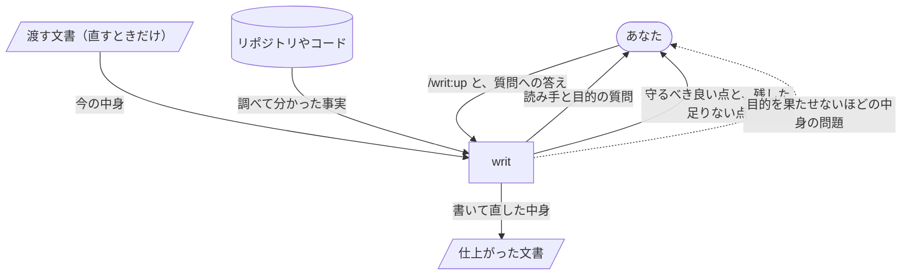

# writ

writ を使うと、Claude Code が書く文書が、人が書いたように読め、読み手が最小の手間で中身を受け取れる形で仕上がります。読んでも自分が何をすればよいのか分からない文書や、同じことを言い換えて繰り返す文、何も言っていない前置きを、あなたが読んで直す手間がなくなります。

## `/writ:up` を呼ぶと、聞かれたことに答えるだけで仕上がった文書が返ってきます



writ は、誰が読み、読み終えて何を決め何をするのかが定まるまで書き始めません。文書の良し悪しは、読み手とその目的が決まって初めて測れるからです。

返す前に、writ は文書を、ここまでの話し合いを知らない読み手の目で確かめ、直せるところを直してから返します。途中の指摘や直しの経緯は返ってきません。[なぜこの形なのか](docs/design.md)は設計書に書いています。

## 例：TypeScript への移行計画をチームに向けて書く

JavaScript で書かれたアプリを TypeScript に移すことになり、その計画書をチームに向けて書くとします。

```console
> /writ:up

● 書く前に3つ教えてください。
  1. この文書は誰が読みますか。
  2. 読み終えたとき、その人は何を決め、何をしますか。
  3. どこに置きますか。

> チームのエンジニア。どのディレクトリから移すかに合意して、それぞれ担当を引き受けてほしい。
  docs/migration-plan.md に置いて。
```

writ はリポジトリのディレクトリ構成やコードを調べてから計画書を書き、docs/migration-plan.md に書き込みます。

```markdown
# TypeScript 移行計画

最初に src/api/ を移し、次に src/ui/ に進みます。src/api/ はほかのコードから呼ばれる側なので、ここに型が付くと、呼ぶ側の誤りもすぐ見つかるようになります。

| ディレクトリ | 担当 |
| --- | --- |
| src/api/ | （未定） |
| src/ui/ | （未定） |
```

返答には、Good と More が添えられます。Good は、役立っていて今後も守るべきところです。More は、writ が直さずに残した足りないところで、読み手が何に困るかと、なぜ残したかが付きます。どちらにも、文書のどこの話かと、その根拠が付きます。

```console
● Good（すべての文書）: 冒頭の1文で、最初に移すディレクトリが分かる。
    場所: 3行目（見出しの次の1文）
    根拠: 読み手が合意すべき点を、最初の1文で受け取れる。

  More（すべての文書）: 担当の欄が空いている。
    場所: 担当の表
    困ること: 読み手は、空欄が埋まるまで自分が何を引き受けるのか分からない。
    残した理由: 誰が担当するかはあなたとチームが決めることなので、空欄の形で残した。
```

すでにある計画書を直すときは、その文書を渡します。writ は文書を読んだうえで、そこから分からないことだけを聞きます。

```console
> /writ:up docs/migration-plan.md

● この計画書は、チームのエンジニアが移す順番と移し終える期限に合意するためのものと読みました。
  ただ、期限がどこにも書かれていません。期限は決まっていますか。
```

期限が決まっていれば、直した結果は元のファイルに書き込まれ、同じように Good と More が返ってきます。期限がまだ決まっていなければ、うまい言い回しで期限をぼかした計画書は返ってこず、期限をどうするかから話が始まります。期限のない計画書では、読み手が期限に合意するという目的を果たせないからです。空欄で残せる担当の欄とは、ここが違います。

## Claude Code も、文書を書く場面で自分から writ を使います

作業の途中で Claude Code が README や設計書を書くときは、会話から読み手と目的が分かればそのまま書き、分からないときだけあなたに聞き、Good と More を返答に添えて返します。

## 文書は、種類ごとの観点で確かめられます

- [どの文書も](references/essentials/doc.md)、読み手が上から順に読むだけで全体をつかみ、読み終えたときにすべきことができるかで確かめます。
- [README](references/essentials/readme.md) はさらに、製品を初めて知った人が、自分に何をしてくれるかを知り、使うかどうかを決め、使い始められるかで確かめます。
- [設計書](references/essentials/design.md)はさらに、作る人と直す人が、利用者に届ける姿がどう実現されるかを知り、ある変更が設計に合うかどうかを説明できるかで確かめます。
- [AI に読ませるプロンプト](references/essentials/prompt.md)はさらに、AI が、書き手の想定していなかった場面でも、目的を果たせる動き方を自分で選べるかで確かめます。

## 入手して使い始める

writ は Claude Code のプラグインなので、Claude Code が必要です。

writ はプラグインマーケットプレイス `lovaizu/ccpm` から入手できます。Claude Code で、マーケットプレイスを追加してから writ を入れてください。

```console
> /plugin marketplace add lovaizu/ccpm
> /plugin install writ@ccpm
```

これで `/writ:up` が使えるようになります。

## ライセンス

MIT ライセンスです。条文はリポジトリ直下の [LICENSE](../LICENSE) にあります。
