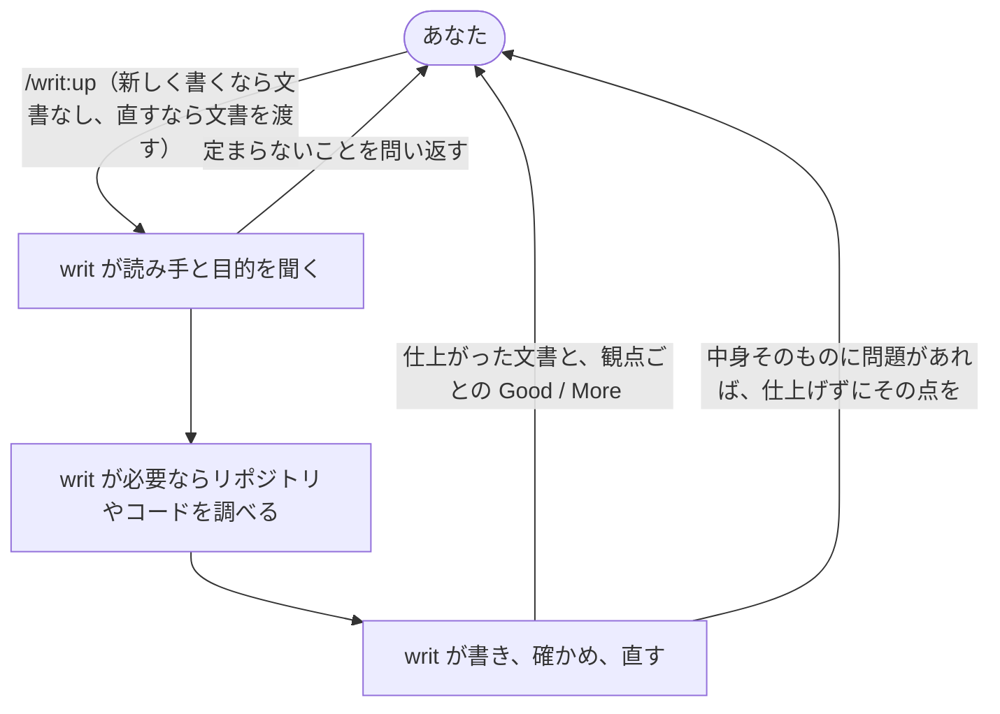

# writ

writ を使うと、Claude Code が書く文書が、人が書いたように読め、読み手が最小の手間で中身を受け取れる形で仕上がります。誰に向けたのか分からない文書や、埋め草と言い直しで膨らんだ文書を、あなたが読んで直す手間がなくなります。

## `/writ:up` を呼ぶと、聞かれたことに答えるだけで仕上がった文書が返ってきます



コマンドは `/writ:up` の1つだけです。文書を渡さなければ新しく書き、文書を渡せばそれを直します。

書き始める前に、writ は誰が読むのか、読み終えて何を決め何をするのかを聞きます。答えが定まらないうちは書かずに問い返します。文書の良し悪しは、読み手とその目的が決まって初めて測れるからです。

返す前に、writ は仕上がった文書を、ここまでの話し合いを知らない読み手の目で確かめ、見つかった足りないところを直し終えてから返します。途中の指摘や直しの経緯は返ってきません。[なぜこの形なのか](docs/design.md)は設計書に書いています。

## 例：TypeScript への移行計画をチームに向けて書く

JavaScript で書かれたアプリを TypeScript に移すことになり、その計画書をチームに向けて書くとします。

```console
> /writ:up

● 書く前に2つ教えてください。
  1. この文書は誰が読みますか。
  2. 読み終えたとき、その人は何を決め、何をしますか。

> チームのエンジニア。どのディレクトリから移すかに合意して、それぞれ担当を引き受けてほしい。
```

writ はリポジトリのディレクトリ構成やコードを調べてから計画書を書き、確かめて直したうえで、文書と一緒に次のような Good と More を返します。Good は役立っていて今後も守るべきところ、More は足りないところと、それで読み手が何に困るかです。どちらにも、文書のどこの話か、なぜそう言えるかが付きます。

```console
● Good（すべての文書）: 冒頭の1文で、最初に移すディレクトリが分かる。
    場所: 1行目
    根拠: 読み手が合意すべき点を、最初の1文で受け取れる。

  More（すべての文書）: 担当の決め方が書かれていない。
    場所: 「進め方」の節
    根拠: 読み手は、読み終えても誰が何を引き受けるのか決められない。
```

すでにある計画書を直すときは、その文書を渡します。

```console
> /writ:up docs/migration-plan.md
```

問題が文章ではなく中身そのものにあり、目的からは直し方が決まらないときは、writ は仕上げずにあなたに戻し、その点から話を始めます。たとえば移行の期限がまだ決まっていないなら、うまい言い回しで期限をぼかした計画書は返ってこず、期限をどうするかを聞かれます。

## Claude Code も、文書を書く場面で自分から writ を使います

あなたが `/writ:up` を呼ばなくても、作業の途中で Claude Code が README や設計書を書く場面では、Claude Code が自分で writ を使います。そのため、頼んだ作業の中で書かれた文書も、同じ基準で仕上がって返ってきます。

## 文書は、種類ごとの観点で確かめられます

Good と More は、次の観点ごとに返ってきます。すべての文書に共通の観点に加えて、文書の種類に応じた観点が使われます。

- [すべての文書](references/essentials/doc.md)
- [README](references/essentials/readme.md)
- [設計書](references/essentials/design.md)
- [AI に読ませるプロンプト](references/essentials/prompt.md)

## 入手して使い始める

writ は Claude Code のプラグインなので、Claude Code が必要です。

writ はプラグインマーケットプレイス `lovaizu/ccpm` から入手できます。Claude Code で、マーケットプレイスを追加してから writ を入れてください。

```console
> /plugin marketplace add lovaizu/ccpm
> /plugin install writ@ccpm
```

これで `/writ:up` が使えるようになります。

## ライセンス

MIT ライセンスです。条文はリポジトリ直下の [LICENSE](../LICENSE) にあります。
