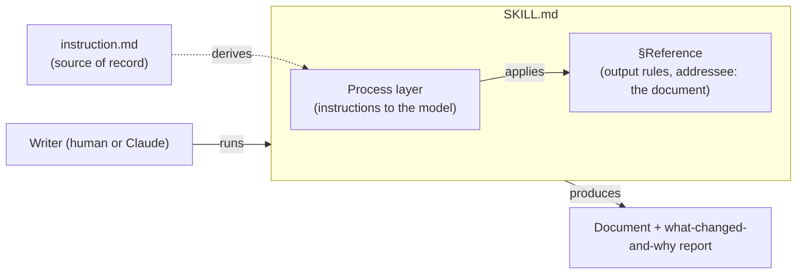
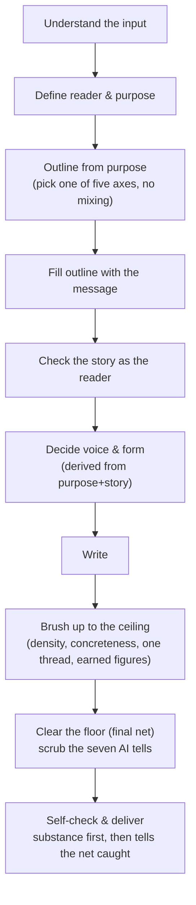

# writ — design notes

Not read at runtime — for whoever maintains the `up` skill and must judge whether a step is still
right when the instruction or the target axes change.

## Context & constraints

The end is a document that reads as if a person wrote it, not an AI — least reader effort, taken in
top to bottom, graspable at a glance. This is packaged as a Claude Code plugin `writ` (skill
`up`) so the procedure applies on demand to any draft, run by a human or by Claude itself. Primary
mode is brushing up an existing draft; authoring from scratch runs the same procedure but is
secondary. `instruction.md` is the verbatim source of record the skill body is derived from — except
where a later decision below deliberately supersedes it (D-4, D-5, D-6). Constraints inherited from
the repo: version lives only in `writ/.claude-plugin/plugin.json`; shipped artifacts are English
except `instruction.md` itself; `README.md` is scenario-style; the skill is self-contained in one
file (source is short, one continuous procedure, no `references/` split).

## Approach

- **(D-1) Plugin `writ` / skill `up`, not matching names** — chosen over the official same-name
  convention, because the skill name is typed often (keep it short) and plugin/skill names are
  independent slots (`rn:gm` is the precedent); "up" fits the primary brush-up-a-level mode.
- **(D-2) Model-invocable (no `disable-model-invocation`)** — chosen over `rn`'s pattern of disabling
  model invocation, because the distinguishing axis is who the skill is for, not side effects: `rn`
  is meant for a human to drive, `up` is meant for a human or Claude itself.
- **(D-3) Two layers physically separated in the body: process vs output rules, no diagram embedded
  in the prompt** — chosen over the original SKILL.md, which embedded a procedure flowchart in the
  prompt body. That was a category error: "render structure/flow as mermaid" is a rule for the
  *document the writer produces*, not a property of the prompt. Output rules (§Reference) carry an
  explicit addressee sentence so the diagram rule is never read as applying to the prompt itself.
- **(D-4) Purpose reframed as human-readable end, quality in two tiers (floor/ceiling)** — chosen
  over treating "reader-first procedure" as the end goal; the procedure is the *means*. Floor
  (table-stakes: scrub the seven AI tells) must clear before ceiling (attractive: density,
  concreteness, one load-bearing thread, earned figures, consistent voice) is worth adding — ceiling
  on an uncleared floor is wasted.
- **(D-5) Rebuild fresh from the input's intent, floor as a final net** — chosen over an edit-the-
  draft-in-place runbook (scrub first, reorder later), which drags the old wording along and reads as
  patched, and was a checklist rather than a writing procedure. The final order: understand input →
  define reader & purpose → outline from purpose → fill outline with the message → check the story as
  the reader → decide voice & form from purpose+story → write → brush up to the ceiling → clear the
  floor (net) → self-check & deliver. Voice and form (prose / list / table / diagram / graph) are
  decided *after* the story stands, derived from purpose+story rather than chosen by reflex.
- **(D-6) Five-axis skeletons re-sourced to researched best practice** — chosen over instruction.md's
  verbatim outlines, per the user's ask for the current recommended structures. Source of truth is
  now Diátaxis (explanation/reference/tutorials), MADR 4.0, AWS ADR guidance, Google/Microsoft
  procedure style guides, GitLab task types, and Google SRE postmortems — not instruction.md.
  `instruction.md` stays the source of record for the other pillars; only the five skeletons deviate.
- **(D-7) Renamed `techting` → `writ`, skill stays `up`** — chosen over keeping the name and just
  rewording the framing, because the plugin name itself was the one thing still narrowing scope to
  "technical" writing. D-6's sourcing (Diátaxis/MADR/ADR/style-guide research) already showed the
  five axes are general document genres, not technical-writing-specific — the mechanism was general
  from the start, only the label lagged. `writ` + skill `up` gives `/writ:up`, read as "write it up",
  with no redundant "up up".

## Structure

| Actor | What it is |
|---|---|
| `instruction.md` | Verbatim source of record for the skill's pillars (except the five-axis skeletons, superseded by D-6 research). |
| `SKILL.md` — process layer | Instructions to the model running the skill: understand → define reader → outline → fill → check story → decide voice/form → write → brush up → clear floor → self-check. |
| `SKILL.md` — §Reference (output rules) | Constraints on the produced document: md, dry, mermaid-for-structure, voice-by-reader, the five axes, the seven-tell floor checklist, both quality tiers — with an explicit addressee sentence naming the produced document, not the prompt. |
| The writer (human or Claude) | Runs the skill against an input draft (or from scratch), producing the document plus a "what changed and why" report. |
| Produced document | The end artifact judged against the floor/ceiling bar — never the prompt itself. |

## Flow

## Open questions

- **Marketplace `category` is a free string** (unverified assumption) — used `"writing"`; the
  existing `rn` entry uses `"development"`.
- **`claude plugin validate` / `claude -p … --plugin-dir` availability** (unverified assumption) — if
  absent in the environment, task #3 falls back to manual verification.
- **Level B dogfood (running the skill on a real draft, two different reader definitions) had not yet
  run as of task #5** — deferred to the Acceptance-criteria run, since it is a goal-level gate, not
  something a single task can close in isolation.
