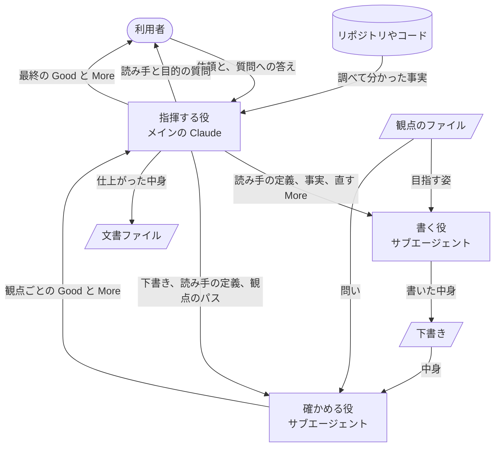
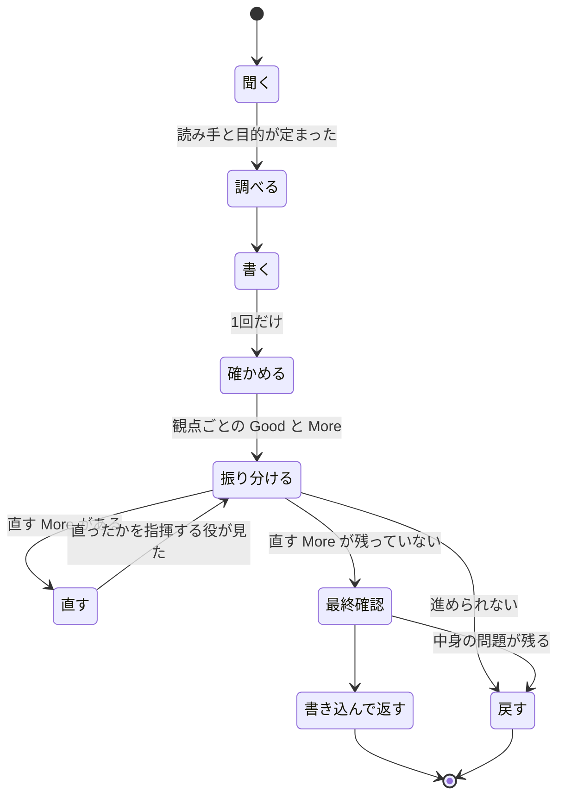
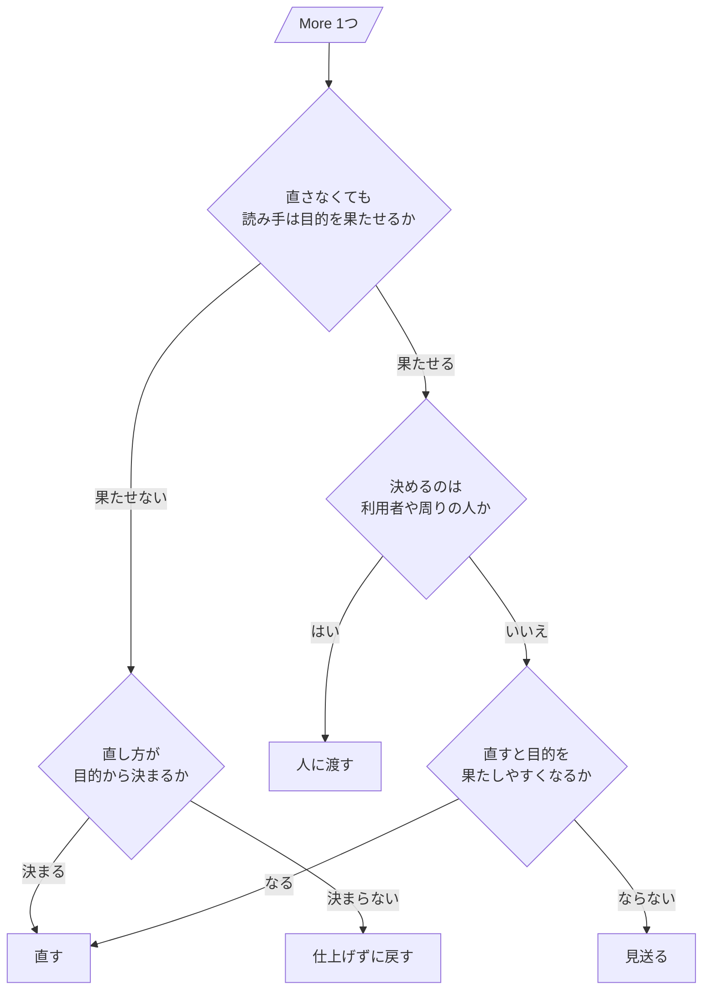

# writ の設計

writ は、文書を書く役と確かめる役を別々のサブエージェントに分け、次に何をするかは利用者と話しているメインの Claude だけが決めることで、README の姿を実現します。確かめる役は話し合いを知らないまま読み手として読み、指揮する役はその評価を1回だけ受けて、直すかどうかを目的に照らして自分で決めます。


```mermaid
flowchart TD
  U([利用者])
  C[指揮する役<br/>メインの Claude]
  R[(リポジトリやコード)]
  E[/観点のファイル/]
  W[書く役<br/>サブエージェント]
  K[確かめる役<br/>サブエージェント]
  D[/下書き/]
  F[/文書ファイル/]
  U -->|依頼と、質問への答え| C
  C -->|読み手と目的の質問| U
  R -->|調べて分かった事実| C
  C -->|読み手の定義、事実、直す More| W
  E -->|目指す姿| W
  W -->|書いた中身| D
  C -->|下書き、読み手の定義、観点のパス| K
  D -->|中身| K
  E -->|問い| K
  K -->|観点ごとの Good と More| C
  C -->|仕上がった中身| F
  C -->|最終の Good と More| U
```

## 迷ったときは、この6つの方針で選びます

- 読み手と目的が定まるまで書かない。

    定まらないまま書くと、確かめる役がどの読み手として読めばよいか分からず、Good も More も測る基準がなくなります。すると評価は一般論の指摘になり、仕上がった文書を利用者が自分で読んで直すことになります。

- 文書を評価する（観点ごとに Good と More を出す）のは、書いていない役だけにする。

    書いた人は、話し合いを知らない状態に戻れないので、読み返しても分かりにくい所を見つけられません。書いた役に評価させると、話し合いを知っている人にしか通じない箇所が、そのまま利用者と読み手に届きます。評価のあとで指揮する役がするのは、直すと決めた More が直ったかを見ることで、文書の評価ではありません。

- 書いていない役の評価は1回だけにし、その後の判断は指揮する役が1か所で下す。

    評価を何度も回すと、本質的でない指摘が続いて終わらず、利用者はいつまでも文書を受け取れません。判断する所が1か所なら、評価と直しのくり返しは「直す More が残っていない」か「進められない」かのどちらかで必ず終わります。

- 目的のためになる直しだけをする。

    目的に関係のない直しは、役立っていた所まで崩し、直すたびに新しい More を生みます。直す文書を渡した利用者から見れば、頼んでいない所まで書き換わります。

- 文章で繕えない中身の問題は、仕上げずに利用者に戻す。

    事実が足りない、方針が決まっていないといった問題を言い回しでぼかすと、文書は仕上がったように見えて届き、読み手は目的を果たせないまま、そのことに気づけません。ここで仕上げるとは、文書をファイルに書き込み、最終の Good と More を返すことです。

- 観点は文書の種類ごとに1ファイルに置き、ほかの文書やプロンプトには写さない。

    写すと、観点を磨くたびに写した先とずれ、書く役が古い写しを目指して書いた文書を、確かめる役が新しい観点で評価します。書く役には直せない More が出続け、利用者には「進められない」が返るか、確かめられていない所が残った文書が届きます。ほかの場所に書くのは、観点のファイルがあることと、誰がどう使うかだけです。

    例外は README の観点の一覧で、各ファイルの冒頭にある読み手の説明を1行ずつ要約しています。利用者が、自分の文書が何で確かめられるかを、writ を使う前に知るために置いています。代償として、観点のファイルの冒頭を変えたら、README のその1行も同じ変更で直します。

## 役は3つで、次に何をするかを決めるのは指揮する役だけです

| | 指揮する役 | 書く役 | 確かめる役 |
| --- | --- | --- | --- |
| 誰か | メインの Claude（利用者と話している本人） | サブエージェント | サブエージェント（書いていない役） |
| 受け取るもの | 利用者との会話、渡された文書、調べた事実 | 読み手の定義、調べた事実、観点のパス、直す More | 下書き、読み手の定義、観点のパス |
| すること | 聞く、調べる、依頼する、More を振り分ける、直した More が直ったかを見る、返す | 観点を目指す姿として読み、書く | 受け取ったことを自分の言葉で言い直し、観点を問いとして上位から答える |
| 決めること | 書き始めるか、More をどうするか、仕上げるか戻すか | 文書の中身と形 | 観点ごとの Good と More |
| 決めないこと | 文書の文面 | 直すかどうか、次に何をするか | 直すかどうか、次に何をするか |

### 指揮する役はメインの Claude でなければなりません

ヒアリングと結果の返却は利用者との会話で行い、Claude Code が自分から writ を使うときは、読み手と目的をその会話から読み取ります。Claude Code のサブエージェントは新しい文脈で始まり、それまでの会話を見ません（公式ドキュメント sub-agents で確認）。そのため、会話を読む役をサブエージェントにすることはできません。

- どの版でも、`/writ:up` のスキルに `context: fork` を付けない。

    付けるとスキルがサブエージェントで動き（公式ドキュメント skills で確認）、指揮する役が会話を読めなくなります。

- どの版でも、`/writ:up` のスキルに `disable-model-invocation: true` を付けない。

    付けると Claude がスキルを自分から読み込めなくなり（公式ドキュメント skills で確認）、Claude Code が文書を書く場面で writ を使えません。Claude が自分から使うかどうかはスキルの説明文で決まるので、説明文には「文書を書く、直す」場面を先頭に書きます。

### 確かめる役が話し合いを知らないことは、ルールでなく作りで守ります

サブエージェントは会話の履歴を見ないので、確かめる役は作りの上で話し合いを知りません。ただし、ふつうのサブエージェントは起動時に、依頼文のほかに CLAUDE.md の全階層と、最近のコミットメッセージを含む git status の写しを受け取ります。fork で呼んだサブエージェントは会話全体を引き継ぎます（いずれも公式ドキュメント sub-agents で確認）。CLAUDE.md には、利用者がこれまでの話し合いで決めたことや書き方の好みが書かれていることがあり、読めば確かめる役は書いた人と同じ前提で読みます。

- どの版でも、確かめる役のエージェント定義に `omitClaudeMd: true` を置く。

    置くと、利用者、プロジェクト、ローカルの CLAUDE.md を読まずに起動します（公式ドキュメント sub-agents で確認）。組織が管理者として配る CLAUDE.md は、置いても読み込まれます。

- どの依頼でも、確かめる役を fork で呼ばない。

    fork は会話全体を引き継ぐので、確かめる役がヒアリングの中身と書いた理由を知ってしまいます。

- どの依頼でも、確かめる役に渡すのは下書き、読み手の定義、観点のパスの3つだけにする。

    ヒアリングの記録、調べた経緯、書く役がそう書いた理由を渡すと、確かめる役は書いた人と同じ前提で読み、分かりにくい所を見落とします。読み手の定義は、読み手として読むために要るので渡します。

代償として、確かめる役には git status の写しに含まれる最近のコミットの件名が見えます（写しの Recent commits に件名が1行ずつ載ることは、メインのセッションで受け取った写しで見ました）。件名そのものに書いた理由が入っていることがあるので、そこから理由が確かめる役に漏れることがあります。それでも受け入れるのは、この写しはプラグインからは切れず、気になる利用者は自分の設定 `includeGitInstructions` で切れるからです（どちらも公式ドキュメント sub-agents で確認）。

確かめる役は、まず受け取ったことを自分の言葉で言い直してから、観点に答えます。言い直しが読み手の定義とずれた所が、読み手にとって分かりにくい所です。上位の問いが満たされないなら下位の問いは省きます。上位が満たされない文書の言葉づかいを直しても、読み手の役に立たないからです。

採らなかった案:

- 書く役に自分で見直させる案は、上の理由で分かりにくい所を見つけられないので採りません。
- 確かめる役に直すかどうかまで決めさせる案は採りません。確かめる役は目的の全体を知らないので、More を字面どおりに直すことになり、役立っている所までやり直します。

### 書く役を分けるのは、指揮する役の頭の中にだけある前提を文書に紛れ込ませないためです

書く役に依頼するとき、指揮する役はヒアリングの結果（読み手の定義、調べた事実）を文字にして渡すことになります。そのため、指揮する役の頭の中にだけある前提が文書に紛れ込みにくくなります。書く役は、観点のファイルに並んだ順に決めて書きます。書く役への決まりは、md で書く、図は mermaid で書く、読み手が定まらなければ指揮する役に問い返す、の3つです。

## 文書は、聞く、書く、確かめる、振り分ける、を経て、仕上がるか利用者に戻ります


```mermaid
stateDiagram-v2
  direction TB
  [*] --> 聞く
  聞く --> 調べる: 読み手と目的が定まった
  調べる --> 書く
  書く --> 確かめる: 1回だけ
  確かめる --> 振り分ける: 観点ごとの Good と More
  振り分ける --> 直す: 直す More がある
  直す --> 振り分ける: 直ったかを指揮する役が見た
  振り分ける --> 最終確認: 直す More が残っていない
  振り分ける --> 戻す: 進められない
  最終確認 --> 書き込んで返す
  最終確認 --> 戻す: 中身の問題が残る
  書き込んで返す --> [*]
  戻す --> [*]
```

入り方は3通りで、違うのは「聞く」だけです。新しく書くときは、読み手と目的に加えて置き場所を聞きます。直すときは、渡された文書を読み、そこから分からないことだけを聞きます。Claude Code が自分から使うときは、会話から分かることは聞きません。「調べる」は、書くのに要る事実がリポジトリやコードにあるときだけ行います。

入口が `/writ:up` の1つなのは、この違いが文書を渡したかどうかと会話の中身だけで決まり、その後の流れが同じだからです。新しく書くコマンドと直すコマンドを分ける案は、違いが「聞く」だけなのに、利用者と Claude が2つの入口を選び分けることになるので採りません。失うのは、利用者がコマンド名で新規か直しかを言い切れることです。

- どの状態でも、仕上げる前の文書は利用者のファイルに書き込まれていない。（提案）

    下書きは、指揮する役が利用者のリポジトリの外の一時的な場所に置き、書き込むか戻すかが決まったら指揮する役が消します。戻すことになったとき、直す途中の文書が元のファイルやリポジトリに残っていると、利用者は仕上がったものと区別できません。

- 読み手が2人いるときは、指揮する役が文書を分けることを利用者に伝え、1つずつこの流れを通す。（提案）

    読み手ごとに基準が違うので、1回の評価で2人分を測ると Good と More が互いに打ち消し合います。

## 振り分けは、読み手が目的を果たせるかどうかを基準にします


```mermaid
flowchart TD
  M[/More 1つ/]
  Q1{直さなくても<br/>読み手は目的を果たせるか}
  Q2{直し方が<br/>目的から決まるか}
  Q3{決めるのは<br/>利用者や周りの人か}
  FIX[直す]
  BACK[仕上げずに戻す]
  SKIP[見送る]
  HAND[人に渡す]
  M --> Q1
  Q1 -->|果たせない| Q2
  Q2 -->|決まる| FIX
  Q2 -->|決まらない| BACK
  Q1 -->|果たせる| Q3
  Q3 -->|はい| HAND
  Q3 -->|いいえ| Q4{直すと目的を<br/>果たしやすくなるか}
  Q4 -->|なる| FIX
  Q4 -->|ならない| SKIP
```

### 書き始めてよいのは、読み手の定義を3行で言えたときです

誰が読むか、読み終えて何を決め何をするか、通して読むか拾い読むか、をそれぞれ1行で言えたら書き始めます。新しく書くときだけ、置き場所も決まっている必要があります。1つでも言えなければ、利用者に聞きます。

### More は1つずつ、直す、見送る、人に渡す、のどれかに振り分けます

- 直すのは、直すと読み手が目的を果たしやすくなり、直し方が目的から決まる More です。

    書く役に直させ、指揮する役がその More が直ったかを観点に照らして見ます。見たときに直しが別の所を崩していれば、それは新しい More になります。「直すたびに新しい More が出る」の More は、ここから出ます。

- 見送るのは、直しても読み手の目的に役立たない More です。

    最終の More として、残した理由をつけて返します。

- 人に渡すのは、利用者やその周りの人が決めることで、決まらなくても文書は目的を果たせる More です。

    空欄などの形で残し、最終の More として、読み手が何に困るかと残した理由をつけて返します。

直さないと目的を果たせず、しかも目的から直し方が決まらない More は、どれにも振り分けず、仕上げずに利用者に戻します。README の担当の欄と期限の違いが、この線です。

### 次のどれかが起きたら、進められないと決めます

- 同じ More がくり返し出る。
- 直すたびに新しい More が出る。
- 合意した文書を変えないと直せない。

進められないときも、仕上げずに利用者に戻し、その More から話を始めます。

代償として、評価のあとの直しは書いていない役の目を通りません。最終の Good と More を場所と根拠つきで利用者に渡すので、利用者が確かめ、必要なら評価をもう一度頼めます。これで受け入れます。

### 最終確認では、指揮する役が観点ごとに Good と More をまとめ直し、仕上げるか戻すかを決めます

直す More が残っていなくなったら、指揮する役は観点ごとに、評価で出た Good が直しで崩れていないかと、残した More をどう振り分けたかを見直し、最終の Good と More にまとめます。崩れた Good があれば、それは直す More として振り分けに戻します。残した More の中に、直さないと目的を果たせず、目的から直し方が決まらないものがあれば、仕上げずに戻します。なければ文書を書き込み、最終の Good と More を返します。

### どの観点を使うかは、観点のファイルの冒頭の読み手で決めます（提案）

`doc.md` はいつも使います。それ以外は、指揮する役が `references/essentials/` にあるファイルの冒頭を読み、書く文書の読み手と目的に合うものを加えます。合うものがなければ `doc.md` だけを使います。スキルに種類の一覧を書かないのは、観点のファイルを足したときに一覧とずれるからです。

## 残るのは、文書ファイルと、返答に添えた最終の Good と More だけです

途中の指摘、直しの経緯、ヒアリングの記録は、どこにも保存しません（提案）。利用者が判断に使うのは最終形だけで、経緯を残すと、それを読む人は今の文書と古い指摘を取り違えます。経緯をファイルに残す案は、この取り違えを招くので採りません。失うのは、後からなぜそう直したかをたどれることです。

| 残るもの | 誰が書くか | 誰が読むか |
| --- | --- | --- |
| 文書ファイル | 指揮する役（新しく書くときはヒアリングで決めた場所、直すときは元のファイル） | 文書の読み手 |
| 最終の Good と More | 指揮する役（返答に添える） | 利用者 |

### 役の間で何を渡すかは、受け手がそのまま動ける形に決めます（提案）

役の間で渡すものは、ずれると受け手が動けなくなるので、形を決めます。

読み手の定義は、指揮する役が書き、書く役と確かめる役が読みます。3行がそれぞれ、確かめる役が言い直しと照らし合わせる基準になります。置き場所は新しく書くときだけ付け、書き込むときに指揮する役が使います。

```text
読み手: チームのエンジニア
読み終えて: どのディレクトリから移すかに合意し、それぞれ担当を引き受ける
読み方: 通して読む
置き場所: docs/migration-plan.md
```

確かめる役の返答は、確かめる役が書き、指揮する役が読みます。

```text
言い直し: 最初に src/api/ を移し、次に src/ui/ に進む計画。担当はまだ決まっていない。
観点: すべての文書 / 読み手が、最初の1文から中身を受け取れるか
  Good: 冒頭の1文で最初に移すディレクトリが分かる
    場所: 3行目  根拠: 合意すべき点を最初に受け取れる
  More: 担当の欄が空いている
    場所: 担当の表  困ること: 自分が何を引き受けるのか分からない
    直し方: 担当を書き入れる
```

- 言い直しは、指揮する役が、読み手の定義とのずれを最初に見るためにあります。
- 観点は、どの問いへの答えかを示し、指揮する役が上位の問いの More から振り分けられるようにするためにあります。
- 場所は、指揮する役が書く役に直させるときにそのまま渡せるよう、下書きの行で示します。
- 根拠は、Good では直すときに何を守るかを、More では指摘が当たっているかを、指揮する役が判断するためにあります。
- 困ることは、More を目的に照らして振り分けるときの材料そのものです。
- 直し方は、直すと決めたときに書く役へ渡す出発点です。直すかどうかは含めません。

利用者に返す最終の Good と More の形は README に示したとおりで、More には直し方の代わりに残した理由が付きます。

## ディレクトリ構成（提案）

```text
ccpm/                          マーケットプレイス lovaizu/ccpm のリポジトリ
├── .claude-plugin/
│   └── marketplace.json       writ の登録を加える
├── LICENSE                    MIT
└── writ/
    ├── .claude-plugin/
    │   └── plugin.json        名前 writ と版
    ├── skills/
    │   └── up/
    │       └── SKILL.md       /writ:up。指揮する役のプロンプト
    ├── agents/
    │   ├── writer.md          書く役
    │   └── checker.md         確かめる役
    ├── references/
    │   └── essentials/
    │       ├── doc.md         すべての文書
    │       ├── readme.md      README
    │       ├── design.md      設計書
    │       └── prompt.md      AI に読ませるプロンプト
    ├── docs/
    │   └── design.md
    ├── README.md
    └── CHANGELOG.md
```

コマンド名 `/writ:up` は、プラグイン名 `writ` とスキルのディレクトリ名 `up` から決まります（公式ドキュメント skills で確認）。プラグインの `agents/` に置いた役は `writ:writer` のようにプラグイン名つきで登録されます（公式ドキュメント sub-agents で確認）。確かめる役には読むための道具だけを許し、文書を書き換えられないようにします。直すかどうかを決めない役が、直せないことを作りで守るためです。下書きはこの構成の中にも利用者のリポジトリにも置かず、その外の一時的な場所に置きます。

writ を使う人が変えてよいのは、書き込み先の文書ファイルだけです。プラグインの中はどこも変えません。作る人と直す人が文書の種類を足すときは、`references/essentials/` にファイルを1つ加え、README の観点の一覧に1行加えます。スキルやエージェントのファイルは変えません。

## README の約束が果たされたかは、どう確かめるか（提案）

どれも、`--plugin-dir` で writ を読み込んだ Claude Code で、README の例と同じような依頼を実際に通して確かめます。役の間のやりとりは、`~/.claude/projects/<プロジェクト>/<セッション>/subagents/` に残る記録から読みます（このディレクトリがあることを実物で確かめただけで、中身の形は未確認）。利用者のゴールに近いものから並べています。

- 仕上がった文書を、利用者が目的のために直す必要がない。

    README 冒頭の約束のためです。外すと、利用者が自分で読んで直す手間が残ります。確かめ方は、writ とは別のサブエージェントに、話し合いを知らせずに読み手の定義と文書だけを渡して言い直させ、あわせて依頼した人が文書を読みます。合格は、言い直しが読み手の定義の「読み終えて」と一致し、読んでも何をすればよいか分からない箇所、同じことを言い換えて繰り返す文、何も言っていない前置きがどれもなく、依頼した人に目的のために直したい箇所がないことです。

- 文章で繕えない中身の問題があると、文書を仕上げずに、その点から話が始まる。

    README の期限の例の約束のためです。外すと、読み手は目的を果たせない文書を受け取ったことに気づけません。確かめ方は、期限が決まっていない計画書を渡して直させることです。合格は、元のファイルが変わっておらず、最初の返答が期限をどうするかの問いであることです。

- 返答には最終の Good と More だけが、場所と根拠つきで付く。

    README の返答の約束のためです。外すと、利用者は全文を読み直さないと判断できず、途中の指摘と今の状態を取り違えます。確かめ方は、上の2つの試走と、担当が決まっていない計画書を新しく書かせる試走の返答を読み、あわせて確かめる役の返答の記録と見比べることです。合格は、どの Good と More にも場所と根拠があり、More に困ることと残した理由があり、確かめる役の記録にあって最終に残らなかった指摘や直しの経緯が返答に含まれないことです。

- 読み手と目的が定まるまで書き始めない。

    README の「書き始めません」の約束のためです。外すと、基準のない評価で仕上がった文書が届きます。確かめ方は、読み手を言わずに依頼すること、直す文書を渡すこと、の2通りです。合格は、前者で書き込みの前に読み手と目的と置き場所を聞き、後者で文書から分かることを聞かないことです。

- Claude Code が文書を書く場面で、頼まれなくても writ を使う。

    README の「自分から使います」の約束のためです。外すと、利用者がコマンドを呼ばない限り、文書の質が上がりません。確かめ方は、`/writ:up` を使わずに、会話の中で README を書くよう頼むことです。合格は、スキルが読み込まれ、会話で読み手と目的が分かっていれば質問せずに書くことです。

- 確かめる役に、書いた理由が渡っていない。

    README の「話し合いを知らない読み手の目」の約束のためです。外すと、評価が書いた人の読み返しと同じになります。確かめ方は、書き方の好みを書いた CLAUDE.md のあるリポジトリで新しく書かせ、記録から確かめる役の起動時の中身と依頼文を読むことです。合格は、確かめる役の定義に `omitClaudeMd: true` があり、fork で呼ばれておらず、依頼文に下書き、読み手の定義、観点のパス以外が入っておらず、その CLAUDE.md の中身が確かめる役に届いていないことです。コミットメッセージが見えることは代償として受け入れているので、合格の条件に入れません。

- 評価と直しのくり返しが、必ず「直す More が残っていない」か「進められない」かで終わる。

    上の約束すべてが、くり返しが終わることを前提にしています。確かめ方は、上のすべての試走の記録で、確かめる役が呼ばれた回数と、最後の返答を数えることです。合格は、どの試走でも確かめる役が1つの文書につき1回だけ呼ばれ、どの試走も文書の書き込みか利用者への戻しで終わり、進められない目安のどれかに当たった試走では利用者に戻っていることです。

諦めたこと: 文書の種類と依頼の組み合わせをすべて通すことはしません。README、設計書、プロンプト、それ以外を1つずつと、上の場面に絞ります。同じ依頼での評価の揺れも、回数を重ねて測ることはしません。
