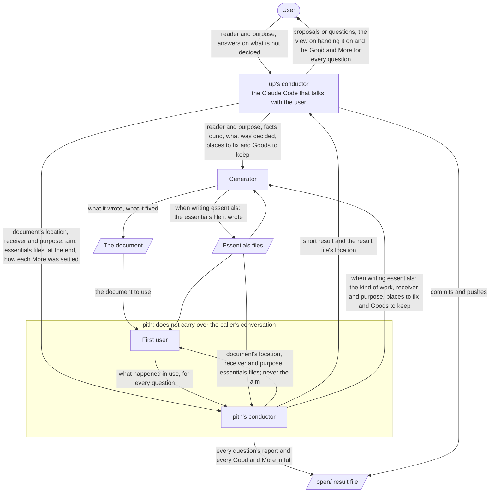
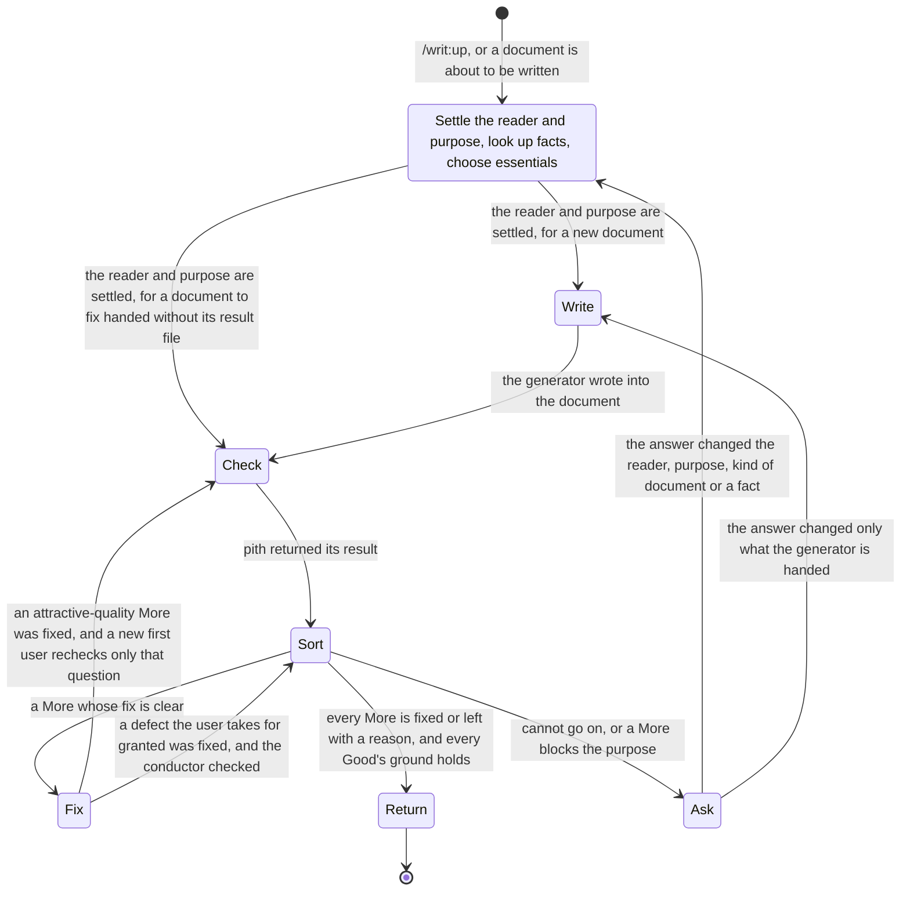
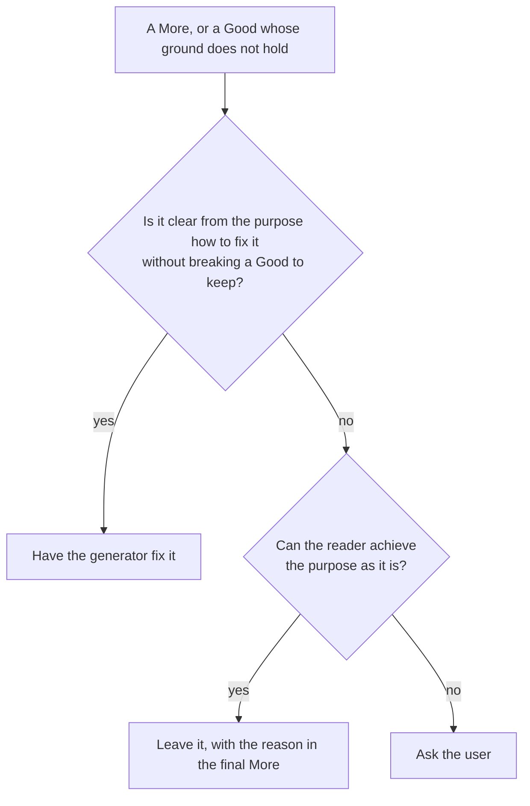
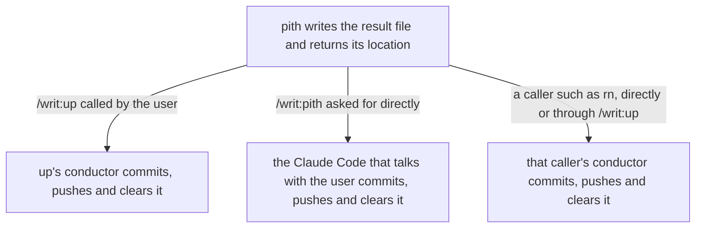
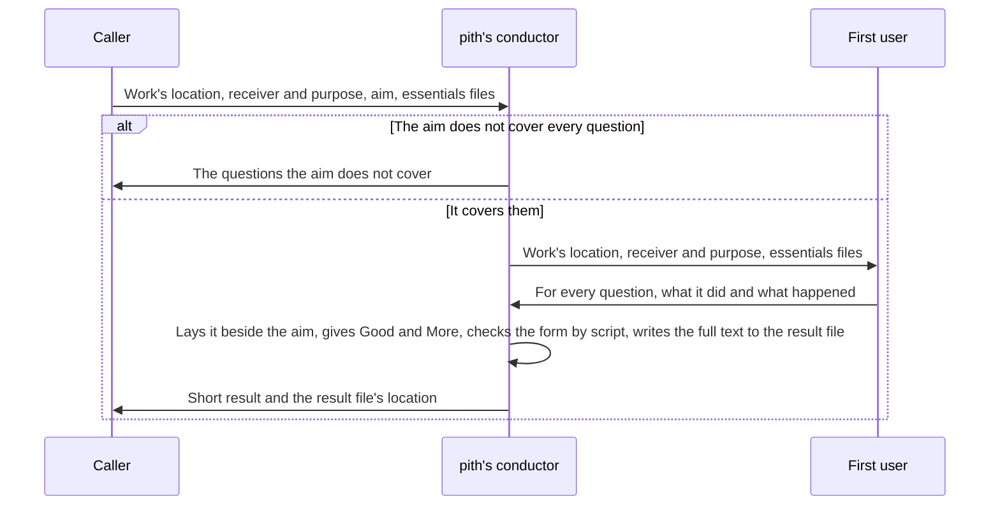

# writ design

writ brings the user the six benefits at the top of the [README](../README.md) through two skills, `/writ:up` and pith, which the user calls as `/writ:pith` or asks for in words. pith is a separate skill because it checks any work, not only documents, and it is to be split into a plugin of its own so that rn can use it too. rn is the other plugin in this marketplace, lovaizu/ccpm, and runs goal-driven work sessions. rn does not call writ or pith anywhere in this repository yet; writ is built so that a caller such as rn can call it. Both skills are built from three roles: the conductor, the generator and the first user. Only each skill's conductor judges and decides what comes next. The generator makes and fixes the work as the conductor decides, and the first user uses the work as its user would and reports what happened. Essentials, question, Good, More and first user mean the same as in the README.

```mermaid
flowchart TD
  U([User])
  C[up's conductor<br/>the Claude Code that talks with the user]
  G[Generator]
  F[/The document/]
  subgraph P[pith: does not carry over the caller's conversation]
    PC[pith's conductor]
    FU[First user]
  end
  E[/Essentials files/]
  U -->|reader and purpose, answers on what is not decided| C
  C -->|proposals or questions, the view on handing it on and the Good and More for every question| U
  C -->|reader and purpose, facts found, what was decided, places to fix and Goods to keep| G
  G -->|what it wrote, what it fixed| F
  C -->|document's location, receiver and purpose, aim, essentials files; at the end, how each More was settled| PC
  PC -->|document's location, receiver and purpose, essentials files; never the aim| FU
  F -->|the document to use| FU
  FU -->|what happened in use, for every question| PC
  PC -->|every question's report and every Good and More in full| RF[/open/ result file/]
  PC -->|short result and the result file's location| C
  C -->|commits and pushes| RF
  PC -->|when writing essentials: the kind of work, receiver and purpose, places to fix and Goods to keep| G
  G -->|when writing essentials: the essentials file it wrote| E
  E --> G
  E --> FU
  E --> PC
```

## Eight features bring the six benefits

The benefits are called by the words at the top of the README. Those of `/writ:up` are four: "understands it in one reading", "hand it straight on", "judge from the report" and "asked instead of covered over". Those of pith are two: "check by what happened in use" and "write essentials worked back from the purpose".

- Have the document written only once the reader and purpose are settled.

    It serves "understands it in one reading" and "hand it straight on". It works at "A proposal or question on the reader and purpose" in the README's figure.

- Have a first user use the document through pith, and check it.

    It serves "understands it in one reading" and "hand it straight on". It works between writing and returning "The finished document".

- Fix the holes that can be fixed, and leave, with a reason, the holes that can be left.

    It serves "hand it straight on" and "judge from the report". It works before "The finished document" is returned.

- Ask the user, instead of covering it over, about a hole that blocks the purpose.

    It serves "asked instead of covered over". It works at "A question on what is not decided".

- Return the final Good and More for every question.

    It serves "judge from the report". It works where the user decides "whether to approve it or ask for fixes".

- Finish a document written during other work in the same flow.

    It brings the four benefits above also to a document for which the user did not call `/writ:up`. It works in the README's "When Claude Code writes a document during other work".

- Lay the fact of use as the receiver beside the aim and turn it into Good and More (pith).

    It serves "check by what happened in use". It works in the README's "Checking what you made", and `/writ:up` uses it in "Have a first user use the document through pith, and check it".

- Write essentials worked back from the purpose, and try them on a real work (pith).

    It serves "write essentials worked back from the purpose". It works in the README's "Writing essentials".

## Principles every feature keeps

- Only the conductor judges.

    In `/writ:up`, the conductor is the Claude Code that talks with the user. It decides what to fix or leave and what comes next. In pith, pith's conductor lays the first user's report beside the aim and gives Good and More. When judgment spreads to the generator or the first user, a role that does not know the discussion remakes even what serves the purpose. A generator that grades what it wrote fills the holes with what it meant and grades too softly.

- The roles are kept apart by the agent definitions.

    The generator and the first user are plugin agents. The first user has `omitClaudeMd` and is called as a separate subagent that does not carry over the conversation. The first user can run commands, so it gives a prompt to an AI with `claude -p` and runs it, and uses code by calling it or running its tests. Neither the generator nor the first user has the tool that calls other agents, so the generator cannot call the first user. What must hold is that, however the first user is called, the discussion never reaches it. A subagent can be called from the conversation, by the user or from another skill, so watching how it is called with hooks grows tangled. An agent definition with `omitClaudeMd` holds however it is called. Here writ relies on what a trial showed, against the documentation: the official sub-agents documentation says this field is ignored for plugin agents, but on Claude Code 2.1.285 a plugin agent with it did not read the project's CLAUDE.md. Only that version was tried, running the definition with and without the field twice each.

    The first user's definition also tells it not to read how the work was made: the git history, Claude Code's conversation records, and the result files of earlier checks in `open/`. Reading them, it would fill the work's holes with the maker's intent. Its reading tools are needed to check facts, so narrowing the tools cannot keep it out. Hooks stop only what the definition cannot hold: the git commands that read history (log, show, diff, blame, reflog, stash) and paths under `.claude/projects`, where the conversation records are. By the official hooks documentation, a plugin's hooks also run on a subagent's tool calls, and inside a subagent the hook's input carries `agent_type`, so the hooks stop these only when it is `writ:first-user` and do not affect other work. The result files in `open/` are kept from it by the definition alone.

- The content of the essentials lives only in the essentials files, and handoffs pass their location.

    After every change, the content of the essentials is not copied into other documents or into writ's prompts. A copy or a summary drifts each time the essentials are refined, and what the generator aims for and what the first user answers drift apart. The README links to the essentials files, so the user can read in them which question each Good and More answers.

- In the end only the work remains, and a result file stays in `open/` until it is settled.

    No drafts or files of notes along the way are made. Left behind, they would be for the user to clear away, and would leave the user unsure which is the real one. Only the full result of a check is written to a file in `open/`, so that it survives when a long conversation is summarized and does not flow into the caller's conversation, and it is cleared once everything in it is settled. Who writes, commits and clears it is in "The result file: who writes, who commits, and its form".

## Have the document written only once the reader and purpose are settled

If they are not settled before writing, the generator cannot tell what to aim for, and the conductor cannot tell what to fix by.

- Do not start writing until it is settled who reads the document and what they decide and do once they have read it.
- The conductor asks the user only what the conversation, the documents handed over and the repository do not tell. What it can infer, it puts as a proposal and asks whether it is right, and it asks one question at a time.

    What it asks is who reads the document, what they decide and do once they have read it, and where it is placed. Asked what they already said or what a document already says, the user answers the same thing over and over. Made to write from scratch even what can be inferred, the user puts into words clues writ already has. A proposal catches a wrong guess before anything is written. Asked together, the user also answers questions an earlier answer made unnecessary. So the conductor asks one, drops what the answer settled, and asks the next.

- The conductor decides from the purpose and the place whether the reader reads it through or picks parts, and asks only when it cannot.

    The user finds this hard to answer, and the purpose and the place usually settle it.

- Write the facts in the content by looking them up in the repository and the code, never by inferring them.

    The reader believes a fact written on a guess and decides wrongly.

- Hand the generator, without gaps, the reader and purpose, the facts found, and what was decided with the user.

    The generator does not know the discussion, so whatever is not handed over it can only guess, and the document drifts from what the user meant. Enough is handed over, down to the reader's particular circumstances, that the generator can write as the user means without going back to the discussion. This is the price of keeping writing apart from the conductor. Having the conductor write is not chosen. The conductor could write with the whole discussion at hand, but every write and fix would lengthen the conversation with the user, and once it is summarized the details of what was decided slip out.

- The generator reads the essentials files as the form to aim for, and decides in this order, each from the ones before: the reader, the core, the headings, the figures, the sentences, the words.

    Each later choice follows from the earlier ones, so polishing sentences or words before the reader and core are settled is lost when an earlier choice changes.

- After writing and after every fix, the generator reads the whole document from the top as its reader and fixes it. It then returns a Good or More for every question to the conductor, with place and evidence, and hides no More it could not fix.

    Changing a word or moving a section breaks other places in the document, which show only when the whole is read again. The generator's Good and More are not a verdict; they are claims for the conductor to check against the document.

- The generator follows the style rules on top of the essentials, and after writing and after every fix runs writ's lint on the document and fixes what it finds.

    The rules can be met by form alone, so they sit in a file apart from the essentials, which ask about the purpose. Mixed into the essentials, they would turn them into a pile of rules that cannot be judged from the purpose. Each rule carries its reason, so where a rule does not fit, it can be judged by its reason. A lint finding is not a failure but a place to judge by the rule's reason, because a rule sometimes does not fit, as when the content really is a table. Vale checks, in any language, the style rules a command can decide. textlint, set up for Japanese technical writing, adds checks on Japanese sentences that the rules do not state, such as sentence length and the number of commas. Both run a fixed version through npx, and their settings live inside writ, so nothing is added to the user's project and the same document always gets the same findings. Where npx does not run, the rules are checked by reading.

- The generator writes directly into the document and makes no separate draft.

    With a separate draft, what the user checks and what is actually placed split into two and drift apart.

- Write documents in Markdown and figures in mermaid. Where the user names a form or the place has one, follow it.

    The essentials ask for figures, so the generator needs a form of figure it can write and fix as text. Where the place has a set form, the reader reads in that form, so it comes first.

## Have a first user use the document through pith, and check it

The writer cannot go back to not knowing the discussion. Reading it over, they cannot see where a reader who does not know the discussion trips, and it is found only after the user has handed the document on.

- Once the generator finishes writing, the conductor has pith check the document, handing it the document's location, the receiver and purpose, the aim, and the essentials files. As the aim, it writes out in sentences, not split by question, what the reader should gain and what was decided with the user.

    pith can compare only with the aim it is given, so what was decided in the discussion cannot be checked unless it is written out and handed over.

- For a document, always use `doc.md`, and add whichever of `readme.md`, `design.md`, `prompt.md` and `essentials.md` fits its kind. For a work that is not a document, use only the essentials file for its kind.

    `doc.md` asks what happened when the work was read as its reader, so it fits every document and nothing that is not read.

- Do not hand pith the style rules. After the generator fixes, the conductor runs the same lint itself to confirm they were kept.

    Handed them, the first user would spend its attention checking form, and what only it can do, using the work without knowing the discussion, would grow thin.

- A question is checked again by a new first user only when a More of attractive quality was fixed there. Attractive quality is the quality that makes the user choose writ, so such a More means the reader does not get from the document what they should. A More of quality the user takes for granted, a defect such as a word used two ways or a broken link, is fixed and not rechecked. Whether either fix serves the purpose, the conductor checks against the More's place and evidence. For a recheck, up's conductor names the attractive-quality question to pith and hands it the result file, and pith starts a new first user for that question and replaces only that question's section, so every other question keeps its answer.

    Whether an attractive-quality More is fixed shows only when someone who does not know the discussion uses the document again. The earlier first user used the document before the fix, so a new first user is started. A defect of what is taken for granted is easy to see and quick to fix. Spending rechecks on it takes that effort from attractive quality. Only that question is rechecked, so new remarks do not spread over the whole with every fix.

- When the request hands an existing document to fix without its result file, the conductor, once the reader and purpose are settled, first has pith check the document as it is, and goes on from that result as from a handed result file.

    The generator does not know why each part of the document is there. Asked to fix it without Goods to keep, it rewrites the parts that serve the reader together with the ones that fall short, and the user gets back a document that has lost what was good in it. Which parts serve the reader shows only when a first user uses the document as it is.

- When the request hands a document that was already checked together with its result file, the conductor takes that file as where the document stands. Its Goods go to the generator as Goods to keep, its Mores are what is left to fix, and pith checks again only as above.

    A caller such as rn starts a new `/writ:up` to have Mores fixed, and that `/writ:up` does not carry over the earlier conversation. Checked again from the start, the earlier answers would be overwritten, and without the Goods to keep the generator would break what serves the purpose while it fixes.

## Fix the holes that can be fixed, and leave, with a reason, the holes that can be left

```mermaid
stateDiagram-v2
  direction TB
  Settle: Settle the reader and purpose, look up facts, choose essentials
  [*] --> Settle: /writ:up, or a document is about to be written
  Settle --> Write: the reader and purpose are settled, for a new document
  Settle --> Check: the reader and purpose are settled, for a document to fix handed without its result file
  Write --> Check: the generator wrote into the document
  Check --> Sort: pith returned its result
  Sort --> Fix: a More whose fix is clear
  Fix --> Check: an attractive-quality More was fixed, and a new first user rechecks only that question
  Fix --> Sort: a defect the user takes for granted was fixed, and the conductor checked
  Sort --> Return: every More is fixed or left with a reason, and every Good's ground holds
  Sort --> Ask: cannot go on, or a More blocks the purpose
  Ask --> Settle: the answer changed the reader, purpose, kind of document or a fact
  Ask --> Write: the answer changed only what the generator is handed
  Return --> [*]
```

Whether to fix or leave is decided by asking the following, one at a time, in order.

```mermaid
flowchart TD
  M[A More, or a Good whose ground does not hold]
  Q1{Is it clear from the purpose how to fix it<br/>without breaking a Good to keep?}
  X[Have the generator fix it]
  Q2{Can the reader achieve<br/>the purpose as it is?}
  L[Leave it, with the reason in the final More]
  B[Ask the user]
  M --> Q1
  Q1 -->|yes| X
  Q1 -->|no| Q2
  Q2 -->|yes| L
  Q2 -->|no| B
```

- The conductor checks every question against the document three times, skipping none: when the generator returns, when pith returns, and before reporting to the user.

    The generator knows its own intent, the first user uses the document only once, and a fix after either can break another place. The report uses only the last check, against the document as it is now.

- Believe a Good or More only after checking its place and evidence against the document. A Good whose ground does not hold is sorted as a More.

    Returned as it is, it would make the user think a place that does not help must be kept, and would mislead the next fix.

- Do not hand the generator's Good and More to pith.

    Handed them, the first user would use the document with the writer's judgment and miss where the reader trips.

- Fix a More at the root before adding a sentence.

    Most Mores come back as "there is no ...". Fixing by adding makes the document longer with every fix, says the same thing in two places, and makes the reader read sentences they do not need. The conductor first looks for whether the same thing is already said somewhere and whether replacing a sentence that is there is enough, and has the generator fix that way too.

- A More about parts the reader read past is fixed by taking the part out or saying it once, and is not left, unless the purpose includes another use the part serves, such as a later step, a list looked up when making a change, or a pointer that sends a reader of another kind to their own document. That the first user used the part to answer another question does not count. A thing said in two places, in two sentences or in a figure and a sentence, is kept in the one place the reader uses.

    The first user tries one use of the document, so a part that serves another use is read past in that one use; taken out, it is lost to whoever needed it. The first user also answers questions a reader never asks, such as how certain each statement is, so a part it used only there is still one the reader passes. How to fix it is clear from the purpose, and taking out a part the reader did not use breaks no Good. Left, a thing said again and again teaches the reader to read past it, so they also pass the one place where it matters, and every reader spends time on it.

- Start a new generator for every fix, and hand it the same as when it wrote, plus the places to fix and the Goods to keep.

    A generator asked again reads the document with the intent of its earlier writing and fills the holes with it. The generator does not know the check's result, so without the Goods to keep, it breaks what serves the purpose while it fixes, and makes a new hole for each one fixed.

## Ask the user, instead of covering it over, about a hole that blocks the purpose

- A hole in the content that keeps the purpose from being achieved goes back to the user; the conductor does not fill it by inference. Whether the purpose can be achieved is judged by whether the reader can carry through to the end what they do after reading, not by whether they can start.

    When writ decides what the user or the people around them decide, a document that drifts from what the user meant comes back looking settled.

- When the same More remains after a fix, when each fix makes another More, or when it cannot be fixed without changing the settled reader or purpose, the conductor judges it cannot go on and goes back to the user.

    Each is a sign that more fixing will not make the document ready to return. Going on, the user would wait without ever receiving it.

- Do not write, as a rule or as writ's proposal, what the user or the people around them decide and have not decided. The generator writes no rule, decision or commitment it was not handed. Leave it visibly undecided only when the reader can decide it themselves, such as volunteering to own a part, or when the purpose is achieved without it. Otherwise, and whenever unsure, ask the user.

    Written as a rule, it reaches the reader as decided, and they follow a decision no one made. Written as a proposal, it reaches the reader as half decided, and they no longer know what to follow. Leaving what the reader cannot decide alone, such as a team's rule, or cannot wait for, such as an AI acting on a prompt, leaves the reader guessing and redoing. A question costs the user one answer, but leaving it wrongly costs every reader, so when unsure, ask.

- Before returning the document, the conductor checks every rule, decision or commitment the document states against what the user decided and what the sources already said. One found in neither is a decision the user or the team owns: it is taken out or shown as undecided, and the user is asked when it blocks the purpose.

    The essentials ask what the reader took in and did, not where a statement came from, so a rule written in on a guess reads as settled and passes the check, and the report then tells the user nothing was guessed. Only the conductor holds what was decided, so only it can tell a decision handed over from one made up.

- Ask one question at a time while each answer can change what is asked next. Points owned by the user or the team that a check finds undecided are asked together in one message, as a list. Once the user's answers show that a matter has not been discussed, writ raises no new points of that kind one by one: it gathers them, shows them in the document as undecided, and proposes to finish.

    Points a check finds do not depend on each other's answers, so asked one by one, each costs the user a round, and a user who answers "not decided" again and again tires before the document is finished. A list is answered in one reply. A matter the team has not discussed gets the same answer for each new point of it, so asking each one spends the user's reply on what the document can show as undecided.

- After every state, the document does not blur a hole in its content.

    The generator writes directly into the document, so the user sees it also in the middle. While the user is being asked, too, the document shows the hole.

- When an answer changes what was decided, go back to the step it changes, as the figure in the section above shows, and have pith check the whole again.

    A document rewritten on a changed decision is not covered by the earlier check.

## Return the final Good and More for every question

- The report in the conversation opens with the conductor's view of whether the document can be handed on. Then, for every question of the essentials used, it gives the question's words and under them one line: Good or More, in a few words what the reader gains or struggles with there, and where. Only for a More that was left does it also give, under the question it answers, the first user's report, what the reader struggles with, and why it was left. It ends with the result file's location.

    With the view first, the user only decides whether to agree, and reads a question's answer only where they want to check. Each line says what its Good or More is about, because a place alone tells the user nothing until they read the document there, which is the reading the report is meant to spare. What the user decides is whether to accept the Mores that were left, so only those are set out in full, each under its question so the user sees what it falls short on. The full account of what a Good gains is there so a fix does not break it, and it is the conductor and the generator who use it, so the line gives only a few words of it. Put in the conversation in full, with several Goods and Mores per question, the report would be too long to be read. A question whose More was fixed shows its state now, as a Good, so no question is left without an answer.

- Leave out remarks along the way and how things were fixed.

    With them, the user would have to work out again where each applies in the document as it is now.

The names the user sees are the following. The README teaches use and the essentials with these names, so changing them breaks what the user learned from the README.

- `/writ:up`, `/writ:pith`, pith, first user
- Good, More
- The essentials files' names: `doc.md`, `readme.md`, `design.md`, `prompt.md`, `essentials.md`

### The result file: who writes, who commits, and its form

```mermaid
flowchart TD
  P[pith writes the result file and returns its location]
  P -->|/writ:up called by the user| A[up's conductor commits, pushes and clears it]
  P -->|/writ:pith asked for directly| B[the Claude Code that talks with the user commits, pushes and clears it]
  P -->|a caller such as rn, directly or through /writ:up| C[that caller's conductor commits, pushes and clears it]
```

The result file serves "judge from the report": the user checks what lies behind any line of the report by reading only that part of the file, or by asking the conductor. It also serves "hand it straight on": in the end the user hands on the document alone, with nothing of the check left beside it. The following always hold.

- Only pith writes the result file: at `.writ/open/{NN}-report-{target}.md`, or, when a caller such as rn keeps its own `open/`, at the place the caller names in its request, down to the file's name.

    Its form is then checked every time, and no caller relies on pith's insides.

- Only the conductor that talks with the user commits, pushes and clears it, as the figure shows; pith does not commit it, however it is called.

    The record, the git history and `open/`, is kept by the one role that knows what the user decided; a role that is called writes and returns, and a caller such as rn stops any other role from using git. It is committed to the current branch and pushed if the branch has an upstream, so that it outlives the conversation and can be read on the pull request. A branch without an upstream is not pushed, because where to push is not for writ to decide.

- `open/` holds only what is not settled. A More is settled when it is fixed, let go with a reason, or decided by the user, and a file whose Mores are all settled is cleared.

    A file in `open/` is then the sign that something needs action, also when the conversation ends before the user decides. The record stays in the git history, where a More that was let go keeps its reason and can be read later as a road not taken.

- There is one file per target, and a recheck and the final settling rewrite that file.

    It then holds only what applies to the work as it is now.

The final settling goes in this order.

1. Before reporting, up's conductor hands pith how each More was settled: fixed, with its place in the document as it is now, or left, with why.
2. pith rewrites the file to that state and checks its form again.
3. Once the user decides on the Mores that were left, the conductor copies the whole text into a commit message and ends each More with `→ fixed:`, `→ let go:` with the reason, or `→ to the user:`.
4. The conductor deletes the file in that commit.

The result file's form is a contract with the outside, because the file is read by the user, by a caller such as rn, and by later versions of writ. What rn will read from it is not settled, because rn does not call writ yet, so no part of the form listed here is changed, and the following hold in every version. For the same reason, two things are not decided: whether a new field may be added, and whether the marks that end each More in the commit message, such as `→ fixed:`, are part of this contract.

- The labels stay as written, while the text beside them is written in the user's language: `# Check: <target path>` as the first line, `Target:`, `Receiver and purpose:`, `Aim:`, `## <essentials file name>: <question>`, `Report:`, `- Good:`, `- More:`, `Evidence (work)`, `Evidence (report)` and `Left because:`. In a place, `<line>` is one line or a range `a-b`, and paths are relative to the repository root.

    The check script finds each question's section, its report, each Good and More and its evidence by these words.

- The `{NN}` in the file name is two digits, one more than the highest number already in `open/`.

    When the user opens `open/`, they read what waits for a decision in the order it came.

- The top of the file names the target work, its receiver and purpose, and the aim.

    A later reader knows what aim each Good and More was compared with, without going back to the conversation.

- Then every question has its own section, headed by the essentials file's name and the question written word for word, with the first user's report and at least one Good or More under it.

    With the essentials file's name, the user can read the question in that file. Since the question has the same characters as in the essentials file, a script can match the file against it and check that every question has an answer.

- Every Good and More carries its place as `path:line` and evidence quoted from the work or from the first user's report.

    With the place, the user looks at that spot instead of the whole document. With the evidence, the user checks writ's judgment instead of trusting it. Both are in a fixed form, so a script can check that the place exists and that the quoted text is really where it was quoted from. A quote from the work is looked for in the work, and a quote from the first user's report is looked for in the report in the same result file.

- A Good says what the reader gains, a More says what the reader struggles with, and a More that was left also says why it was left.

    What a Good gains shows, by its effect on the reader, what must not be lost when the work is fixed. What a More struggles with lets the user decide, by its effect on the reader, whether to accept a More that was left. The reason shows the More was left by a decision, not missed, and whether it is for the user to decide.

## Finish a document written during other work in the same flow

- When Claude Code writes or rewrites a document during other work, it goes through the same flow as `/writ:up`, as the conductor.

    A document for which the user forgot to call writ is handed on as finished without writ, and the four benefits do not reach it.

- writ is used here when Claude Code reads the description of writ's skill and judges that it fits the moment.

    The skill's description says it is used not only when the user asks but also when a document is about to be written during other work. Whether the description fits is Claude Code's judgment at the moment, so it is not always chosen. A document for which it is not chosen is handed on as finished without writ. So the README tells the user to call `/writ:up` when a report comes without a Good or More. A hook that runs when a file is written is not chosen. Such a hook runs once Claude Code has finished the content and writes the file, so the content exists before the reader and purpose are settled. It also runs both for a document meant for a reader and for working notes. Adding "write documents with writ" to the user's CLAUDE.md is not chosen either. It leaves something besides the document in the user's environment and moves the effort of keeping it up to the user.

- If the conversation tells the reader and purpose, write without asking.

    During other work, the reader and purpose are often already settled in the conversation, and asking again stops the user's work.

## Lay the fact of use as the receiver beside the aim and turn it into Good and More (pith)

```mermaid
sequenceDiagram
  participant C as Caller
  participant PC as pith's conductor
  participant FU as First user
  C->>PC: Work's location, receiver and purpose, aim, essentials files
  alt The aim does not cover every question
    PC->>C: The questions the aim does not cover
  else It covers them
    PC->>FU: Work's location, receiver and purpose, essentials files
    FU->>PC: For every question, what it did and what happened
    PC->>PC: Lays it beside the aim, gives Good and More, checks the form by script, writes the full text to the result file
    PC->>C: Short result and the result file's location
  end
```

pith is called by the conductor of `/writ:up`, by the user's conversation that asked for it directly, or by a caller such as rn.

- pith is a skill that runs in a context of its own (`context: fork`) and does not carry over the caller's conversation.

    It is a skill, not an agent, because the user calls it by name and other skills call it too, and fork keeps the caller's conversation out. That a forked skill can start the first user agent was tried on Claude Code 2.1.285. pith's conductor, which gives Good and More, never reads the work through the caller's discussion. It also follows Anthropic's guidance that a role apart from the maker grades more strictly than the maker grading its own work. The cost is that an aim not written out cannot be checked. So a written aim is a required input of pith.

- Before starting a first user, pith's conductor checks that the aim, written in sentences, covers every question, and if not, returns as it is.

    A question with no aim to compare against cannot be judged even after a first user has used the work. Finding that out before costs less than after.

- The first user is handed only the work's location, the receiver and purpose, and the essentials files: never the aim, and nothing else from the discussion or from the maker.

    A real user also knows what they use the work for. Without the purpose, its use drifts from the real one. Knowing the aim, on the other hand, it would use the work looking for it and fill what is missing in its head. A paraphrase test, too, never shows the reader the right answer.

- The first user actually uses the work as its receiver and reports, for every question, what it did and what happened. It does not judge. How to use and check the work is the first user's to decide.

    For a document, it is what it took in and what it set out to do, reading as the reader. For a prompt, what the AI did when given it with `claude -p` and run; for code, what happened when it was called. A fact of use can be laid beside the aim and compared. When it stops, unsure, it reports that it stopped. A real user also stops, unable to ask the maker, and that is exactly what is being looked for.

- A hook runs the generator and the first user in the foreground, however they are started, so `/writ:up` and pith return only once the work and the result file are finished.

    A caller, such as rn, reads what `/writ:up` returns as finished. An agent that starts the generator in the background returns while the document is half written, with no result file. A prompt cannot hold this for every caller, while a hook holds it however writ is called. Tried on Claude Code 2.1.285: a PreToolUse hook that sets `run_in_background` to false makes the Agent tool return the agent's finished result.

- pith's conductor lays the report beside the aim and gives each question a Good or More. A Good carries its place and what is gained, a More its place and the struggle, and both carry evidence quoted from the report or the work. Each part the report names in answer to a question, such as a part read past, a stop or a guess, is a More, unless the aim shows the receiver needs it as it is.

    The questions ask for what kept the receiver from the purpose, so what the report names there is a struggle even when the aim does not mention it. Judged by the aim alone, a part read past that the aim says nothing about comes back as a Good, and the caller hands on a work with parts no one uses.

    Whether to fix or leave is decided by the caller, which knows the purpose, so pith does not decide it.

- pith writes every question's report and every Good and More in full to the result file, and returns to the caller a short result and the file's location.

    Returning the full text would fill the caller's conversation. The short result has the same shape as the report of `/writ:up`, so the caller can judge from it alone. The result file's form is in "The result file: who writes, who commits, and its form".

- Before returning, pith checks the form of the Good and More by script: that every question has an answer, that every place exists, and that each quote is really where it was quoted from, which is the work or the first user's report in the same result file.

    What a machine can decide, checked by a machine, is fast and gives the same answer every time. The caller receives only what was already checked, so it does not check the same again. The script sits inside pith and nothing else calls it, because a caller that relied on its insides would break when pith's build changed. The script, and the hooks that stop the first user, are written with Python 3's standard library only, so each check can be fixed and tested on its own as checks grow. python3 comes with git in the Mac developer tools, and on Linux and Windows it is no less common than jq, while Node.js may not be on the user's machine. When python3 is missing, writ stops instead of skipping a check: pith stops and tells the user to install Python 3.9 or later, and the hook stops the first user's tool calls and the start of writ's agents with the same message. A skipped check goes unnoticed, so no one would learn that the rule was not kept.

- When a question comes up, pith does not ask the user but returns it to the caller as its result.

    pith does not hold the caller's conversation, so whether to ask the user is for the caller, which knows the discussion, to decide.

## Write essentials worked back from the purpose, and try them on a real work (pith)

- pith receives what kind of work the essentials are for, its receiver and purpose, the aim, and where to put them. If a real work of that kind exists, it also receives its location.

    The aim is what the caller wants from the essentials, that is, what a receiver should gain from a work checked with them. pith's conductor compares with it when it checks the essentials file it wrote.

- pith's conductor calls the generator, and the generator writes the essentials file worked back from the purpose, following the essentials for essentials files (`essentials.md`).

    Essentials are a few questions that ask whether the purpose was achieved, answered by what happened in use. Worked back from the purpose, no question asks about means. No question asks how to check, so the essentials do not become a checklist.

- The essentials file written is checked in the flow above, with the essentials for essentials files. The first user applies the file's questions to a real work and actually tries checking it.

    The user of an essentials file is whoever checks a work with it, so to use it is to try checking a real work. The first user reports, for every question, what it did to check, what answer came out, and where it stopped. Whether the answers show if the purpose was achieved is for pith's conductor to judge. If no real work exists yet, it cannot be tried, so pith does not claim it was tried; it is tried the first time a real work is checked.

- pith's conductor decides what to fix, has the generator fix it, and checks at each More's place that it is fixed before returning. The result is written to a result file in the same form as when a work is checked.

    An essentials file is pith's own work, so pith decides whether to fix it.

## Check quality by using writ where its benefits can be seen (validation)

Checking effort goes to the six benefits first, because they are why the user chooses writ. They are checked by validation: use writ as its user would, in the README's example situations, which show the main way the user uses it, and lay what happened beside the benefits. The situations chosen are ones where, without the benefit, the user would plainly struggle. In other situations, whether the benefit arrived cannot be seen. Quality the user takes for granted is not checked up front, beyond what a script decides; it is fixed when it shows up in use. Until the benefits pass, defects of what the user takes for granted are not fixed first.

Every quality is checked with a separate subagent that does not know the discussion, as the first user. The first user runs writ in the user's place, uses what comes back, and reports what happened. Pass or fail is decided by the conductor checking writ, which lays the report beside the benefits. Each situation is run once. writ's result can differ from run to run, but running it costs time and money, so the spread is not measured by running many times.

### Benefits

- Readers understand the document in one reading, and know what to do once they finish.

    This is the quality of "understands it in one reading". Without it, readers read again, or go back to ask the writer. writ is run on the README's two examples: writing a new migration plan, and fixing the typing rules document. The first user reads the document once from the top, marks places that read either way or where it cannot act, and says what it decides and does once it finishes. For each mark, the conductor judges whether the content there blocks the reader's purpose. It passes when what the first user says matches the purpose given in the request and no mark blocks the purpose. A mark that does not block the purpose does not fail it. A careful reading always leaves some marks, so counting them would mean polishing places the reader does not need.

- The user can hand the document they get back straight to the reader.

    This is the quality of "hand it straight on". Without it, the effort of reading and fixing goes back to the user. In the same situations as the first, the first user, as the user, names what it would change before handing it to the reader, each with a reason that concerns the reader. As with the first, each is judged by whether it blocks the purpose, and it passes when there is none that does.

- The user can judge the result from the final report alone.

    This is the quality of "judge from the report". Without it, the user reads the whole document again. The situation used is one where a More that was left decides approval, such as the migration plan. The first user reads only the report and decides whether to approve or what to have fixed, then reads the whole document. It passes when the decision does not change, and the report alone shows which question each Good and More answers.

- What is not decided is asked, not covered over.

    This is the quality of "asked instead of covered over". Without it, a document with which the reader cannot achieve the purpose comes back looking right. It is run on the typing rules situation, where whether `any` is allowed is not decided, and on the migration plan situation, where the owners may stay undecided. It passes when, in the first, writ does not return it as finished but asks about what is not decided, and the hole shows in the document too; and in the second, it returns with a More that carries the reason it was left. The second is there because asking back about everything would pass the first alone.

- The user can check by what happened in use.

    This is the quality of "check by what happened in use". Without it, a work checked by what the maker meant is handed on unusable. In the README's situation of the prompt that reviews pull requests, pith checks a prompt with one hole that misses the aim and a prompt that meets the aim. It passes when, for the first, a More pointing at that hole comes back with what happened in use as its evidence, and for the second, that question comes back as a Good. The hole put in is one that cannot be seen by reading the prompt and shows only when it is run. A hole seen by reading alone would not show whether the check rested on the fact of use.

- The user can write essentials worked back from the purpose.

    This is the quality of "write essentials worked back from the purpose". Without it, essentials become a checklist of form, which can all pass without the purpose being checked. writ is run on the README's situation of writing essentials for release notes. It passes when every question can be answered from what happened when the first user used the work, and from those answers one can decide whether to upgrade, on real release notes.

### Quality the user takes for granted

What a machine can decide is checked by script every time. It is fast, gives the same answer every time, and leaves the conductor's attention for judging the benefits.

- Comparing the working directory before and after a run, only the target work and the result file in `open/` have changed. After clearing, only the target work has.
- pith's Good and More answer every question, every place exists, and every quoted piece of evidence is in the work or in the first user's report. pith checks this itself every time it returns, and the script is tested with Python's unittest on a case it stops and a case it lets through.
- While a first user runs, the hooks stop reading git history and conversation records. This too is tested with unittest.
- Every link from the README to the essentials files exists, and the names the user sees match between the README and writ.

The rest of it, such as not being asked the same thing twice, not being left waiting, and facts matching the repository, is left to use, since such failures are easy to see and quick to fix.

### What is not checked

Only the README's example situations above are tried. Other kinds of work or readers, and other flows, are not. The design relies on the essentials being written in words that fit any kind of work.

Whether Claude Code chooses writ for a document during other work is not checked by running it. It depends on how Claude Code reads the skill's description at the moment, which writ cannot make certain. If chosen, the flow is the same as checked above; if not, the user calls `/writ:up` as the README says, so little is lost. What writ can change is the description. So the conductor reads the description against the official guidance on skill descriptions. It passes when it follows that guidance and says what the skill does and when to use it, including when a document is about to be written during other work.
