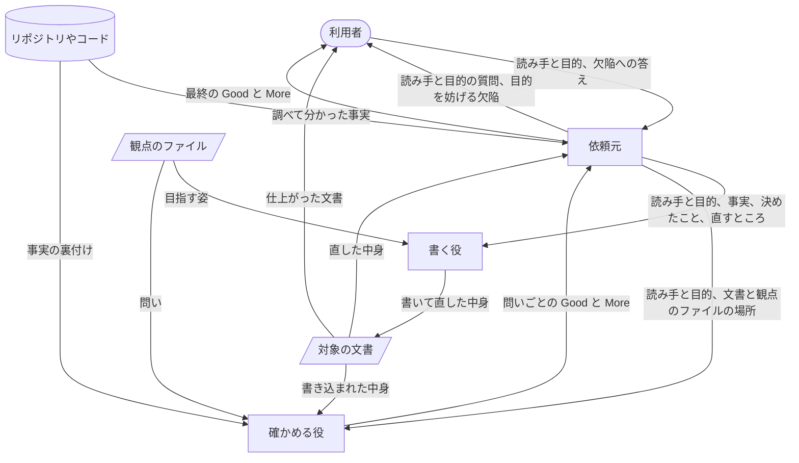
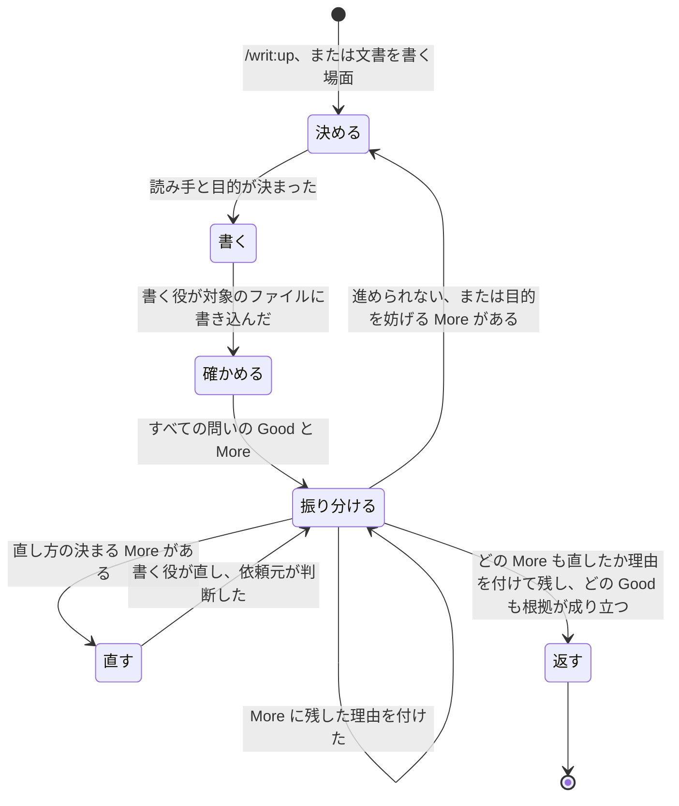
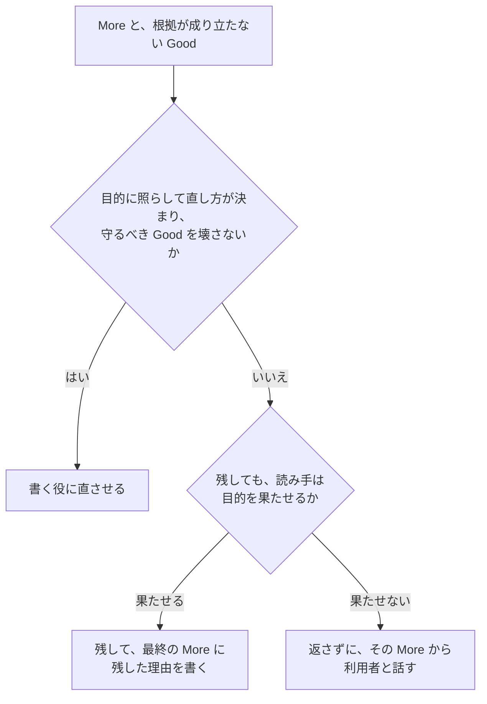
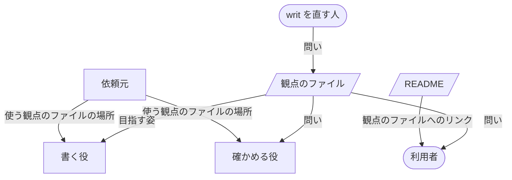

# writ の設計

writ は、利用者が直さずにそのまま読み手へ渡せる文書を返します。そのために、読み手と目的が決まってから書く役に書かせ、話し合いを知らない確かめる役に1回だけ確かめさせ、その結果をどう扱うかは、利用者と話している Claude Code（依頼元）だけが決めます。

確かめる役は、観点のファイルにあるすべての問いに Good と More で答えます。観点のファイルは、文書の種類ごとに、良い文書かを問いの形で並べたものです。Good は目的に役立っていて直すときに壊してはいけないところ、More は足りないところと、それで読み手が何に困るかです。

```mermaid
flowchart TD
  U([利用者])
  R[依頼元]
  S[(リポジトリやコード)]
  W[書く役]
  E[/観点のファイル/]
  F[/対象の文書/]
  K[確かめる役]
  U -->|読み手と目的、欠陥への答え| R
  R -->|読み手と目的の質問、目的を妨げる欠陥| U
  S -->|調べて分かった事実| R
  R -->|読み手と目的、事実、決めたこと、直すところ| W
  E -->|目指す姿| W
  W -->|書いて直した中身| F
  R -->|読み手と目的、文書と観点のファイルの場所| K
  F -->|書き込まれた中身| K
  E -->|問い| K
  S -->|事実の裏付け| K
  K -->|問いごとの Good と More| R
  F -->|直した中身| R
  R -->|最終の Good と More| U
  F -->|仕上がった文書| U
```

## 読み手と目的を先に決め、話し合いを知らない役が1回だけ確かめ、依頼元だけが判断し、欠陥は隠しません

- 読み手と、読み終えて何を決め何をするかが決まるまで、書き始めません。

    文書の良し悪しは読み手と目的に照らして初めて測れます。決まらないまま書くと、書く役は何を目指すかを、依頼元は何を基準に直すかを決められず、利用者が自分で読んで直すことになります。

- 文書を確かめるのは、話し合いも書いた理由も知らない役です。

    書いた者は、話し合いを知らなかった状態に戻れません。だから読み返しても、話し合いを知らない読み手がつまずく箇所が見えず、その箇所は利用者が文書を渡した先で初めて見つかります。

- 直すか残すかは依頼元だけが決め、確かめる役による評価は、読み手と目的を決めてから文書を返すまでの間に1回にします。

    評価を何度も回すと、直すたびに本質的でない指摘が新しく出て終わらず、利用者はいつまでも文書を受け取れません。評価が1回なら、そのあとに続くのは依頼元が直しを判断することだけで、依頼元は、返せるか、これ以上直しても進まないかを自分で決められます。返せるとは、どの More も直したか理由を付けて残し、どの Good も根拠が成り立つことです。だから文書は、返されるか、利用者との話し合いに戻るかのどちらかで必ず止まります。話し合って読み手や目的を決め直したあとは、書き直した文書をもう一度確かめます。文書の土台が変わっているうえ、利用者の決定が間に入るので、指摘が止まらないまま続くことはありません。

- 中身の欠陥は、言い回しで取り繕わず、欠陥のまま示します。

    目的に要る中身が欠けた文書を上手な文で包むと、利用者も読み手も欠陥に気づかないまま使い、読み手は目的を果たせません。

## 利用者が決め、依頼元が頼んで判断し、書く役は書き、確かめる役は答えるだけです

### 利用者は、読み手と目的と、目的を妨げる欠陥の扱いを決めます

- 依頼元が利用者に聞くのは、会話、渡された文書、リポジトリから分からないことだけです。

    聞くのは、誰が読むか、読み終えて何を決め何をするか、どこに置くかです。すでに言ったことや文書から分かることを聞かれると、利用者は同じことを何度も答えることになります。既にある文書を渡されたときは、読み取った読み手と目的を示したうえで、読み取れないことだけを聞きます。Claude Code が作業の途中で自分から writ を使うときも同じで、会話から分かれば聞かずに書きます。

- 通して読むか拾い読むかは、目的と置き場所から依頼元が決め、決められないときだけ聞きます。

    利用者には答えにくい問いで、しかも多くは目的と置き場所から決まるからです。

- 目的を果たせないほどの中身の欠陥は、依頼元が推し量って埋めず、利用者に戻します。

    利用者やその周りの人が決めることを writ が決めると、利用者の意図と違う文書が、決まったことのような顔をして返ります。

### 依頼元は、聞き、調べ、書く役に渡し、直すかどうかを決めます

依頼元は、利用者と話している Claude Code そのものです。書くのと直すのは、別に立てた書く役に任せます。書いて直すやりとりが利用者との会話に入らないので、会話が長くならず、途中で要約されて決めたことの細部が落ちにくくなるからです。依頼元が自分で書く案は採りません。話し合いのすべてを手元に置いて書けますが、書いて直すたびに利用者との会話が長くなり、途中で要約されやすくなります。

- 書く中身の事実は、推し量らず、リポジトリやコードを調べて得ます。

    推し量った事実を書くと、読み手はそれを信じて誤った判断をします。

- 書く役には、読み手と目的、調べて分かった事実、利用者と決めたことを、欠けなく渡します。

    これが書く役を分ける代償です。書く役は話し合いを知らないので、渡されなかったことは推し量って埋めるしかなく、利用者の意図と違う文書になります。渡すのは、読み手の細かな事情まで含め、書く役が話し合いに戻らなくても利用者の意図どおりに書けるだけのものです。

### 書く役は、渡されたものと観点のファイルから、対象のファイルに書いて直します

- 観点のファイルを目指す姿として読み、読み手、要点、見出し、図、文、言葉の順に、前のものから決めます。

    書く役の仕事は文書を良い姿に近づけることなので、問いを満たすべき姿として読みます。後のものは前のものの決定に従うので、読み手や要点が決まる前に文や言葉を磨いても、前のものを変えたときに無駄になります。

- 対象のファイルに直接書き、下書きを別に作りません。

    下書きを別に作ると、利用者が確かめる物と実際に置かれる物が2つになって食い違いが起き、片付けるべきファイルが利用者の環境に残ります。既にある文書を直すときも、元のファイルに書き込みます。

- 文書は Markdown、図は mermaid で書き、利用者の指定や置き場所の形式があればそちらに従います。

    すべての文書の観点が図を求めるので、書く役が文字として書いて直せる図の形式が要ります。置き場所に決まった形式があるなら、読み手はその形式で読むので、そちらを優先します。

### 確かめる役は、話し合いを知らないまま問いに答え、何も決めません

- どの受け渡しでも、確かめる役が手にするのは、対象の文書、読み手と目的、観点のファイル、文書が語るリポジトリやコードだけです。

    読み手と目的とは、誰が読むか、読み終えて何を決め何をするか、通して読むか拾い読むかです。話し合い、書いた理由、前の版やその差分は渡しません。1つでも渡ると、確かめる役は書き手の意図で文書の欠けを補って読み、読み手がつまずく箇所を見落とします。今の会話を引き継いで立てた役を確かめる役にしても、同じことが起きます。

- 最初に、読み手、読み手がすべきこと、文書の要点を、自分の言葉で言い直します。

    書き手の意図と言い直しとのずれは、書いた者には見えない分かりにくさそのものです。依頼元は、言い直しを話し合いで決めたことと比べ、ずれていればそこを More として扱います。

- 使う観点のファイルにあるすべての問いに、Good と More の一方か両方で答えます。

    確かめる役の仕事は文書の今の状態を答えることなので、観点のファイルを問いとして読みます。読み手や要点が崩れていたら見出しから後の問いに答えない、という案は採りません。答えのない問いがあると、依頼元は直すときに壊してはいけない箇所を知らず、利用者への返答にもその問いの答えが欠けます。

- 直すかどうかも、次に何をするかも決めません。

    確かめる役は話し合いを知らないので、その指摘を字面どおりに受けて直すと、目的に役立っている部分まで作り直すことになります。

## 文書は、決める・書く・確かめる・振り分ける・直すと進み、返るか利用者との話し合いに戻ります

```mermaid
stateDiagram-v2
  direction TB
  [*] --> 決める: /writ:up、または文書を書く場面
  決める --> 書く: 読み手と目的が決まった
  書く --> 確かめる: 書く役が対象のファイルに書き込んだ
  確かめる --> 振り分ける: すべての問いの Good と More
  振り分ける --> 振り分ける: More に残した理由を付けた
  振り分ける --> 直す: 直し方の決まる More がある
  直す --> 振り分ける: 書く役が直し、依頼元が判断した
  振り分ける --> 返す: どの More も直したか理由を付けて残し、どの Good も根拠が成り立つ
  振り分ける --> 決める: 進められない、または目的を妨げる More がある
  返す --> [*]
```

- どの状態のあとでも、対象のファイルの中身は、中身の欠陥をぼかしていません。

    対象のファイルに直接書くので、利用者は途中の状態も目にします。進められずに話し合いへ戻るときも、ファイルにあるのは欠陥が見える文書です。

## 振り分けは、読み手が目的を果たせるかで決めます

担当が空欄の移行計画は、読み手が空欄を埋めて担当を引き受けられるので、残して返します。期限のない移行計画は、読み手が期限に合意するという目的を果たせないので、返さずに話し合います。

```mermaid
flowchart TD
  M[More と、根拠が成り立たない Good]
  Q1{目的に照らして直し方が決まり、<br/>守るべき Good を壊さないか}
  X[書く役に直させる]
  Q2{残しても、読み手は<br/>目的を果たせるか}
  L[残して、最終の More に<br/>残した理由を書く]
  B[返さずに、その More から<br/>利用者と話す]
  M --> Q1
  Q1 -->|はい| X
  Q1 -->|いいえ| Q2
  Q2 -->|果たせる| L
  Q2 -->|果たせない| B
```

- Good は1つずつ根拠を文書と照らし、成り立たないものは More として振り分けます。

    成り立たない Good を返すと、利用者は効いていない箇所を守るべきところと信じ、次の直しで判断を誤ります。

- 直した結果は、依頼元が読み手と目的に照らして判断し、確かめる役には戻しません。

    確かめる役にしかできないのは、話し合いを知らずに読むことだけです。直しが目的に合うかは、依頼元のほうがよく分かります。その代わり、評価のあとの直しは、話し合いを知らない目を通りません。それでも最終の Good と More には場所と根拠が付くので、利用者はその箇所を確かめられ、必要なら writ にもう一度渡せます。そのため、この限界を受け入れます。

- 依頼元が直した結果を判断していて、直しても同じ More が残る、直すたびに別の More が生まれる、決めた読み手や目的を変えないと直せない、のどれかに当たったら、進められないと判断します。

    どれも、直しを重ねても返せる状態にならない兆しです。そのまま続けると、利用者は文書を受け取れないまま待つことになります。

## 利用者に返るのは、対象の文書と、問いごとの最終の Good と More だけです

- どの状態のあとでも、利用者の環境に writ が残すのは対象の文書だけです。

    下書きや評価の記録が残ると、利用者が片付けることになり、どれが本物かにも迷います。

- 返答には、使った観点のファイルのすべての問いについて最終の Good と More を添え、途中の指摘や直しの経緯は添えません。

    利用者が承認するのは最終形なので、最終の Good と More があれば、全文を読み直さずに承認か直しの依頼かを決められます。経緯を添えると、それが今の文書のどこに当てはまるかを利用者が確かめ直すことになります。

Good と More に付く項目は、それぞれ利用者の判断を助けるためにあります。

- 観点の名前は、利用者が観点のファイルで問いそのものを読めるようにします。
- 場所は、利用者が全文でなくその箇所だけを見れば済むようにします。
- 根拠は、利用者が writ の判断を信じる代わりに確かめられるようにします。
- More に付く読み手が困ることは、残した More を受け入れるかを読み手への影響で決められるようにします。
- More に付く残した理由は、直さなかったのが見落としでなく判断だと示し、利用者が自分で決めるべきことかを見分けられるようにします。

## 観点は1か所にだけ置き、書く役も確かめる役も同じファイルを読みます

```mermaid
flowchart TD
  M([writ を直す人])
  E[/観点のファイル/]
  R[依頼元]
  W[書く役]
  K[確かめる役]
  D[/README/]
  U([利用者])
  M -->|問い| E
  R -->|使う観点のファイルの場所| W
  R -->|使う観点のファイルの場所| K
  E -->|目指す姿| W
  E -->|問い| K
  D -->|観点のファイルへのリンク| U
  E -->|問い| U
```

すべての文書の観点はいつも使い、README、設計書、AI に読ませるプロンプトなら、その種類の観点を重ねます。種類は、依頼元が置き場所と目的から決めます。

- どの受け渡しでも、観点は要約せず、ファイルの場所で渡します。

    要約を渡すと、要約した役の読み方で問いが変わり、観点のファイルを磨いても古い要約が使われ続けるからです。

- どの変更のあとでも、観点の中身は観点のファイルにだけあり、ほかの文書や writ の指示に写されていません。

    写すと、観点を磨くたびに写しとずれていき、利用者が README から読む観点と、実際に書いて確かめるときに使われる観点が食い違います。

- 利用者に見える名前は、`/writ:up`、Good と More、観点のファイルの名前（`doc.md`、`readme.md`、`design.md`、`prompt.md`）です。

    README がこれらの名前で使い方と観点を伝えているので、変えると利用者が README で覚えたことが通じなくなります。

## 品質は、利用者に届く姿ごとに writ を走らせて試します

どの品質も、利用者の立場で writ を走らせ、返ってきたものを読む人（試す人）が合否を決めます。

- 利用者が、返ってきた文書を直さずに読み手へ渡せる。

    [README](../README.md) の最初の約束で、欠けると、読んで直す手間が利用者に戻ります。観点の種類ごとに、新しく書く場面と既にある文書を直す場面で writ を走らせます。話し合いを知らない人に文書を読ませ、読み終えて何を決め何をするかを言わせます。その答えが依頼したときの目的と一致し、試す人が読み手に渡す前に変えたい箇所を読み手に関わる理由つきで挙げて、1つも残らなければ合格です。

- 利用者は、すでに伝えたことや文書から分かることを聞かれず、読み手と目的が決まらないまま書かれた文書も受け取らない。

    [README](../README.md) の「聞かれたことに答えるだけ」と「分からないときだけ聞く」の約束で、欠けると、同じことを何度も答えるか、的の定まらない文書を受け取ります。読み手を言わずに頼む場面、読み手と目的の分かる文書を渡す場面、会話で読み手と目的が決まったあとに Claude Code が自分から文書を書く場面で走らせます。最初の場面だけ書く前に質問が来て、残りの2つは質問なしに書き始めれば合格です。

- 利用者は、返答の Good と More だけで、承認するか直しを求めるかを決められる。

    [README](../README.md) の Good と More の約束で、欠けると、利用者は全文を読み直すことになります。試す人が返答だけで判断を決め、そのあと全文を読みます。判断が変わらず、すべての場所と根拠が文書と合い、使った観点のファイルのすべての問いに答えがあれば合格です。

- 目的を果たせない中身の欠陥があるとき、利用者は取り繕った文書でなく、その欠陥についての話し合いを受け取る。

    [README](../README.md) の期限の例の約束で、欠けると、読み手が目的を果たせない文書がそれらしく返ります。期限の決まっていない移行計画のように目的に要る中身が欠けた依頼と、担当のように空欄で残せる欠けがある依頼で走らせます。前者では文書を仕上がったものとして返さずに欠けた中身から話し始め、後者では残した理由つきの More とともに返せば合格です。

- 利用者は、文書か、それを妨げている欠陥についての話し合いのどちらかを必ず受け取り、終わらないまま待たされない。

    [README](../README.md) の、聞かれたことに答えれば文書が返るという約束で、欠けると、利用者は何も受け取れないまま待ち続けます。上に挙げたすべての場面に加え、決めた読み手と目的を変えないと直せない欠けを含む依頼で走らせます。どの場面でも、文書と Good と More が返るか、進められない理由から話し合いが始まるかのどちらかで終われば合格です。

- 利用者の環境に、対象の文書のほかは何も残らない。

    欠けると、利用者が片付けることになります。走らせる前と後で作業ディレクトリを比べ、変わったのが対象のファイルだけなら合格です。

試すのは、上に挙げた種類と場面の組み合わせまでです。あらゆる種類の文書や読み手は試さず、観点のファイルが種類を問わない問いで書かれていることに頼ります。README から読む観点と実際に使われる観点が食い違わないことと、利用者に見える名前が変わらないことは、走らせて試しません。どちらも writ を変えたときに起き、走らせて返ってきたものからは見分けにくいので、writ を変える人が変更のたびに観点のファイルと README を見比べて守ります。
