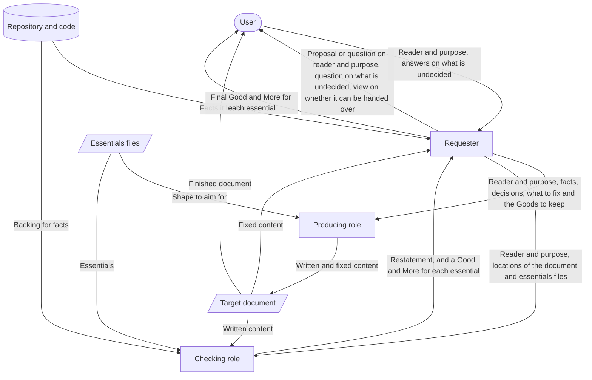
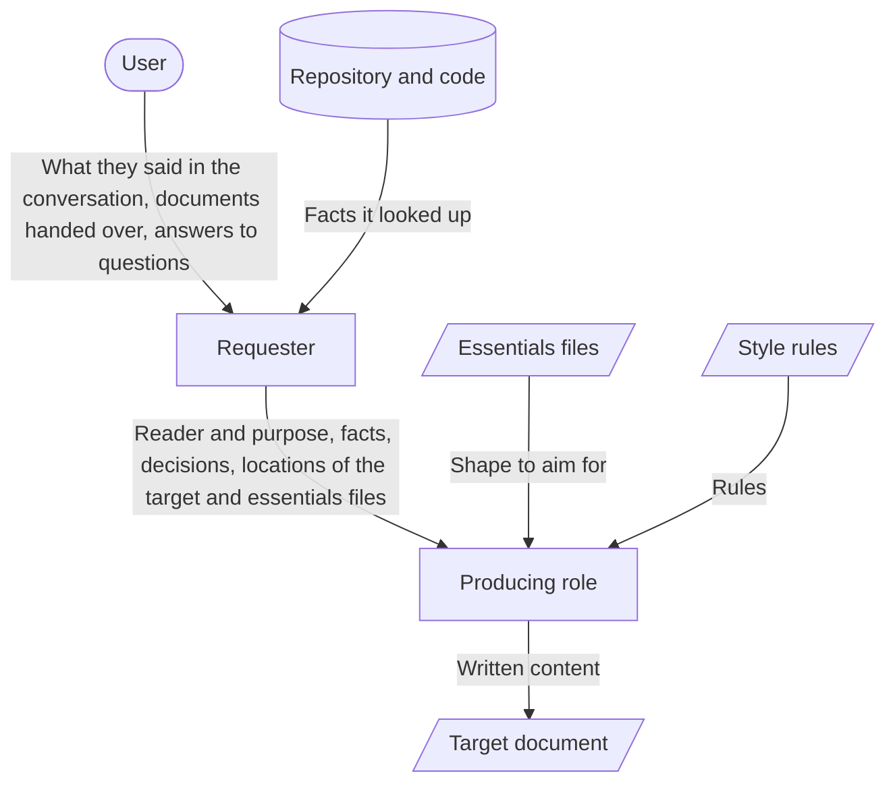
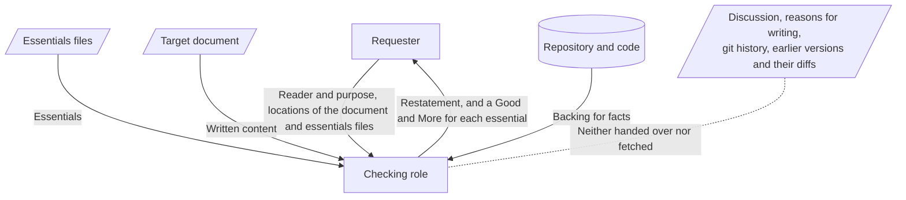
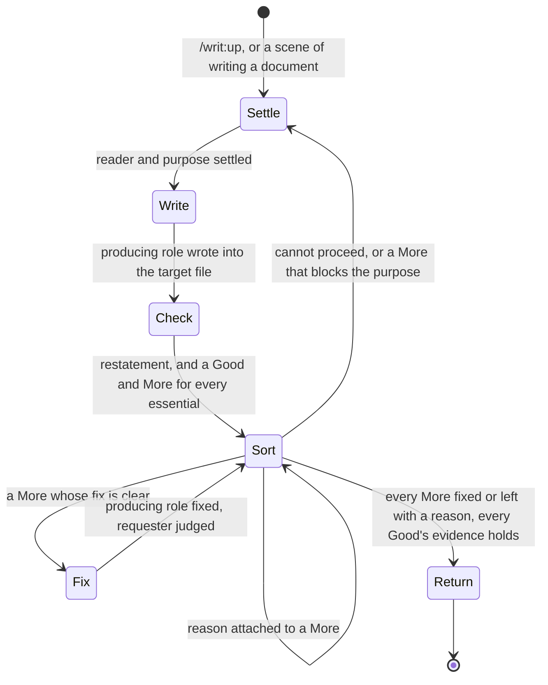
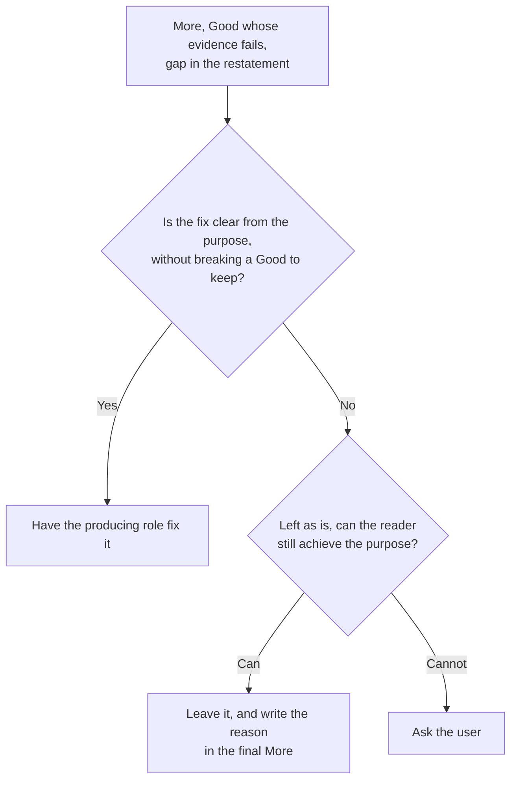

# writ design

writ gives the user the four benefits listed at the top of the [README](../README.md) through six features. The Claude Code that talks with the user is called the requester. Every feature rests on one shape: only the requester judges, and it leaves writing and checking to a producing role and a checking role that it starts inside `/writ:up`. Essential, Good and More mean the same as in the README.

```mermaid
flowchart TD
  U([User])
  R[Requester]
  S[(Repository and code)]
  E[/Essentials files/]
  W[Producing role]
  F[/Target document/]
  K[Checking role]
  U -->|Reader and purpose, answers on what is undecided| R
  R -->|Proposal or question on reader and purpose, question on what is undecided, view on whether it can be handed over| U
  S -->|Facts it looked up| R
  R -->|Reader and purpose, facts, decisions, what to fix and the Goods to keep| W
  E -->|Shape to aim for| W
  W -->|Written and fixed content| F
  R -->|Reader and purpose, locations of the document and essentials files| K
  F -->|Written content| K
  E -->|Essentials| K
  S -->|Backing for facts| K
  K -->|Restatement, and a Good and More for each essential| R
  F -->|Fixed content| R
  R -->|Final Good and More for each essential| U
  F -->|Finished document| U
```

## Six features give the four benefits

The benefits are named by the README's opening words — "understood in one reading", "handed over as it is", "judged from the report", "asked instead of glossed over" — and the stage where each feature works is named by the words of the README's diagram.

- Settle the reader and purpose before having it written.

    A feature for "understood in one reading" and "handed over as it is"; it works at the stage where the user answers "a proposal or a question about the reader and purpose".

- Have a role that does not know the discussion check once for each set of decisions made with the user.

    A feature for "understood in one reading" and "handed over as it is"; it works between the user's answer and the user receiving the "finished document".

- Fix the gaps that can be fixed, and leave, with a reason, the gaps that can be left.

    A feature for "handed over as it is" and "judged from the report"; it works before the user receives the "finished document".

- Ask the user about a gap that blocks the purpose, without covering it up.

    A feature for "asked instead of glossed over"; it works at the stage where the user answers "a question about what is undecided".

- Return the final Good and More for each essential.

    A feature for "judged from the report"; it works at the stage where the user decides "whether to approve or ask for fixes".

- Finish a document written in the middle of work by the same flow.

    A feature that gives all four benefits to documents the user does not call `/writ:up` for; it works in the README's "When Claude Code writes a document in the middle of its work".

## Policies that hold across every feature

- Only the requester decides whether to fix or leave, and what to do next.

    If judgment spreads to the producing role or the checking role, the judgment of a role that does not know the discussion redoes parts that serve the purpose, and the user does not get a document they can hand over as it is.

- The producing role and the checking role act only when the requester starts them inside `/writ:up`.

    `/writ:up` starts each role as a subagent and passes it the location of the file holding that role's instructions. The instruction files are read only while writ runs, and there is no entry point that calls a role from outside `/writ:up`. If a role could be called from outside, the producing role would write before the reader and purpose are settled, or a checking role handed the discussion would check, and the user would not get a document they can hand over as it is. Placing the roles as plugin agents is not chosen. The user and Claude Code can call a plugin agent directly, so "use it through `/writ:up`" could only be a rule to follow, not something the shape prevents.

- The content of the essentials lives only in the essentials files, and every handoff passes their location, not a summary.

    After any change, the content of the essentials stays uncopied into other documents and into writ's instructions. Copies and summaries drift each time the essentials are refined, the shape the producing role aims for drifts away from the shape the checking role asks about, and the user no longer gets a document they can hand over as it is. The README links to these files, so the user can read the essentials themselves to see which essential a Good or More answers.

- The only thing writ leaves in the user's environment is the target document.

    After any operation, there are no draft files or check records. Left behind, they would be the user's to clean up, and the user would wonder which is the real document.

## Settle the reader and purpose before having it written

```mermaid
flowchart TD
  U([User])
  R[Requester]
  S[(Repository and code)]
  W[Producing role]
  E[/Essentials files/]
  C[/Style rules/]
  F[/Target document/]
  U -->|What they said in the conversation, documents handed over, answers to questions| R
  S -->|Facts it looked up| R
  R -->|Reader and purpose, facts, decisions, locations of the target and essentials files| W
  E -->|Shape to aim for| W
  C -->|Rules| W
  W -->|Written content| F
```

Writing before they are settled leaves the producing role unable to decide what to aim for, and the requester unable to decide what to fix by.

- Writing does not start until the reader, and what they decide and do when they finish, are settled.
- The requester asks the user only what the conversation, the documents handed over and the repository do not tell, proposes what it can infer and asks whether it is right, and asks one thing at a time.

    What it asks is who reads, what they decide and do when they finish, and where the document goes. Asked what they already said or what the document already tells, the user answers the same thing again and again. Made to write out from scratch even what can be inferred, the user puts into words clues writ already has; as a proposal, a wrong inference shows up before writing starts. Asked several things at once, the user answers questions an earlier answer made unnecessary, so the requester asks one thing, removes what the answer settled, and then asks the next.

- Whether the reader reads straight through or skims is decided by the requester from the purpose and the location, and asked only when it cannot decide.

    The user finds this question hard to answer, and the purpose and the location settle it in most cases.

- The facts in the content are found by looking into the repository and code, not inferred.

    Written as inferred, a fact is trusted by the reader, who then decides wrongly.

- The producing role is given the reader and purpose, the facts looked up, and the decisions made with the user, with nothing missing.

    The producing role does not know the discussion, so whatever it is not given it can only fill by inference, and the document departs from the user's intent. What it is given is enough, down to the reader's particular circumstances, for it to write as the user intends without going back to the discussion. This is the cost of separating writing from the requester. Having the requester write is not chosen. It could write with the whole discussion at hand, but each round of writing and fixing lengthens the conversation with the user, which then gets summarized and tends to lose the details of what was decided.

- The producing role reads the essentials files as the shape to aim for, and decides the reader, the core, the headings, the figures, the sentences and the words in that order, each from the ones before.

    Each later one follows from the decisions of the earlier ones, so polishing sentences or words before the reader and core are settled is wasted once an earlier one changes.

- The producing role follows the style rules on top of the essentials.

    The rules can be met by form alone, so they sit in a file apart from the essentials, which ask from the purpose. Mixed into the essentials, they would turn the essentials into a pile of rules that cannot be judged from the purpose. Kept apart, a rule can be added whenever one is found. Each rule carries its reason, so where a rule does not fit, the producing role can judge by the reason.

- The producing role writes straight into the target file and makes no separate draft.

    A separate draft makes what the user checks and what is actually placed two things that diverge. When fixing an existing document, it writes into the original file too.

- Documents are written in Markdown and diagrams in mermaid, unless the user specifies or the location requires another format.

    The essentials call for diagrams, so the producing role needs a diagram format it can write and fix as text. If the location has a set format, the reader reads in that format, so it takes priority.

## Have a role that does not know the discussion check once for each set of decisions made with the user

```mermaid
flowchart TD
  R[Requester]
  K[Checking role]
  N[/Discussion, reasons for writing,<br/>git history, earlier versions and their diffs/]
  E[/Essentials files/]
  F[/Target document/]
  S[(Repository and code)]
  R -->|Reader and purpose, locations of the document and essentials files| K
  E -->|Essentials| K
  F -->|Written content| K
  S -->|Backing for facts| K
  N -.-|Neither handed over nor fetched| K
  K -->|Restatement, and a Good and More for each essential| R
```

Whoever wrote a document cannot return to not knowing the discussion. So rereading it, they cannot see where a reader who does not know the discussion trips, and those places are first found after the user hands the document over.

- The checking role has only the target document, the reader and purpose, the essentials files, and the repository and code the document speaks of.

    The reader and purpose are who reads, what they decide and do when they finish, and whether they read straight through or skim. Given even one thing more, the checking role fills the document's gaps with the writer's intent and misses where the reader trips. The same happens if a role started by carrying over the current conversation is used as the checking role.

- The style rules are not given to the checking role, and the rules a script can decide are checked by the requester with a script.

    Given the rules, the checking role spends its eye on checking form, and the judgment only it can make, whether the reader can achieve their purpose, grows thin.

- The checking role's instructions name the git history, the discussion and the earlier versions it must not fetch itself, with the reason.

    The reading tools the checking role uses to back facts reach these as they are, so narrowing the tools does not close the boundary. Only what is handed over and what the instructions name can keep it. Knowing the reason, the checking role also avoids other paths that are not named.

- The checking role first restates, in its own words, the reader, what the reader is to do, and the document's core.

    A gap between the writer's intent and the restatement is exactly the unclearness the writer cannot see.

- The checking role answers every essential for the document's kind with a Good, a More, or both.

    An essential left unanswered leaves the requester not knowing which parts must not be broken when fixing, and leaves that essential's answer missing from the report to the user. Skipping the essentials from the headings on when the reader or core is off is not chosen. The check runs only once, so an essential left unanswered there would come back without ever passing an eye that does not know the discussion, even after fixing.

- The checking role spends most of its judgment on whether the reader can get what they should get from the document.

    Only the checking role can read without knowing the discussion, so its eye goes to judging whether the reader can achieve why they read the document.

- The checking role changes no file and decides neither whether to fix nor what to do next.

    The checking role does not know the discussion, so fixing by the letter of its remarks redoes even parts that serve the purpose. If the checking role fixed the document itself, fixes the requester never judged would enter the target document.

- The check runs only once, unless the reader and purpose or the decisions from the discussion change; fixes after it are judged by the requester.

    Checking again after every fix keeps bringing new non-essential remarks, and the user never gets the document. All only the checking role can do is read without knowing the discussion; whether a fix fits the purpose, the requester knows better. In exchange, fixes made after the check do not pass an eye that does not know the discussion. Even so, the final Good and More carry a location and evidence, so the user can check those places and hand the document to writ again if needed. So this limit is accepted. A document rewritten because a decision from the discussion changed is checked again, since the earlier check no longer applies to it. Each recheck has a decision of the user's between, so rechecks go on only as long as the user keeps deciding.

## Fix the gaps that can be fixed, and leave, with a reason, the gaps that can be left

```mermaid
stateDiagram-v2
  direction TB
  [*] --> Settle: /writ:up, or a scene of writing a document
  Settle --> Write: reader and purpose settled
  Write --> Check: producing role wrote into the target file
  Check --> Sort: restatement, and a Good and More for every essential
  Sort --> Sort: reason attached to a More
  Sort --> Fix: a More whose fix is clear
  Fix --> Sort: producing role fixed, requester judged
  Sort --> Return: every More fixed or left with a reason, every Good's evidence holds
  Sort --> Settle: cannot proceed, or a More that blocks the purpose
  Return --> [*]
```

Whether to fix or leave is decided by asking, one at a time, in this order.

```mermaid
flowchart TD
  M[More, Good whose evidence fails,<br/>gap in the restatement]
  Q1{Is the fix clear from the purpose,<br/>without breaking a Good to keep?}
  X[Have the producing role fix it]
  Q2{Left as is, can the reader<br/>still achieve the purpose?}
  L[Leave it, and write the reason<br/>in the final More]
  B[Ask the user]
  M --> Q1
  Q1 -->|Yes| X
  Q1 -->|No| Q2
  Q2 -->|Can| L
  Q2 -->|Cannot| B
```

- If the checking role's restatement departs from what was decided in the discussion, that gap is sorted as a More.
- Each Good's evidence is checked against the document one by one, and a Good whose evidence fails is sorted as a More.

    Returned, a Good whose evidence fails makes the user believe a part that does nothing is one to keep, and misjudge the next fix.

- A More is fixed at its root before any sentence is added.

    Most Mores come back in the form "… is missing", so fixing by adding lengthens the document each time, says the same thing in two places, and makes the reader read sentences they do not need. The requester first looks at whether the same thing is already said somewhere and whether replacing an existing sentence would do, and has the producing role fix it that way too.

- When having the producing role fix, the requester hands over the Goods to keep together with what to fix.

    The producing role does not know the check's results, so without the Goods to keep, it breaks parts that serve the purpose while fixing, and each fix creates another gap.

## Ask the user about a gap that blocks the purpose, without covering it up

- A gap in the content big enough that the purpose cannot be achieved is not filled by the requester's inference; it goes back to the user.

    If writ decides what the user or those around them should decide, a document that departs from the user's intent comes back looking as if it were decided. A document with a gap wrapped in smooth sentences is used by the user and the reader unaware, and the reader cannot achieve the purpose.

- When the same More remains after fixing, each fix creates another More, or a fix needs the settled reader or purpose to change, the requester judges that it cannot proceed and goes back to the user.

    Each is a sign that further fixing will not reach a returnable state. Carrying on leaves the user waiting without ever getting the document. The cycle of fixing is expected to stop at these three signs, but whether the signs can always be told is not checked; the quality "never left waiting without an end" checks it.

- A decision that belongs to the user or those around them is not written into the document as writ's proposal; the document shows it as undecided, and writ's proposal goes in the final More for it.

    Written in as a proposal, it reaches the reader as half decided, so the reader cannot tell what to follow, and the document grows with parts the reader need not read. In the report, the user decides every proposal at once after seeing the document, instead of answering one question after another before it.

- After any state, the content of the target file does not blur a gap in the content.

    The producing role writes straight into the target file, so the user sees intermediate states too. Even when the user is being asked, the file holds a document whose gap is visible.

- Work resumes from the stage that a decision from the discussion changes.

    If the kind of essentials changes, from choosing the essentials again; if the facts change, from looking them up again; if only what is handed to the producing role changes, from rewriting.

## Return the final Good and More for each essential

- The report shows, for every essential of the kinds used, the essential word for word with its final Good and More.

    For an essential whose More was fixed, the fixed current state is given as a Good, so no essential is left unanswered.

- The report opens with the requester's view on whether the document can be handed over as it is, and lists the answers for each essential as its grounds.

    With the view first, the user only decides whether they agree, and reads the answers for each essential only where they want to check the view. With the answers alone, the user has to collect them to work out whether the document can be handed over.

- Remarks from along the way and the history of fixes are not attached.

    Attached, they leave the user checking again where each applies in the current document.

Each item attached to a Good and More is there to help the user judge.

- The name of the essentials file lets the user read the essential in context in that file.
- The location lets the user look at that place only, not the whole document.
- The evidence lets the user check writ's judgment instead of trusting it.
- The gain attached to a Good shows, by its effect on the reader, what must not be lost when fixing.
- The struggle attached to a More lets the user decide, by its effect on the reader, whether to accept a More that was left.
- The reason it was left, attached to a More, shows that leaving it was a judgment, not an oversight, and lets the user tell whether it is theirs to decide.
- The proposal, attached to a More left undecided, lets the user settle it by saying whether it is right.

The names the user sees are `/writ:up`, Good and More, and the essentials file names `doc.md`, `readme.md`, `design.md`, `prompt.md` and `essentials.md`. The README teaches use and the essentials by these names, so changing them breaks what the user learned from the README.

## Finish a document written in the middle of work by the same flow

- When Claude Code comes to write or rewrite a document in the middle of its work, it proceeds as the requester by the same flow as `/writ:up`.

    A document the user forgot to call writ for is handed over as it would be finished without writ, and none of the four benefits reach it.

- writ is used in this scene when Claude Code reads writ's skill description and judges that it fits the scene at hand.

    The skill description says it is used not only when the user asks but also when Claude Code is about to write a document in the middle of its work. Whether Claude Code applies the description is its judgment in the moment, so it will not always be chosen. A document it is not chosen for is handed over as finished without writ, so the README tells the user to call `/writ:up` if no Good and More are attached. A hook that runs on file writes is not chosen. A hook runs when Claude Code has finished making the content and writes it to a file, so the content is made before the reader and purpose are settled, and it runs on every file write, whether a document for a reader or a working note. Adding "write documents with writ" to the user's CLAUDE.md is not chosen either. writ would leave something other than the target document in the user's environment, and the work of keeping it would move to the user.

- If the conversation tells the reader and purpose, it writes without asking.

    In the middle of work, the reader and purpose are often already settled in the conversation, and asking again stops the user's work. Asking only when it cannot tell is the same as when called.

## Qualities are checked against asking Claude Code without writ

What the user would use instead of writ is asking Claude Code for the same document without writ. So the qualities check the four benefits first, against that alternative, as the user and the reader would feel them. Each benefit is run on a case where, without it, the user would visibly lose out. On a case where Claude Code without writ loses nothing, the benefit is not measured, so the case is changed and run again. Until the benefits pass, failures of what the user takes for granted are not fixed first. Those failures are easy to see, so fixing what shows keeps fixing only them, and the benefits never get measured.

For every quality, a person who runs writ in the user's place and reads what comes back decides pass or fail as the tester. Each case runs once. writ's results can change from run to run, but running takes time and money, so the spread is not measured by running many times. Instead, a person who did not write the instructions reads them against the essentials and the design, and traces end to end which role writes what and who reads it. Branches a run hardly passes through are checked by reading too.

### Benefits

- The reader understands the document in one reading and knows what to do when they finish.

    A quality for "understood in one reading"; without it, the reader rereads or goes back to the writer with questions. Run writ and Claude Code without writ on a request whose first words name neither reader nor purpose, with a decision made in the conversation that cannot be read from the repository. Do it for each kind of essentials, in both a scene of writing new and a scene of fixing an existing document. Have a person who does not know the discussion read both documents once from the top, mark each place they wanted to reread, and then say what they decide and do when they finish. It passes if, for writ's document, the answer matches the purpose given in the request and there is no mark, and for the document without writ, the answer departs or there is a mark.

- The user can hand the returned document to the reader as it is, without reading and fixing it themselves.

    A quality for "handed over as it is"; without it, the work of reading and fixing goes back to the user. Run as for the first quality; the tester, as the user, lists the places they would change before handing the document to the reader, each with a reason that concerns the reader. It passes if writ's document has no such place and the document without writ has some.

- The user can judge the result from the report alone, without rereading the whole document.

    A quality for "judged from the report"; without it, the user rereads the whole document. Run on a request where a More that was left sways the decision to approve, such as a migration plan whose owners are undecided. The tester reads only the report, decides whether to approve or which fixes to ask for, then reads the whole document. It passes if the decision does not change and the tester can tell from the report alone which essential each Good and More answers. With Claude Code without writ, the same decision should need the whole document read; if it does not on this request, change the request.

- When something is undecided, the user gets a question about it, not a document that glosses over it.

    A quality for "asked instead of glossed over"; without it, a document with which the reader cannot achieve the purpose comes back looking right, and the user hands it over unaware of the hole. Run on a request that Claude Code without writ would blur or fill by inference, such as typing rules where whether any may be used is undecided, and on a request with a gap that can be left undecided, such as the owners. It passes if, in the first, writ does not return the document as finished but starts by asking about what is undecided, with the gap visible in the target file too, and in the second, it returns with a More that carries the reason it was left. The second is there because asking back about everything would pass the first alone.

- Documents Claude Code writes in the middle of its work also get the four benefits.

    A quality for the feature for documents written in the middle of work; without it, documents the user forgot to call writ for are handed over as finished without writ. Run on a scene where, after the reader and purpose are settled in the conversation, the user has Claude Code write a README without calling `/writ:up`. The design does not promise it is chosen every time, and the README tells what to do when it is not, so what is checked is whether the benefits reach the document when it is chosen. It passes if writ is chosen, starts writing without asking, adds a Good and More for each essential to the report, and the document meets the pass criteria of the first and second qualities. If it is not chosen, run again until it is.

### What the user takes for granted

What a script can decide is checked with a script. It is fast, gives the same answer every time, and leaves the tester's attention for judging the benefits.

- Comparing the working directory before and after the run, only the target file changed.
- Every link from the README to an essentials file reaches a file that exists, and the names the user sees match between the README and writ.
- The report has an answer to every essential of the kinds used.

What a script cannot decide is checked by the tester.

- The user is not asked what they already said or what the document tells.

    Run on a scene where a document whose reader and purpose can be read is handed over; it passes if writ asks only what cannot be read, and proposes what it can infer, asking whether it is right.

- The user always gets either the document or a question about the gap that blocks it, and is never left waiting without an end.

    Run on every scene above, plus a request with a gap that cannot be fixed without changing the settled reader and purpose. It passes if every scene ends either with the document and its Good and More, or with writ starting to ask the user from the reason it cannot proceed.

- The facts written in the document match the repository and code.

    The tester checks each fact in the document against the repository; it passes if nothing disagrees.

### What is not checked

The tests go only as far as the combinations of kinds and scenes listed above. Not every kind of document or reader is tried; this relies on the essentials being worded to fit every kind of document.
