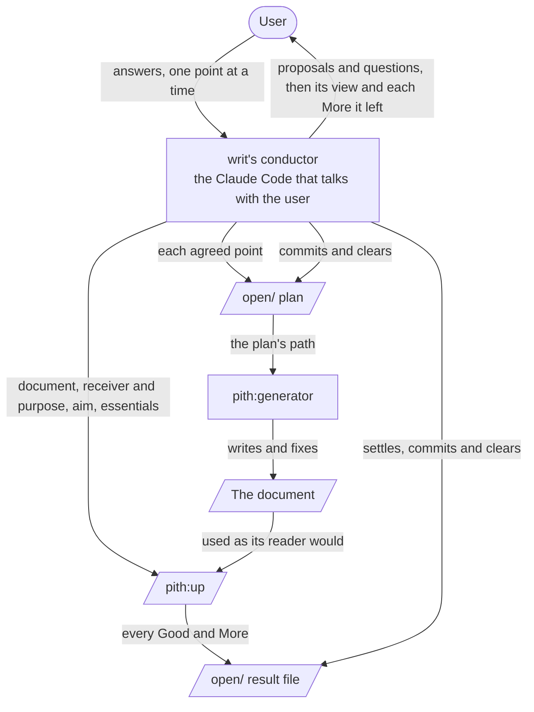

# writ design

writ brings the user the four benefits at the top of the [README](../README.md) through one skill, `/writ:up`, from three roles. writ's conductor, the Claude Code that talks with the user, alone judges and decides what comes next. The generator (`pith:generator`) writes and fixes the document as the conductor decides. The first user, started by pith, uses it as its reader would and reports what happened. The generator, the first user, the essentials, the style rules and the lint are pith's, and how a check runs is in [pith's design](../../pith/docs/design.md): writ keeps only what it hands pith and what it does with the result.


```mermaid
flowchart TD
  U([User])
  C[writ's conductor<br/>the Claude Code that talks with the user]
  PL[/open/ plan/]
  G[pith:generator]
  F[/The document/]
  P[/pith:up/]
  RF[/open/ result file/]
  U -->|answers, one point at a time| C
  C -->|proposals and questions, then its view and each More it left| U
  C -->|each agreed point| PL
  PL -->|the plan's path| G
  G -->|writes and fixes| F
  C -->|document, receiver and purpose, aim, essentials| P
  F -->|used as its reader would| P
  P -->|every Good and More| RF
  C -->|settles, commits and clears| RF
  C -->|commits and clears| PL
```

## Five features bring the four benefits

The benefits are called by the README's words: "understands it in one reading", "hand it straight on", "judge from the report" and "asked instead of covered over".

- Agree with the user on the document's plan before anything is written: serves "understands it in one reading" and "hand it straight on".
- Have a first user use the document once through pith: serves the same two.
- Fix only what stands between the reader and their purpose, and ask the user what the plan does not settle: serves "hand it straight on" and "asked instead of covered over".
- Return a short report of what the user decides: serves "judge from the report".
- Take the same path for a document written during other work: brings all four to a document the user did not call `/writ:up` for.

## Agree on the plan before writing

What the reader gets is settled before writing: who reads it and what they do after, and what each part tells them, in what order and how. Agreed then, a mismatch costs the user one answer; found after writing, it costs a round of writing and checking, and the user waits for each.

- The conductor agrees the plan one point per message and writes each point to `.writ/open/{NN}-notes-{target}.md` as it is agreed. Once all are agreed, it shows the plan as a whole, and writing starts when the user agrees.

    One point per message can be talked through until both see the same thing; asked together, the user answers the one they follow and the rest go by half-decided. Written to a file, the plan outlives a summarized conversation and is what the generator is handed.

- The plan is worked out from what the reader decides and does once they finish: for each, what they need to know, looked up in the repository with its source; then the flow and each section built from those, with its heading in the reader's words, what it tells and how.

    What the user says gives the purpose; what the reader needs to decide well is mostly in the repository, and the user does not think to say it. Left to the generator, the document comes out clean in form and thin in what the reader acts on.

- The conductor asks only what the request and the repository leave open, putting what it can infer as a proposal with why. When the conversation or a caller such as rn has already agreed the whole plan, the conductor writes it down and goes on without asking.

    Asked what is already settled, the user answers the same thing over and learns to answer without reading.

- An existing document is material for the plan, and is written again from the agreed plan rather than patched.

    A document fixed by patching drifts apart where the patches meet; written again from a plan that names what served the reader, it reads as one and keeps those parts.

- The generator is handed paths, never a summary: the plan, the existing document, the essentials files, pith's style rules and lint, and the document's place and language. It writes directly into the document and returns only what it could not settle from what it was handed.

    A summary carries the conductor's reading, and the generator would write from that instead of what was agreed. The conductor does not write the document itself, because every write would lengthen the conversation with the user, and once it is summarized the details of what was decided slip out.

## Check once, and fix only what stands in the way

The writer cannot go back to not knowing the discussion, so where a reader who does not know it trips shows only when such a reader uses the document.

- Before pith runs, the conductor reads the document against the plan and every question, and has what it finds fixed, so the first user meets only what use can show.
- pith is called once, with the document, the reader and purpose, the essentials files (`doc.md`, plus the one for the document's kind and any a caller adds), and the aim: the plan's purpose and what was agreed, in sentences, since pith compares only with what is written out.
- Each More is sorted in this order.

    ```mermaid
    flowchart TD
      M[A More]
      Q1{Can the reader still carry through<br/>what they do after reading?}
      L[Leave it, with the reason]
      Q2{Does the plan tell how to fix it<br/>without breaking a Good?}
      X[Have it fixed, then repeat<br/>what the first user did there]
      B[Ask the user, write the answer to the plan,<br/>and have it fixed from it]
      M --> Q1
      Q1 -->|yes| L
      Q1 -->|no| Q2
      Q2 -->|yes| X
      Q2 -->|no| B
    ```

    Fixing what does not stand in the reader's way only costs the user a wait, and every fix can break what already serves them. A fix is confirmed by repeating what the first user did where it tripped, not by another check: a new first user brings fresh small remarks with every run, and the checking never ends.

- When a caller hands back a document already checked with its result file, the conductor goes on from that file instead of checking again.

    The new `/writ:up` does not carry the earlier conversation; checked again from the start, the earlier answers would be overwritten and the user would wait for a whole check.

- When a More shows something no essentials question asked, it becomes a viewpoint in the plan for this document, and a proposal for pith's essentials in the report.

    Fixed only where it was met, the same gap shows up again elsewhere.

- The document never states, as a rule or as a proposal, what the user or the people around them decide and have not decided; it shows it as undecided, with who decides it.

    Written as a rule, it reaches the reader as decided; written as a proposal, as half decided; either way they follow what no one decided.

## Report only what the user decides

- The report opens with the conductor's view of whether the document can be handed on, then each More left, under the question it answers, with what happened, what the reader struggles with, and why it was left; then any viewpoint proposed for pith's essentials, and the result file's location.

    What the user decides is whether to accept the Mores that were left. A report that grows with the document or the questions is either read whole, spending the time writ was meant to save, or not read at all. Every Good and More stays in the result file.

- Called by the user, the conductor commits the plan and the result file to the current branch, pushes if it has an upstream, and clears both once the user decides: their whole text goes into a commit message, each More ending with `→ fixed:`, `→ let go:` and the reason, or `→ to the user:`, and they are deleted in that commit. Called by a caller such as rn, it leaves both to the caller.

    The record is kept by the one role that knows what the user decided. A file in `.writ/open/` is then the sign that something still waits. A branch without an upstream is not pushed, because where to push is not writ's to decide.

The names the user sees: `/writ:up`, pith, first user, Good, More, and the essentials files' names `doc.md`, `readme.md`, `design.md`, `prompt.md`, `essentials.md`. The README teaches use with these names, so changing them breaks what the user learned.

## A document written during other work

- The skill's description says it is for a document about to be written during other work too, so Claude Code chooses it when the description fits the moment.

    A hook on file writes is not chosen: it runs after the content exists, and for working notes as well as documents. A line in the user's CLAUDE.md is not chosen either: it leaves something in the user's environment for them to keep up. Whether the description fits is Claude Code's judgment, so the README tells the user to call `/writ:up` when a document comes back without a report.

## Validation

The benefits are checked by running writ as its user would, in the README's two stories, and setting what happened beside each benefit; the scenes and when each passes are in `dev/writ/trials/`. What the user spends, waiting and lines read, is measured on the same runs, and the documents are compared, without saying which is which, with those writ 0.1.0 writes in the same story. What a script can decide, that the README's links and names match writ's, is tested in `dev/writ/tests/` on every push.
