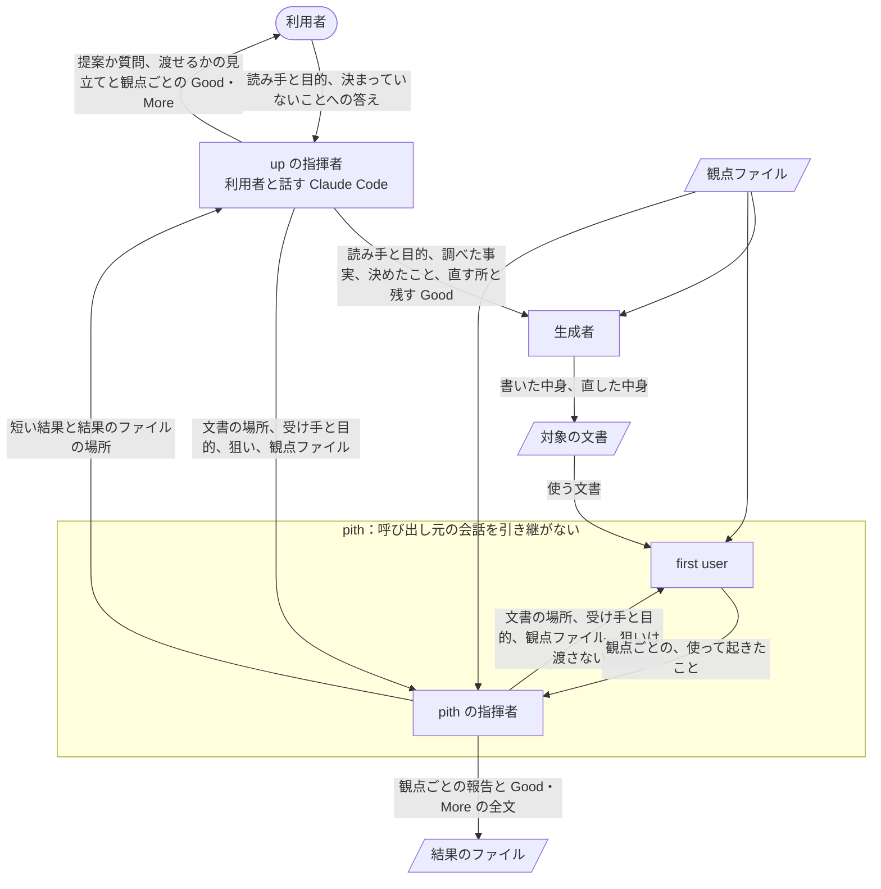
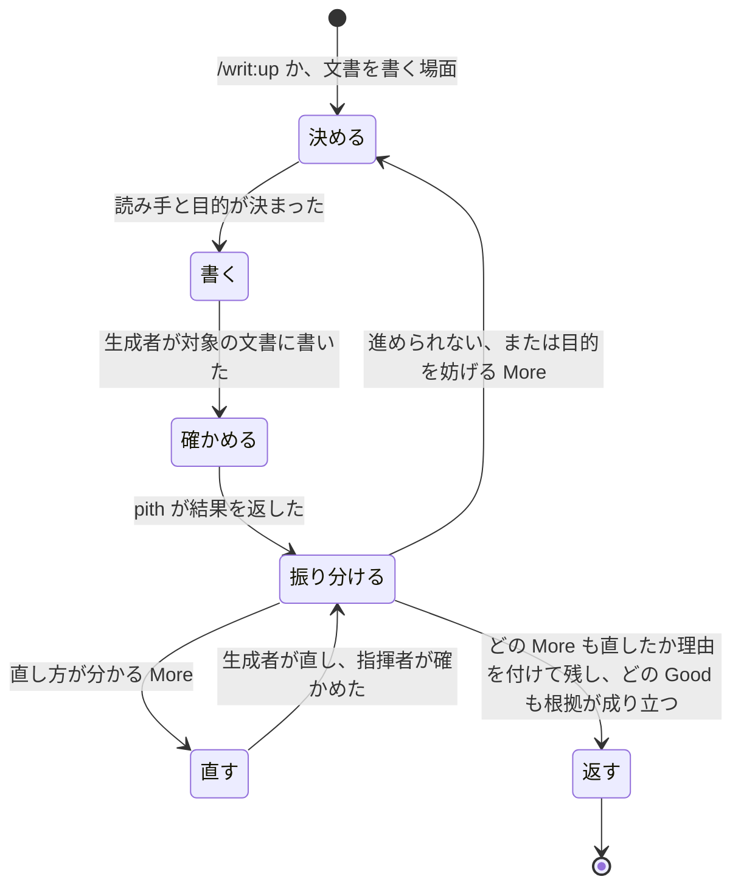
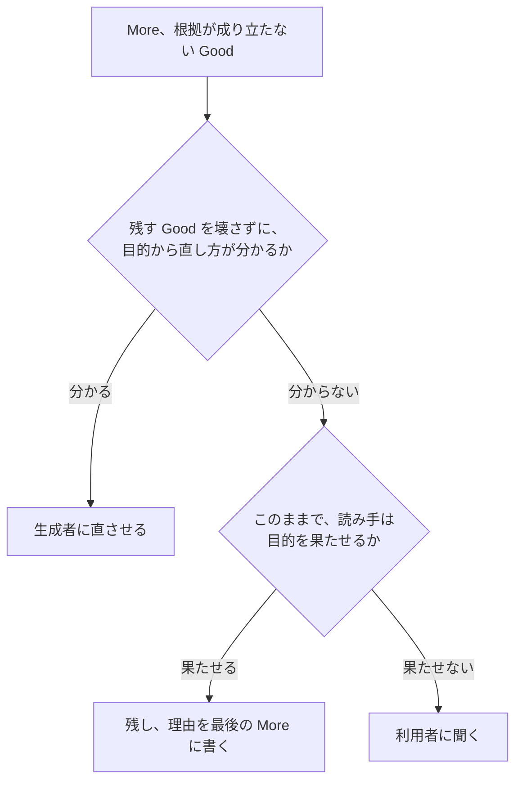
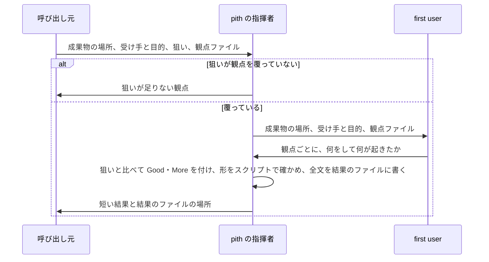

# writ の設計

writ は、[README](../README.md) の冒頭に挙げた6つのベネフィットを、2つのスキルで利用者に届けます。`/writ:up` は文書を書いて仕上げ、pith は成果物を観点で確かめ、観点を作ります。どちらも、指揮者・生成者・first user の3つの役で組みます。判断して次を決めるのは指揮者だけです。生成者は指揮者の決めたとおりに作って直し、first user は成果物を利用者として使って、起きたことを報告します。観点、Good、More、first user の意味は README と同じです。

```mermaid
flowchart TD
  U([利用者])
  C[up の指揮者<br/>利用者と話す Claude Code]
  G[生成者]
  F[/対象の文書/]
  subgraph P[pith：呼び出し元の会話を引き継がない]
    PC[pith の指揮者]
    FU[first user]
  end
  E[/観点ファイル/]
  U -->|読み手と目的、決まっていないことへの答え| C
  C -->|提案か質問、渡せるかの見立てと観点ごとの Good・More| U
  C -->|読み手と目的、調べた事実、決めたこと、直す所と残す Good| G
  G -->|書いた中身、直した中身| F
  C -->|文書の場所、受け手と目的、狙い、観点ファイル| PC
  PC -->|文書の場所、受け手と目的、観点ファイル。狙いは渡さない| FU
  F -->|使う文書| FU
  FU -->|観点ごとの、使って起きたこと| PC
  PC -->|観点ごとの報告と Good・More の全文| RF[/結果のファイル/]
  PC -->|短い結果と結果のファイルの場所| C
  E --> G
  E --> FU
  E --> PC
```

## 8つの機能が6つのベネフィットを生む

ベネフィットは README の冒頭の言葉で呼びます。`/writ:up` のものは「一度読めば分かる」「そのまま渡せる」「報告で判断できる」「ごまかさずに聞かれる」の4つです。pith のものは「使った事実で確かめられる」「目的から逆算した観点を作れる」の2つです。

- 読み手と目的を決めてから書かせる。

    「一度読めば分かる」「そのまま渡せる」のための機能です。README の図の「読み手と目的の提案か質問」で働きます。

- 決めごとの組ごとに1回、pith で first user に使わせて確かめる。

    「一度読めば分かる」「そのまま渡せる」のための機能です。書いてから「仕上がった文書」を返すまでの間に働きます。

- 直せる穴は直し、残せる穴は理由を付けて残す。

    「そのまま渡せる」「報告で判断できる」のための機能です。「仕上がった文書」を返す前に働きます。

- 目的を妨げる穴は、ごまかさずに利用者へ聞く。

    「ごまかさずに聞かれる」のための機能です。「決まっていないことの質問」で働きます。

- 観点ごとの最後の Good・More を返す。

    「報告で判断できる」のための機能です。利用者が「承認するか、直しを頼むか」を決めるところで働きます。

- 作業の途中で書く文書も、同じ流れで仕上げる。

    利用者が `/writ:up` を呼ばなかった文書にも、上の4つを届ける機能です。README の「作業の途中で Claude Code が文書を書くとき」で働きます。

- 受け手として使った事実を、狙いと比べて Good・More にする（pith）。

    「使った事実で確かめられる」のための機能です。README の「作ったものを確かめる」で働き、`/writ:up` の2つ目の機能もこれを使います。

- 観点を目的から逆算して書き、実物で試す（pith）。

    「目的から逆算した観点を作れる」のための機能です。README の「観点を作る」で働きます。

## どの機能でも守る方針

- 判断するのは指揮者だけ。

    `/writ:up` では利用者と話す Claude Code が指揮者です。直すか残すかと、次に何をするかを決めます。pith では pith の指揮者が、first user の報告を狙いと比べて Good・More を付けます。生成者や first user に判断が広がると、話し合いを知らない役の判断が、目的に役立っている所まで作り直します。生成者が自分の書いたものを採点すると、自分の意図で穴を埋めて甘くなります。

- 役は、エージェントの定義で切り離す。

    生成者と first user は、プラグインのエージェントとして置きます。first user には `omitClaudeMd` を付け、会話を引き継がない別のサブエージェントとして呼びます。渡すのは、成果物、受け手と目的、観点ファイルだけです。生成者が使える道具からはほかのエージェントを呼ぶ道具を外し、生成者が first user を呼べないようにします。以前は、利用者や Claude Code が直接呼べてしまうことを理由に、プラグインのエージェントにしない形を選んでいました。しかし守りたいのは、呼べるかどうかではなく、どう呼ばれても話し合いが届かないことです。それを守れるのは、`omitClaudeMd` を付けられるエージェントの定義だけです。

- 観点の中身は観点ファイルにだけ置き、受け渡しでは場所を渡す。

    どの変更のあとも、観点の中身は、ほかの文書や writ の指示に写されていません。写しや要約は観点を磨くたびにずれ、生成者のめざす形と first user の答える問いも離れていきます。README は観点ファイルにリンクしているので、利用者は、Good・More がどの観点への答えかを観点ファイルで読めます。

- 利用者の環境に残すのは、対象の成果物と、その最新の結果のファイルだけ。

    どの操作のあとも、下書きや途中の記録のファイルはありません。残ると利用者が片付けることになり、どれが本物か迷わせます。結果のファイルだけは残します。会話が長くなって要約されても全文が残り、呼び出し元の会話に全文が流れ込まないからです。結果のファイルは対象ごとに1つで、確かめるたびに上書きするので溜まりません。置き場所は、指定がなければ `.writ/` の下で、対象と同じ道筋の名前にします（例：`.writ/docs/migration-plan.md`）。rn のように呼び出し元が自分の記録の場所を持つときは、呼び出し元が置き場所を指定します。コミットするかは利用者が決めます。

## 読み手と目的を決めてから書かせる

書く前に決まっていないと、生成者は何をめざせばよいか決められず、指揮者は何を基準に直すかを決められません。

- 誰が読み、読み終えて何を決めて何をするかが決まるまで、書き始めない。
- 指揮者が利用者に聞くのは、会話・渡された文書・リポジトリから分からないことだけ。推し量れることは提案として出して合っているかを聞き、1つずつ聞く。

    聞くのは、誰が読むか、読み終えて何を決めて何をするか、どこに置くかです。すでに言ったことや文書に書いてあることを聞かれると、利用者は同じことを何度も答えることになります。推し量れることまで一から書かせると、writ がすでに持っている手がかりを言葉にさせることになります。提案なら、推し量り違いが書く前に見つかります。まとめて聞くと、前の答えで要らなくなった質問にも答えさせます。そこで1つ聞き、答えで決まったことを外してから次を聞きます。

- 通して読むか拾い読みするかは、目的と置き場所から指揮者が決め、決められないときだけ聞く。

    利用者には答えにくい質問で、たいていは目的と置き場所で決まります。

- 中身の事実は、推し量らずにリポジトリとコードを調べて書く。

    推し量って書いた事実を読み手は信じ、判断を誤ります。

- 生成者には、読み手と目的、調べた事実、利用者と決めたことを、欠けなく渡す。

    生成者は話し合いを知らないので、渡されなかったことは推し量るしかなく、文書が利用者の意図からずれます。渡す量は、読み手の細かい事情まで含め、話し合いに戻らなくても利用者の意図どおりに書ける量です。これは書くことを指揮者から切り離す代わりに払うものです。指揮者が自分で書く形は選びません。話し合いのすべてを手元に書けますが、書いて直すたびに利用者との会話が長くなり、要約されて決めたことの細部が抜けやすくなるからです。

- 生成者は、観点ファイルをめざす形として読み、読み手、核、見出し、図、文、言葉の順に、前のものから決める。

    後のものは前のものの決定から決まるので、読み手と核が決まる前に文や言葉を磨いても、前のものが変われば無駄になります。

- 生成者は、書いたあとと直すたびに文書全体を頭から読み手として読んで直す。そのうえで、観点ごとの Good・More を場所と根拠を付けて指揮者へ返し、直せなかった More も隠さない。

    言葉を変えたり節を動かしたりすると、文書のほかの所が崩れ、全体を読み直して初めて見えます。生成者の Good・More は判定ではなく、指揮者が文書に照らして確かめるための申告です。

- 生成者は、観点に加えて書き方の決まりに従い、書いたあとと直すたびに、writ に付いている lint を対象の文書で走らせる。

    決まりは形だけで満たせるので、目的から問う観点とは別のファイルに置きます。観点に混ぜると、観点が目的から判断できない決まりの山になります。決まりごとに理由を付けるので、合わない所では理由で判断できます。lint の指摘は失敗ではなく、決まりの理由で判断する場所として扱います。中身が本当に表である場合のように、決まりが合わないこともあるからです。Vale は、どの言語でも、コマンドで決められる書き方の決まりを確かめます。日本語の技術文書向けの設定を入れた textlint は、文の長さや読点の数など、決まりに書いていない日本語の文の確認を足します。どちらも npx で決まった版を動かし、設定は writ の中に置くので、利用者のプロジェクトに何も足さず、同じ文書には同じ指摘が出ます。npx が動かない所では、読んで確かめます。

- 生成者は対象の文書に直接書き、別の下書きを作らない。

    別の下書きがあると、利用者が確かめるものと実際に置かれるものが2つに分かれて、ずれていきます。

- 文書は Markdown で、図は mermaid で書く。利用者の指定か置き場所の決まりがあれば、それに従う。

    観点が図を求めるので、生成者には、文字として書いて直せる図の形が要ります。置き場所に決まった形があれば、読み手はその形で読むので、そちらを優先します。

## 決めごとの組ごとに1回、pith で first user に使わせて確かめる

書いた本人は、話し合いを知らなかった頃に戻れません。読み直しても、話し合いを知らない読み手がつまずく所は見えず、利用者が文書を渡したあとで初めて見つかります。

- 指揮者は、生成者が書き終えたら、pith に、文書の場所、受け手と目的、狙い、観点ファイルを渡して確かめさせる。狙いには、読み手が得るべきものと、利用者と決めたことを書き出す。

    pith は渡された狙いとしか比べられないので、話し合いで決めたことは、書き出して渡さない限り確かめられません。

- 書き方の決まりは pith に渡さず、指揮者が lint で確かめる。

    渡すと first user が形の確認に目を使い、first user にしかできない、話し合いを知らずに使うことが薄くなります。

- 確かめるのは1回だけで、読み手と目的か、話し合いで決めたことが変わったときだけ、確かめ直す。確かめたあとの直しは、指揮者が More の場所と根拠に照らして確かめる。

    直すたびに確かめ直すと、そのたびに本質でない新しい指摘が出て、利用者は文書を受け取れません。代わりに、確かめたあとの直しは、話し合いを知らない目を通りません。それでも最後の Good・More には場所と根拠が付くので、利用者はその場所を確かめ、必要なら writ にもう一度渡せます。決めたことが変わって書き直した文書は、前の確かめが当てはまらないので、確かめ直します。確かめ直しの間には必ず利用者の決定が挟まるので、利用者が決め続ける間だけ続きます。

## 直せる穴は直し、残せる穴は理由を付けて残す

```mermaid
stateDiagram-v2
  direction TB
  [*] --> 決める: /writ:up か、文書を書く場面
  決める --> 書く: 読み手と目的が決まった
  書く --> 確かめる: 生成者が対象の文書に書いた
  確かめる --> 振り分ける: pith が結果を返した
  振り分ける --> 直す: 直し方が分かる More
  直す --> 振り分ける: 生成者が直し、指揮者が確かめた
  振り分ける --> 返す: どの More も直したか理由を付けて残し、どの Good も根拠が成り立つ
  振り分ける --> 決める: 進められない、または目的を妨げる More
  返す --> [*]
```

直すか残すかは、次の順に1つずつ問うて決めます。

```mermaid
flowchart TD
  M[More、根拠が成り立たない Good]
  Q1{残す Good を壊さずに、<br/>目的から直し方が分かるか}
  X[生成者に直させる]
  Q2{このままで、読み手は<br/>目的を果たせるか}
  L[残し、理由を最後の More に書く]
  B[利用者に聞く]
  M --> Q1
  Q1 -->|分かる| X
  Q1 -->|分からない| Q2
  Q2 -->|果たせる| L
  Q2 -->|果たせない| B
```

- 指揮者は、観点のすべてを文書に照らして、1つも飛ばさずに3回確かめる。生成者が返したとき、pith が返したとき、利用者に報告する前。

    生成者は自分の意図を知っていて、first user は1回しか使わず、どちらのあとの直しもほかの所を崩しうるからです。報告には、今の文書に照らした最後の確かめだけを使います。

- Good・More は、場所と根拠を文書に照らしてから信じる。根拠が成り立たない Good は More として振り分ける。

    そのまま返すと、役に立っていない所を残すべき所だと利用者に思わせ、次の直しを誤らせます。

- 生成者の Good・More は pith に渡さない。

    渡すと、first user が書いた側の判断で使い、読み手がつまずく所を見逃します。

- More は、文を足す前に根から直す。

    More の多くは「〜がない」の形で返ります。足して直すと、直すたびに文書が長くなって同じことを2か所で言い、読み手に要らない文を読ませます。指揮者は、同じことがすでにどこかで言われていないか、今ある文を置き換えれば済まないかを先に見て、生成者にもそう直させます。

- 生成者に直させるときは、直す所と一緒に、残す Good を渡す。

    生成者は確かめた結果を知らないので、残す Good がないと、直しながら目的に役立つ所を壊し、直すたびに別の穴ができます。

## 目的を妨げる穴は、ごまかさずに利用者へ聞く

- 目的を果たせないほどの中身の穴は、指揮者が推し量って埋めず、利用者に戻す。果たせるかは、読み手が始められるかではなく、読み終えてすることを最後までやり切れるかで判断する。

    writ が、利用者やその周りの人が決めることを決めると、利用者の意図からずれた文書が、決まったような顔で返ってきます。

- 直しても同じ More が残るとき、直すたびに別の More ができるとき、決めた読み手や目的を変えないと直せないときは、進められないと判断して利用者に戻る。

    どれも、これ以上直しても返せる形にならない印です。続けると、利用者は文書を受け取れないまま待つことになります。

- 利用者やその周りの人が決めることを、writ の提案として文書に書かない。読み手が自分で決められるとき（担当を名乗り出るなど）か、決まらなくても目的を果たせるときだけ、決まっていないと分かる形で残す。それ以外と、迷うときは利用者に聞く。

    提案として書くと、半分決まったものとして読み手に届き、何に従えばよいか分からなくなります。読み手が自分で決められないこと（チームの決まりなど）や、決定を待てないこと（プロンプトで動く AI など）を残すと、読み手は推し量ってやり直すことになります。質問は利用者が1回答えれば済みますが、残し方を誤ると読み手全員が困るので、迷えば聞きます。

- どの状態のあとも、対象の文書は中身の穴をぼかさない。

    生成者は対象の文書に直接書くので、利用者は途中の状態も目にします。利用者に聞いている間も、文書は穴が見える形です。

- 話し合いで決めたことが変わったら、それが変える段階からやり直す。

    観点の種類が変われば観点を選ぶところから、事実が変われば調べるところから、生成者に渡すものだけが変われば書くところからです。

## 観点ごとの最後の Good・More を返す

- 会話での報告は、渡せるかの指揮者の見立てから始める。続けて、使った観点のすべてについて、観点の文言と、Good か More かとその場所を1行ずつ示す。残した More だけは、first user の報告、困ること、残した理由まで示す。最後に、結果のファイルの場所を添える。

    見立てが先にあれば、利用者は同意するかだけを決め、確かめたい所だけ観点ごとの答えを読みます。利用者が決めるのは、残した More を受け入れるかどうかなので、詳しく示すのはそこだけです。Good の得るものは、直すときに壊さないためのもので、使うのは指揮者と生成者です。全部を会話に載せると、観点ごとに Good・More がいくつも付くので、報告が長くなりすぎて読まれません。More を直した観点は、直した今の状態を Good として示すので、答えのない観点は残りません。

- 結果のファイルには、観点ごとの first user の報告と、最後の Good・More のすべてを、場所と根拠付きで書く。

    利用者は、確かめたい所だけファイルで読むか、指揮者に聞けば、Good・More が使った事実にもとづくことを確かめられます。

- 途中の指摘や直した経緯は付けない。

    付けると、利用者は、それぞれが今の文書のどこに当てはまるかを確かめ直すことになります。

結果のファイルの Good・More に付けるものは、どれも利用者の判断を助けるためのものです。

- 観点ファイルの名前で、利用者は観点をそのファイルの中で読めます。
- 場所で、利用者は文書全体でなくその所だけを見られます。
- 根拠で、利用者は writ の判断を信じるのでなく確かめられます。
- Good の得るもので、直すときに失ってはいけないものが、読み手への効き目で分かります。
- More の困ることで、残した More を受け入れるかを、読み手への効き目で決められます。
- More の残した理由で、見落としでなく判断して残したことと、利用者が決めることかどうかが分かります。

利用者が目にする名前は、次のものです。README はこの名前で使い方と観点を教えるので、変えると利用者が README で覚えたことが崩れます。

- `/writ:up`、pith、first user
- Good、More
- 観点ファイルの名前：`doc.md`、`readme.md`、`design.md`、`prompt.md`、`essentials.md`

## 作業の途中で書く文書も、同じ流れで仕上げる

- Claude Code が作業の途中で文書を書いたり書き直したりするときは、`/writ:up` と同じ流れで、指揮者として進める。

    利用者が呼び忘れた文書は、writ なしで仕上がったものとして渡され、4つのベネフィットが届きません。

- この場面で writ が使われるのは、Claude Code が writ のスキルの説明を読み、今の場面に当てはまると判断したとき。

    スキルの説明には、利用者が頼んだときだけでなく、作業の途中で文書を書こうとするときにも使うと書きます。説明を当てはめるかはその場の Claude Code の判断なので、いつも選ばれるとは限りません。選ばれなかった文書は writ なしで仕上がったものとして渡されます。そこで README で、Good・More が付いていなければ `/writ:up` を呼ぶよう伝えます。ファイルを書くときに動く hook は選びません。hook は Claude Code が中身を作り終えてファイルに書くときに動くので、読み手と目的が決まる前に中身ができています。しかも、読み手に向けた文書でも作業メモでも動いてしまいます。利用者の CLAUDE.md に「文書は writ で書く」と足す形も選びません。対象の文書以外のものを利用者の環境に残し、それを保つ手間を利用者に移すからです。

- 会話から読み手と目的が分かれば、聞かずに書く。

    作業の途中では、読み手と目的が会話ですでに決まっていることが多く、聞き直すと利用者の作業を止めます。

## 受け手として使った事実を、狙いと比べて Good・More にする（pith）

```mermaid
sequenceDiagram
  participant C as 呼び出し元
  participant PC as pith の指揮者
  participant FU as first user
  C->>PC: 成果物の場所、受け手と目的、狙い、観点ファイル
  alt 狙いが観点を覆っていない
    PC->>C: 狙いが足りない観点
  else 覆っている
    PC->>FU: 成果物の場所、受け手と目的、観点ファイル
    FU->>PC: 観点ごとに、何をして何が起きたか
    PC->>PC: 狙いと比べて Good・More を付け、形をスクリプトで確かめ、全文を結果のファイルに書く
    PC->>C: 短い結果と結果のファイルの場所
  end
```

呼び出し元は、`/writ:up` の指揮者のことも、pith を直接頼んだ利用者の会話のこともあります。どちらでも、作った側は早く終えたいので、自分の作ったものを甘く採点します。

- pith は、呼び出し元の会話を引き継がない別の文脈（`context: fork`）で動く。

    Good・More を付ける pith の指揮者が、呼び出し元の話し合いで補って読むことがありません。採点は作った側と別の目で行う、という公式の推奨にも沿います。代わりに、書き出されなかった狙いは確かめられません。そのため、狙いを書き出して渡すことを、pith の入力として必須にします。

- pith の指揮者は、first user を動かす前に、狙いがすべての観点を覆っているかを確かめ、足りなければそのまま返す。

    比べる狙いのない観点は、first user に使わせても判定できません。使わせたあとで分かるより、手間がかかりません。

- first user には、成果物の場所、受け手と目的、観点ファイルだけを渡し、狙いは渡さない。

    本物の利用者も、何のために使うかは知っています。目的を知らずに使うと、使い方が本物から外れます。一方、狙いを知ると、それを探しながら使い、足りない所を頭の中で補います。言い換えテストでも、読み手に正解は見せません。

- first user は、成果物を受け手として実際に使い、観点ごとに、何をして何が起きたかを報告する。良し悪しは付けない。どう使って確かめるかは first user が決める。

    文書なら、読み手として読んで何を受け取り、何をしようとしたかです。プロンプトなら AI に渡して動かしたときに AI が何をしたか、コードなら呼んで何が起きたかです。使った事実なら、狙いの横に置いて比べられます。迷って止まったときは、止まったことを報告します。本物の利用者も、作った人に聞けずに止まるので、それこそが見つけたいことです。

- first user のエージェントの定義は、作った経緯に触れないように組み、定義で守れない所だけを hook で止める。

    first user は git の履歴、Claude Code の会話の記録、前の版を読みません。読むと、成果物の穴を作った側の意図で埋めます。読む道具は事実を確かめるのにも要るので、道具を絞るだけでは守れません。そこで、first user が動いているときに、これらを読む道具の使い方を hook で止めます。どのエージェントが動いているかは hook の入力で分かるので、ほかの作業には効きません。

- pith の指揮者は、報告を狙いと比べ、観点ごとに Good・More を付ける。Good には場所と得るもの、More には場所と困ることを付け、どちらにも、報告や成果物から引いた根拠を付ける。

    直すか残すかは、目的を知る呼び出し元が決めるので、pith は決めません。

- pith は、観点ごとの報告と Good・More の全文を結果のファイルに書き、呼び出し元には、短い結果とファイルの場所を返す。

    全文を返すと、呼び出し元の会話がそれで埋まります。呼び出し元が置き場所を指定すれば、そこに書きます。

- pith は、返す前に、Good・More の形をスクリプトで確かめる。すべての観点に答えがあるか、場所が実在するか、根拠として引いた文が成果物に本当にあるか。

    機械で判定できることは機械で確かめれば、速く、毎回同じ答えが出ます。呼び出し元は、確かめ済みのものだけを受け取るので、同じことを確かめ直しません。スクリプトは pith の中に置き、ほかから呼ばせません。呼び出し元が中身に頼ると、pith の作りを変えたときに壊れるからです。

- 質問が出ても、pith は利用者に聞かず、結果として呼び出し元に返す。

    pith は呼び出し元の会話を持たないので、利用者に聞くかどうかは、話し合いを知る呼び出し元が決めます。

## 観点を目的から逆算して書き、実物で試す（pith）

- 受け取るのは、何の成果物の観点か、その受け手と目的、置き場所。その種類の実物があれば、その場所も受け取る。
- 生成者が、観点の観点（`essentials.md`）に沿って、目的から逆算して観点ファイルを書く。

    観点は、目的を達成したかを、使って起きたことで答えさせる少ない問いです。目的から逆算すれば、手段を問う観点は出てきません。どう確かめるかを問いにしないので、観点はチェックリストになりません。

- 書いた観点ファイルは、上の流れで、観点の観点を使って確かめる。first user は、観点ファイルの問いを実物に当てて、実際に確かめてみる。

    観点ファイルの利用者は、それで成果物を確かめる人です。そのため「使う」とは、実物を確かめてみることです。first user は、問いごとに何をして確かめ、どんな答えが出たか、どこで止まったかを報告します。答えから目的を達成したかが分かるかは、pith の指揮者が判断します。実物がまだなければ試せないので、試したことにはせず、最初に実物を確かめるときに試します。

- pith の指揮者は、直す所を決めて生成者に直させ、More の場所で直ったかを確かめてから返す。

    観点ファイルは pith が作るものなので、直すかどうかも pith が決めます。

## 品質は、Claude Code に writ なしで頼んだ場合と比べて確かめる

writ の代わりに利用者が使うのは、writ なしで Claude Code に同じものを頼むことです。そこで品質は、まず6つのベネフィットを、その代わりと比べて、利用者と読み手の感じ方で確かめます。どのベネフィットも、ゴールデンパスの場面で、それがなければ利用者がはっきり困る場面を使います。writ なしの Claude Code でも困らない場面では、ベネフィットを測れないので、場面を変えて試し直します。ベネフィットが通るまで、当たり前品質の欠けを先に直すことはしません。

どの品質も、利用者の代わりに writ を動かし、返ってきたものを読む人が、確かめる人として合否を決めます。場面ごとに1回ずつ動かします。writ の結果は動かすたびに変わりえますが、動かすには時間とお金がかかるので、ばらつきは何度も動かして測りません。

### ベネフィット

- 読み手は一度読めば分かり、読み終えて何をすればよいかも分かる。

    「一度読めば分かる」の品質です。これがないと、読み手は読み直すか、書いた人に聞きに戻ります。README の2つの例（移行計画を新しく書く、型の決まりの文書を直す）で、writ と、writ なしの Claude Code を動かします。話し合いを知らない人が、両方の文書を頭から1回読み、どちらとも読める所や動けない所に印を付け、読み終えて何を決めて何をするかを言います。印ごとに、その所の中身が読み手の目的を妨げるかを判断します。合格は次の3つがそろうときです。writ の文書で、言ったことが頼んだときの目的と合う。目的を妨げる印がない。writ なしの文書より、目的を妨げる印が少ない。目的を妨げない印は不合格にしません。丁寧に読めば何かしら印は付くので、数で測ると、読み手に要らない所まで磨くことになるからです。

- 返ってきた文書を、そのまま読み手に渡せる。

    「そのまま渡せる」の品質です。これがないと、読んで直す手間が利用者に戻ります。1つ目と同じ場面で、確かめる人は利用者として、読み手に渡す前に変えたい所を、読み手に関わる理由と一緒に挙げます。1つ目と同じく、目的を妨げるかで判断し、writ の文書にそういう所がなく、writ なしの文書より少なければ合格です。

- 最後の報告だけで、結果を判断できる。

    「報告で判断できる」の品質です。これがないと、利用者は文書全体を読み直します。使うのは、移行計画のように、残した More が承認の判断を左右する場面です。確かめる人は報告だけを読んで承認するかどこを直してもらうかを決め、そのあと文書全体を読みます。判断が変わらず、どの Good・More がどの観点への答えかが報告だけで分かれば合格です。

- 決まっていないことは、ごまかされずに聞かれる。

    「ごまかさずに聞かれる」の品質です。これがないと、読み手が目的を果たせない文書が、正しそうな顔で返ってきます。型の決まりの場面（any を使ってよいかが決まっていない）と、移行計画の場面（担当は決まっていなくてよい）で動かします。前者では仕上がったものとして返さずに決まっていないことを聞き、対象の文書でも穴が見え、後者では残した理由の付いた More とともに返れば合格です。後者があるのは、何でも聞き返せば前者だけは通ってしまうからです。

- 使った事実で確かめられる。

    「使った事実で確かめられる」の品質です。これがないと、作った側の思い込みで確かめたものが、使えないまま渡ります。README の、PR を見るプロンプトの場面で、狙いから外れる穴を1つ入れたプロンプトと、狙いどおりのプロンプトを pith で確かめます。前者ではその穴を指す More が、使って起きたことを根拠に返り、後者ではその観点が Good で返れば合格です。writ なしで Claude Code に「確かめて」と頼んだ場合に、その穴が見つかる場面なら、測れていないので穴を変えます。

- 目的から逆算した観点を作れる。

    「目的から逆算した観点を作れる」の品質です。これがないと、観点は形を問うチェックリストになり、全部通っても目的は確かめられません。README の、リリースノートの観点を作る場面で動かします。どの問いも first user が使って起きたことで答えられ、その答えから、実物のリリースノートで上げるかを決められれば合格です。

### 当たり前品質

機械で決められることは、スクリプトで毎回確かめます。速く、毎回同じ答えが出て、確かめる人の目をベネフィットの判断に残せます。

- 動かす前と後で作業ディレクトリを比べて、変わったのが対象の成果物とその結果のファイルだけであること。
- pith の返す Good・More が、すべての観点に答え、場所が実在し、引いた根拠が成果物にあること。これは pith が返すたびに自分で確かめ、そのスクリプトは Python の unittest で、止める例と通す例を確かめる。
- first user が動いているとき、作った経緯を読む道具の使い方が hook で止まること。これも unittest で確かめる。
- README から観点ファイルへのリンクがすべて実在し、利用者が目にする名前が README と writ でそろっていること。

それ以外の当たり前品質は、前もって網羅して確かめず、使いながら出てきたら直します。同じことを聞かれない、止まったまま待たされない、事実がリポジトリと合う、などです。目に見えやすく、すぐ直せるからです。

### 確かめないこと

試すのは、上に挙げたゴールデンパスの場面だけです。ほかの種類の成果物や読み手、別の流れは試しません。観点が、どの種類の成果物にも当てはまる言葉で書かれていることに頼ります。

作業の途中の文書に Claude Code が writ を選ぶかは、動かして確かめません。その場の Claude Code のスキルの説明の読み方しだいで、writ の側では確実にできないからです。選ばれれば上で確かめた流れと同じで、選ばれなければ利用者が README のとおり `/writ:up` を呼ぶので、失うものはわずかです。writ の側で変えられるのは説明です。そこで確かめる人は、説明をスキルの説明についての公式の手引きと照らして読みます。手引きに沿い、何をするかといつ使うか（作業の途中で文書を書く場面を含む）を言っていれば合格です。
