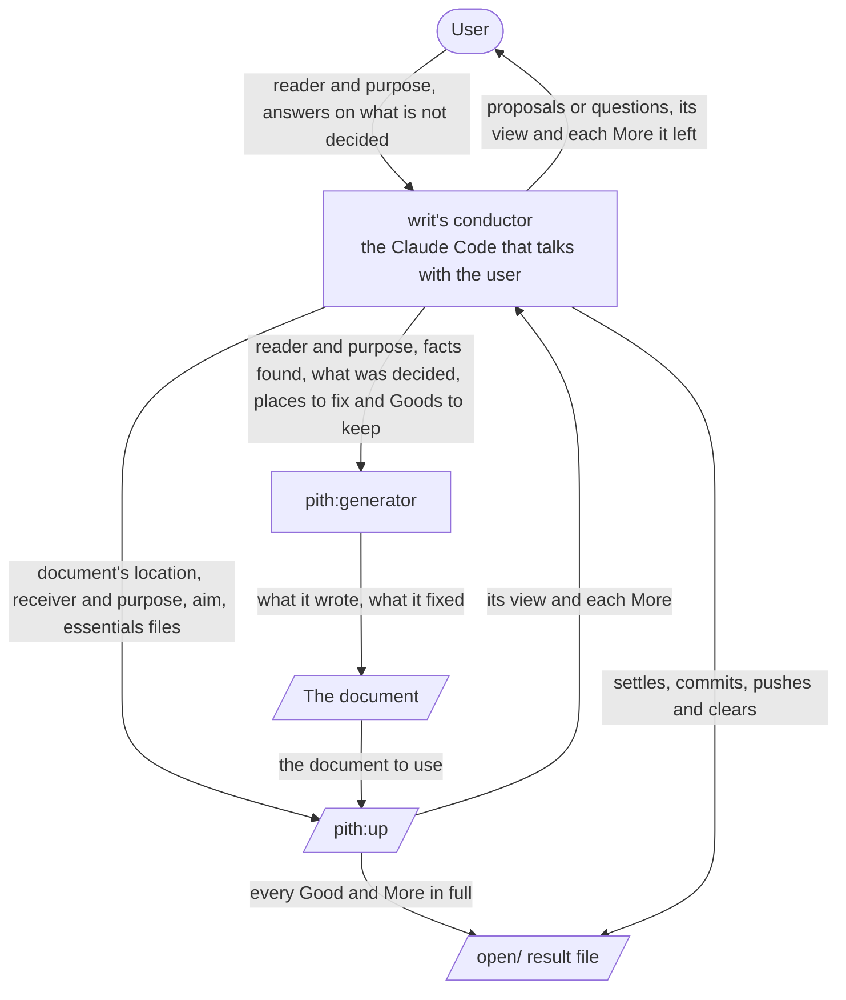
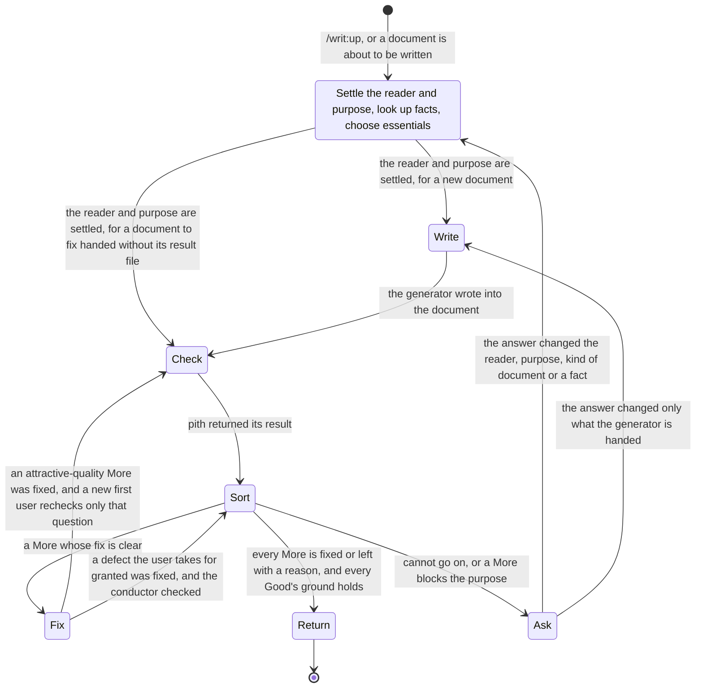
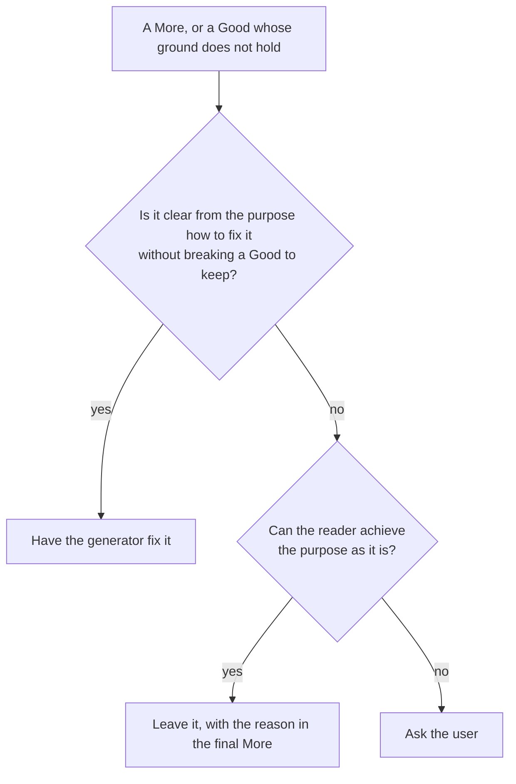

# writ design

writ brings the user the four benefits at the top of the [README](../README.md) through one skill, `/writ:up`. It is built from three roles: the conductor, the generator and the first user. Only writ's conductor judges and decides what comes next. The generator (`pith:generator`) writes and fixes the document as the conductor decides, and the first user, started by pith, uses it as its reader would and reports what happened. The generator, the first user, the essentials, the style rules and the lint are pith's, and how a check runs is in [pith's design](../../pith/docs/design.md): writ keeps only what it hands pith and what it does with the result. Essentials, question, Good, More and first user mean the same as in the README.

```mermaid
flowchart TD
  U([User])
  C[writ's conductor<br/>the Claude Code that talks with the user]
  G[pith:generator]
  F[/The document/]
  P[/pith:up/]
  RF[/open/ result file/]
  U -->|reader and purpose, answers on what is not decided| C
  C -->|proposals or questions, its view and each More it left| U
  C -->|reader and purpose, facts found, what was decided, places to fix and Goods to keep| G
  G -->|what it wrote, what it fixed| F
  C -->|document's location, receiver and purpose, aim, essentials files| P
  F -->|the document to use| P
  P -->|every Good and More in full| RF
  P -->|its view and each More| C
  C -->|settles, commits, pushes and clears| RF
```

## Six features bring the four benefits

The benefits are called by the words at the top of the README: "understands it in one reading", "hand it straight on", "judge from the report" and "asked instead of covered over".

- Have the document written only once the reader and purpose are settled.

    It serves "understands it in one reading" and "hand it straight on". It works at "A proposal or question on the reader and purpose" in the README's figure.

- Have a first user use the document through pith, and check it.

    It serves "understands it in one reading" and "hand it straight on". It works between writing and returning "The finished document".

- Fix the holes that can be fixed, and leave, with a reason, the holes that can be left.

    It serves "hand it straight on" and "judge from the report". It works before "The finished document" is returned.

- Ask the user, instead of covering it over, about a hole that blocks the purpose.

    It serves "asked instead of covered over". It works at "A question on what is not decided".

- Return a short report of what the user decides.

    It serves "judge from the report". It works where the user decides "whether to approve it or ask for fixes".

- Finish a document written during other work in the same flow.

    It brings the four benefits above also to a document for which the user did not call `/writ:up`. It works in the README's "When Claude Code writes a document during other work".

## Principles every feature keeps

- Only the conductor judges.

    The conductor is the Claude Code that talks with the user. It decides what to fix or leave and what comes next; pith lays the first user's report beside the aim and gives Good and More. When judgment spreads to the generator or the first user, a role that does not know the discussion remakes even what serves the purpose. A generator that grades what it wrote fills the holes with what it meant and grades too softly.

- The content of the essentials lives only in the essentials files, and handoffs pass their location.

    The content of the essentials is not copied into other documents or into writ's prompts. A copy or a summary drifts each time the essentials are refined, and what the generator aims for and what the first user answers drift apart. The README links to pith's essentials files, so the user can read in them which question each Good and More answers. writ learns where they are from pith's `pith:where` skill, since a plugin cannot name a file inside another.

- In the end only the work remains, and a result file stays in `open/` until it is settled.

    No drafts or files of notes along the way are made. Left behind, they would be for the user to clear away, and would leave the user unsure which is the real one. Only the full result of a check is written to a file in `open/`, so that it survives when a long conversation is summarized and does not flow into the caller's conversation, and it is cleared once everything in it is settled. Who writes, commits and clears it is in "The result file: who writes, who commits, and its form".

## Have the document written only once the reader and purpose are settled

If they are not settled before writing, the generator cannot tell what to aim for, and the conductor cannot tell what to fix by.

- Do not start writing until it is settled who reads the document and what they decide and do once they have read it.
- The conductor asks the user only what the conversation, the documents handed over and the repository do not tell. What it can infer, it puts as a proposal and asks whether it is right, and it asks one question at a time.

    What it asks is who reads the document, what they decide and do once they have read it, and where it is placed. Asked what they already said or what a document already says, the user answers the same thing over and over. Made to write from scratch even what can be inferred, the user puts into words clues writ already has. A proposal catches a wrong guess before anything is written. Asked together, the user also answers questions an earlier answer made unnecessary. So the conductor asks one, drops what the answer settled, and asks the next.

- The conductor decides from the purpose and the place whether the reader reads it through or picks parts, and asks only when it cannot.

    The user finds this hard to answer, and the purpose and the place usually settle it.

- Write the facts in the content by looking them up in the repository and the code, never by inferring them.

    The reader believes a fact written on a guess and decides wrongly.

- Hand the generator, without gaps, the reader and purpose, the facts found, and what was decided with the user.

    The generator does not know the discussion, so whatever is not handed over it can only guess, and the document drifts from what the user meant. Enough is handed over, down to the reader's particular circumstances, that the generator can write as the user means without going back to the discussion. This is the price of keeping writing apart from the conductor. Having the conductor write is not chosen. The conductor could write with the whole discussion at hand, but every write and fix would lengthen the conversation with the user, and once it is summarized the details of what was decided slip out.

- The generator reads the essentials files as the form to aim for, and decides in this order, each from the ones before: the reader, the core, the headings, the figures, the sentences, the words.

    Each later choice follows from the earlier ones, so polishing sentences or words before the reader and core are settled is lost when an earlier choice changes.

- After writing and after every fix, the generator reads the whole document from the top as its reader and fixes it. It then returns a Good or More for every question to the conductor, with place and evidence, and hides no More it could not fix.

    Changing a word or moving a section breaks other places in the document, which show only when the whole is read again. The generator's Good and More are not a verdict; they are claims for the conductor to check against the document.

- The generator follows the style rules on top of the essentials, and after writing and after every fix runs writ's lint on the document and fixes what it finds.

    The rules can be met by form alone, so they sit in a file apart from the essentials, which ask about the purpose. Mixed into the essentials, they would turn them into a pile of rules that cannot be judged from the purpose. Each rule carries its reason, so where a rule does not fit, it can be judged by its reason. A lint finding is not a failure but a place to judge by the rule's reason, because a rule sometimes does not fit, as when the content really is a table. Vale checks, in any language, the style rules a command can decide. textlint, set up for Japanese technical writing, adds checks on Japanese sentences that the rules do not state, such as sentence length and the number of commas. Both run a fixed version through npx, and their settings live inside writ, so nothing is added to the user's project and the same document always gets the same findings. Where npx does not run, the rules are checked by reading.

- The generator writes directly into the document and makes no separate draft.

    With a separate draft, what the user checks and what is actually placed split into two and drift apart.

- Write documents in Markdown and figures in mermaid. Where the user names a form or the place has one, follow it.

    The essentials ask for figures, so the generator needs a form of figure it can write and fix as text. Where the place has a set form, the reader reads in that form, so it comes first.

## Have a first user use the document through pith, and check it

The writer cannot go back to not knowing the discussion. Reading it over, they cannot see where a reader who does not know the discussion trips, and it is found only after the user has handed the document on.

- Once the generator finishes writing, the conductor has pith check the document, handing it the document's location, the receiver and purpose, the aim, and the essentials files. As the aim, it writes out in sentences, not split by question, what the reader should gain and what was decided with the user.

    pith can compare only with the aim it is given, so what was decided in the discussion cannot be checked unless it is written out and handed over.

- Always use `doc.md`, and add whichever of `readme.md`, `design.md`, `prompt.md` and `essentials.md` fits the document's kind, and any essentials file a caller adds for what the document must also achieve.

    `doc.md` asks what happened when the work was read as its reader, so it fits every document. A caller such as rn adds its own questions, such as whether a design achieves its goal, so the document is checked once, by one first user, rather than again by the caller.

- Do not hand pith the style rules. Before pith runs, the conductor runs the lint and reads the document against every question itself, and has what it finds fixed.

    Handed them, the first user would spend its attention checking form, and what only it can do, using the work without knowing the discussion, would grow thin. What the conductor can see by reading is fixed before the first user runs, so the one use goes to what only use shows.

- A question is checked again by a new first user only when a More of attractive quality was fixed there. Attractive quality is the quality that makes the user choose writ, so such a More means the reader does not get from the document what they should. A More of quality the user takes for granted, a defect such as a word used two ways or a broken link, is fixed and not rechecked. Whether either fix serves the purpose, the conductor checks against the More's place and evidence. For a recheck, up's conductor names the attractive-quality question to pith and hands it the result file, and pith starts a new first user for that question and replaces only that question's section, so every other question keeps its answer.

    Whether an attractive-quality More is fixed shows only when someone who does not know the discussion uses the document again. The earlier first user used the document before the fix, so a new first user is started. A defect of what is taken for granted is easy to see and quick to fix. Spending rechecks on it takes that effort from attractive quality. Only that question is rechecked, so new remarks do not spread over the whole with every fix.

- When the request hands an existing document to fix without its result file, the conductor, once the reader and purpose are settled, first has pith check the document as it is, and goes on from that result as from a handed result file.

    The generator does not know why each part of the document is there. Asked to fix it without Goods to keep, it rewrites the parts that serve the reader together with the ones that fall short, and the user gets back a document that has lost what was good in it. Which parts serve the reader shows only when a first user uses the document as it is.

- When the request hands a document that was already checked together with its result file, the conductor takes that file as where the document stands. Its Goods go to the generator as Goods to keep, its Mores are what is left to fix, and pith checks again only as above.

    A caller such as rn starts a new `/writ:up` to have Mores fixed, and that `/writ:up` does not carry over the earlier conversation. Checked again from the start, the earlier answers would be overwritten, and without the Goods to keep the generator would break what serves the purpose while it fixes.

## Fix the holes that can be fixed, and leave, with a reason, the holes that can be left

```mermaid
stateDiagram-v2
  direction TB
  Settle: Settle the reader and purpose, look up facts, choose essentials
  [*] --> Settle: /writ:up, or a document is about to be written
  Settle --> Write: the reader and purpose are settled, for a new document
  Settle --> Check: the reader and purpose are settled, for a document to fix handed without its result file
  Write --> Check: the generator wrote into the document
  Check --> Sort: pith returned its result
  Sort --> Fix: a More whose fix is clear
  Fix --> Check: an attractive-quality More was fixed, and a new first user rechecks only that question
  Fix --> Sort: a defect the user takes for granted was fixed, and the conductor checked
  Sort --> Return: every More is fixed or left with a reason, and every Good's ground holds
  Sort --> Ask: cannot go on, or a More blocks the purpose
  Ask --> Settle: the answer changed the reader, purpose, kind of document or a fact
  Ask --> Write: the answer changed only what the generator is handed
  Return --> [*]
```

Whether to fix or leave is decided by asking the following, one at a time, in order.

```mermaid
flowchart TD
  M[A More, or a Good whose ground does not hold]
  Q1{Is it clear from the purpose how to fix it<br/>without breaking a Good to keep?}
  X[Have the generator fix it]
  Q2{Can the reader achieve<br/>the purpose as it is?}
  L[Leave it, with the reason in the final More]
  B[Ask the user]
  M --> Q1
  Q1 -->|yes| X
  Q1 -->|no| Q2
  Q2 -->|yes| L
  Q2 -->|no| B
```

- The conductor checks every question against the document when the generator returns, when pith returns, and before reporting to the user.

    The generator knows its own intent, the first user uses the document only once, and a fix after either can break another place. The report uses only the last check, against the document as it is now.

- Believe a Good or More only after checking its place and evidence against the document. A Good whose ground does not hold is sorted as a More.

    Returned as it is, it would make the user think a place that does not help must be kept, and would mislead the next fix.

- Do not hand the generator's Good and More to pith.

    Handed them, the first user would use the document with the writer's judgment and miss where the reader trips.

- Fix a More at the root before adding a sentence.

    Most Mores come back as "there is no ...". Fixing by adding makes the document longer with every fix, says the same thing in two places, and makes the reader read sentences they do not need. The conductor first looks for whether the same thing is already said somewhere and whether replacing a sentence that is there is enough, and has the generator fix that way too.

- A More about parts the reader read past is fixed by taking the part out or saying it once, and is not left, unless the purpose includes another use the part serves, such as a later step, a list looked up when making a change, or a pointer that sends a reader of another kind to their own document. That the first user used the part to answer another question does not count. A thing said in two places, in two sentences or in a figure and a sentence, is kept in the one place the reader uses.

    The first user tries one use of the document, so a part that serves another use is read past in that one use; taken out, it is lost to whoever needed it. The first user also answers questions a reader never asks, such as how certain each statement is, so a part it used only there is still one the reader passes. How to fix it is clear from the purpose, and taking out a part the reader did not use breaks no Good. Left, a thing said again and again teaches the reader to read past it, so they also pass the one place where it matters, and every reader spends time on it.

- Start a new generator for every fix, and hand it the same as when it wrote, plus the places to fix and the Goods to keep.

    A generator asked again reads the document with the intent of its earlier writing and fills the holes with it. The generator does not know the check's result, so without the Goods to keep, it breaks what serves the purpose while it fixes, and makes a new hole for each one fixed.

## Ask the user, instead of covering it over, about a hole that blocks the purpose

- A hole in the content that keeps the purpose from being achieved goes back to the user; the conductor does not fill it by inference. Whether the purpose can be achieved is judged by whether the reader can carry through to the end what they do after reading, not by whether they can start.

    When writ decides what the user or the people around them decide, a document that drifts from what the user meant comes back looking settled.

- When the same More remains after a fix, when each fix makes another More, or when it cannot be fixed without changing the settled reader or purpose, the conductor judges it cannot go on and goes back to the user.

    Each is a sign that more fixing will not make the document ready to return. Going on, the user would wait without ever receiving it.

- Do not write, as a rule or as writ's proposal, what the user or the people around them decide and have not decided. The generator writes no rule, decision or commitment it was not handed. Leave it visibly undecided only when the reader can decide it themselves, such as volunteering to own a part, or when the purpose is achieved without it. Otherwise, and whenever unsure, ask the user.

    Written as a rule, it reaches the reader as decided, and they follow a decision no one made. Written as a proposal, it reaches the reader as half decided, and they no longer know what to follow. Leaving what the reader cannot decide alone, such as a team's rule, or cannot wait for, such as an AI acting on a prompt, leaves the reader guessing and redoing. A question costs the user one answer, but leaving it wrongly costs every reader, so when unsure, ask.

- Before returning the document, the conductor checks every rule, decision or commitment the document states against what the user decided and what the sources already said. One found in neither is a decision the user or the team owns: it is taken out or shown as undecided, and the user is asked when it blocks the purpose.

    The essentials ask what the reader took in and did, not where a statement came from, so a rule written in on a guess reads as settled and passes the check, and the report then tells the user nothing was guessed. Only the conductor holds what was decided, so only it can tell a decision handed over from one made up.

- Ask one question at a time while each answer can change what is asked next. Points owned by the user or the team that a check finds undecided are asked together in one message, as a list. Once the user's answers show that a matter has not been discussed, writ raises no new points of that kind one by one: it gathers them, shows them in the document as undecided, and proposes to finish.

    Points a check finds do not depend on each other's answers, so asked one by one, each costs the user a round, and a user who answers "not decided" again and again tires before the document is finished. A list is answered in one reply. A matter the team has not discussed gets the same answer for each new point of it, so asking each one spends the user's reply on what the document can show as undecided.

- After every state, the document does not blur a hole in its content.

    The generator writes directly into the document, so the user sees it also in the middle. While the user is being asked, too, the document shows the hole.

- When an answer changes what was decided, go back to the step it changes, as the figure in the section above shows, and have pith check the whole again.

    A document rewritten on a changed decision is not covered by the earlier check.

## Return a short report of what the user decides

- The report in the conversation opens with the conductor's view of whether the document can be handed on. Then, for each More that was left, under the question it answers, it gives the first user's report, what the reader struggles with, and why it was left. It ends with the result file's location.

    What the user decides is whether to accept the Mores that were left, so the report holds only those and the view that frames them. A line for every question would grow with the essentials, and a user asked to decide from a list that grows with the work either reads all of it or stops reading (#46). Every Good and More stays in the result file, where the user can read what lies behind any question, or ask the conductor.

- Leave out remarks along the way and how things were fixed.

    With them, the user would have to work out again where each applies in the document as it is now.

The names the user sees are the following. The README teaches use and the essentials with these names, so changing them breaks what the user learned from the README.

- `/writ:up`, pith, first user
- Good, More
- The essentials files' names: `doc.md`, `readme.md`, `design.md`, `prompt.md`, `essentials.md`

### The result file: who writes, who settles, and who clears it

The result file serves "judge from the report": the user checks what lies behind any line of the report by reading only that part of the file, or by asking the conductor. It also serves "hand it straight on": in the end the user hands on the document alone, with nothing of the check left beside it. Its form is pith's, and pith's hook checks it on every write, by whoever writes. The following always hold.

- pith writes the result file at `.writ/open/{NN}-report-{target}.md`, or, when a caller such as rn keeps its own `open/`, at the place the caller names.
- Before reporting, writ's conductor settles it itself: each fixed More rewritten as the Good it now is, each left More given `Left because:` with the reason.

    writ used to run pith once more only to write this settling, so that only pith wrote the file and its form held; a whole run spent on bookkeeping kept the user waiting (#37). A hook now checks the form whoever writes.

- Only the conductor that talks with the user commits, pushes and clears it. Called by the user, writ commits the file to the current branch and pushes if the branch has an upstream; called by a caller such as rn, it leaves the file to the caller.

    The record is kept by the one role that knows what the user decided. A branch without an upstream is not pushed, because where to push is not for writ to decide.

- Once every More is settled, the file is cleared: its whole text is copied into a commit message, each More ending with `→ fixed:`, `→ let go:` with the reason, or `→ to the user:`, and the file is deleted in that commit. A file in `open/` is then the sign that something needs action.

## Finish a document written during other work in the same flow

- When Claude Code writes or rewrites a document during other work, it goes through the same flow as `/writ:up`, as the conductor.

    A document for which the user forgot to call writ is handed on as finished without writ, and the four benefits do not reach it.

- writ is used here when Claude Code reads the description of writ's skill and judges that it fits the moment.

    The skill's description says it is used not only when the user asks but also when a document is about to be written during other work. Whether the description fits is Claude Code's judgment at the moment, so it is not always chosen. A document for which it is not chosen is handed on as finished without writ. So the README tells the user to call `/writ:up` when a document comes back without a report. A hook that runs when a file is written is not chosen. Such a hook runs once Claude Code has finished the content and writes the file, so the content exists before the reader and purpose are settled. It also runs both for a document meant for a reader and for working notes. Adding "write documents with writ" to the user's CLAUDE.md is not chosen either. It leaves something besides the document in the user's environment and moves the effort of keeping it up to the user.

- If the conversation tells the reader and purpose, write without asking.

    During other work, the reader and purpose are often already settled in the conversation, and asking again stops the user's work.

## Check quality by using writ where its benefits can be seen (validation)

Checking effort goes to the four benefits first, because they are why the user chooses writ. They are checked by validation: use writ as its user would, in the README's example situations, which show the main way the user uses it, and lay what happened beside the benefits. The situations chosen are ones where, without the benefit, the user would plainly struggle. In other situations, whether the benefit arrived cannot be seen. Quality the user takes for granted is not checked up front, beyond what a script decides; it is fixed when it shows up in use. Until the benefits pass, defects of what the user takes for granted are not fixed first.

Every quality is checked with a separate subagent that does not know the discussion, as the first user. The first user runs writ in the user's place, uses what comes back, and reports what happened. Pass or fail is decided by the conductor checking writ, which lays the report beside the benefits. Each situation is run once. writ's result can differ from run to run, but running it costs time and money, so the spread is not measured by running many times.

### Benefits

- Readers understand the document in one reading, and know what to do once they finish.

    This is the quality of "understands it in one reading". Without it, readers read again, or go back to ask the writer. writ is run on the README's two examples: writing a new migration plan, and fixing the typing rules document. The first user reads the document once from the top, marks places that read either way or where it cannot act, and says what it decides and does once it finishes. For each mark, the conductor judges whether the content there blocks the reader's purpose. It passes when what the first user says matches the purpose given in the request and no mark blocks the purpose. A mark that does not block the purpose does not fail it. A careful reading always leaves some marks, so counting them would mean polishing places the reader does not need.

- The user can hand the document they get back straight to the reader.

    This is the quality of "hand it straight on". Without it, the effort of reading and fixing goes back to the user. In the same situations as the first, the first user, as the user, names what it would change before handing it to the reader, each with a reason that concerns the reader. As with the first, each is judged by whether it blocks the purpose, and it passes when there is none that does.

- The user can judge the result from the final report alone.

    This is the quality of "judge from the report". Without it, the user reads the whole document again. The situation used is one where a More that was left decides approval, such as the migration plan. The first user reads only the report and decides whether to approve or what to have fixed, then reads the whole document. It passes when the decision does not change, and the report alone shows which question each Good and More answers.

- What is not decided is asked, not covered over.

    This is the quality of "asked instead of covered over". Without it, a document with which the reader cannot achieve the purpose comes back looking right. It is run on the typing rules situation, where whether `any` is allowed is not decided, and on the migration plan situation, where the owners may stay undecided. It passes when, in the first, writ does not return it as finished but asks about what is not decided, and the hole shows in the document too; and in the second, it returns with a More that carries the reason it was left. The second is there because asking back about everything would pass the first alone.

- Writing a document costs the user less than writ 0.1.0 did.

    In the migration plan situation, the time the user waited, the number of agents started, and the lines of the report are recorded and set beside the same situation run with writ 0.1.0. What the user spends is part of what writ gives, and shows only when a whole run is measured.

### Quality the user takes for granted

What a machine can decide is checked by script every time. It is fast, gives the same answer every time, and leaves the conductor's attention for judging the benefits.

- Comparing the working directory before and after a run, only the target work and the result file in `open/` have changed. After clearing, only the target work has.
- Every link from the README to the essentials files exists, and the names the user sees match between the README and writ.

The rest of it, such as not being asked the same thing twice, not being left waiting, and facts matching the repository, is left to use, since such failures are easy to see and quick to fix.

### What is not checked

Only the README's example situations above are tried. Other kinds of documents or readers, and other flows, are not.

Whether Claude Code chooses writ for a document during other work is not checked by running it. It depends on how Claude Code reads the skill's description at the moment, which writ cannot make certain. If chosen, the flow is the same as checked above; if not, the user calls `/writ:up` as the README says, so little is lost. What writ can change is the description. So the conductor reads the description against the official guidance on skill descriptions. It passes when it follows that guidance and says what the skill does and when to use it, including when a document is about to be written during other work.
