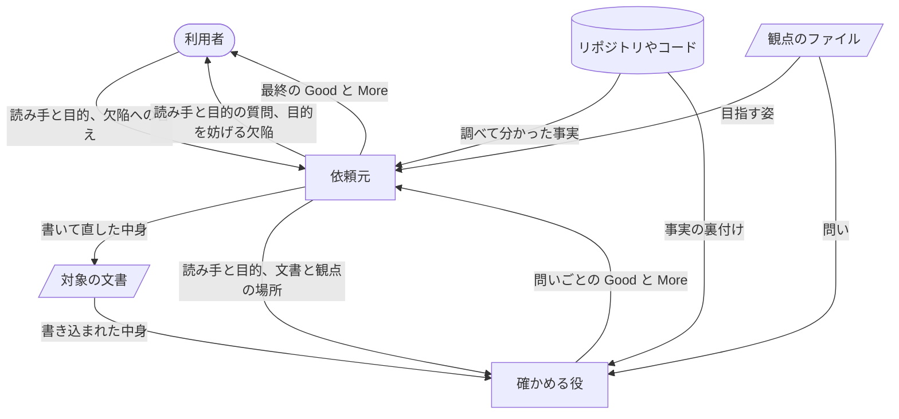
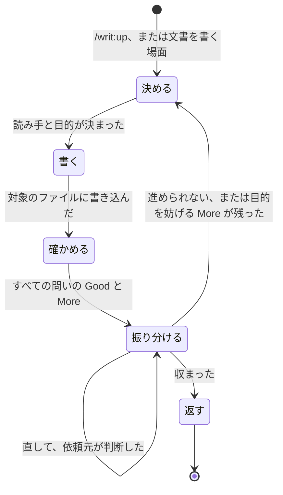
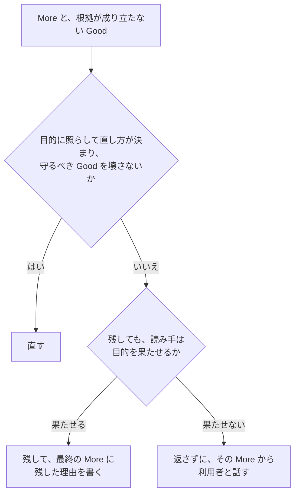

# writ の設計

writ は、読み手と目的が決まってから書き、話し合いを知らない役に1回だけ確かめさせ、その結果をどう扱うかを利用者と話している Claude Code（依頼元）だけが決めることで、利用者が直さずにそのまま渡せる文書を返します。

```mermaid
flowchart TD
  U([利用者])
  R[依頼元]
  S[(リポジトリやコード)]
  E[/観点のファイル/]
  F[/対象の文書/]
  K[確かめる役]
  U -->|読み手と目的、欠陥への答え| R
  R -->|読み手と目的の質問、目的を妨げる欠陥| U
  S -->|調べて分かった事実| R
  E -->|目指す姿| R
  R -->|書いて直した中身| F
  R -->|読み手と目的、文書と観点の場所| K
  F -->|書き込まれた中身| K
  E -->|問い| K
  S -->|事実の裏付け| K
  K -->|問いごとの Good と More| R
  R -->|最終の Good と More| U
```

## 迷ったときは、4つの方針で選びます

- 読み手と、読み終えて何を決め何をするかが決まるまで、書き始めません。

    文書の良し悪しは読み手と目的に照らして初めて測れます。決まらないまま書くと、確かめる役も依頼元も何を基準に直すかを決められず、利用者が自分で読んで直すことになります。

- 文書を確かめるのは、話し合いも書いた理由も知らない役です。

    書いた者は、話し合いを知らなかった状態に戻れません。だから読み返しても、話し合いを知らない読み手がつまずく箇所が見えず、その箇所は利用者が文書を渡した先で初めて見つかります。

- 直すか残すかは依頼元だけが決め、確かめる役による評価は1回にします。

    評価を何度も回すと本質的でない指摘が続いて収まらず、利用者はいつまでも文書を受け取れません。判断が1か所にあるので、くり返しは「収まった」か「進められない」かのどちらかに必ず決まります。

- 中身の欠陥は、言い回しで取り繕わず、欠陥のまま示します。

    期限のない計画書を上手な文で包むと、利用者も読み手も欠陥に気づかないまま使い、読み手は目的を果たせません。

## 利用者が決め、依頼元が書いて判断し、確かめる役は答えるだけです

### 利用者は、読み手と目的と、目的を妨げる欠陥の扱いを決めます

- 依頼元が利用者に聞くのは、会話、渡された文書、リポジトリから分からないことだけです。

    聞くのは、誰が読むか、読み終えて何を決め何をするか、どこに置くかです。すでに言ったことや文書から分かることを聞かれると、利用者は同じことを何度も答えることになります。既にある文書を渡されたときは、読み取った読み手と目的を示したうえで、読み取れないことだけを聞きます。Claude Code が作業の途中で自分から writ を使うときも同じで、会話から分かれば聞かずに書きます。

- 通して読むか拾い読むかは、目的と置き場所から依頼元が決め、決められないときだけ聞きます。

    利用者には答えにくい問いで、しかも多くは目的と置き場所から決まるからです。

- 目的を果たせないほどの中身の欠陥は、依頼元が推し量って埋めず、利用者に戻します。

    期限のように、利用者やその周りの人が決めることを writ が決めると、利用者の意図と違う文書が、決まったことのような顔をして返ります。

### 依頼元は、聞き、調べ、書き、直すかどうかを決めます

依頼元は、利用者と話している Claude Code そのもので、書く役も兼ねます。書くには、読み手の細かな事情まで含めた話し合いのすべてが要るからです。書く役を別に立てる案は採りません。受け渡しで話し合いの一部が落ちるうえ、話し合いを知らずにいなければならないのは確かめる役だけなので、分けて得るものがありません。

- 観点を目指す姿として読み、読み手、要点、見出し、図、文、言葉の順に、上の層から決めます。

    下の層は上の層の決定に従います。上が決まる前に文や言葉を磨いても、上を変えたときに無駄になります。

- 書く中身の事実は、推し量らず、リポジトリやコードを調べて得ます。

    推し量った事実を書くと、読み手はそれを信じて誤った判断をします。

- 対象のファイルに直接書き、下書きを別に作りません。

    下書きを別に作ると、利用者が確かめる物と実際に置かれる物が2つになって食い違いが起き、片付けるべきファイルが利用者の環境に残ります。既にある文書を直すときも、元のファイルに書き込みます。

- 文書は Markdown、図は mermaid で書き、利用者の指定や置き場所の形式があればそちらに従います。

    観点が図を求めるので、依頼元が文字として書いて直せる図の形式が要ります。置き場所に決まった形式があるなら、読み手はその形式で読むので、そちらを優先します。

### 確かめる役は、話し合いを知らないまま問いに答え、何も決めません

- 確かめる役が手にするのは、対象の文書、読み手と目的、観点のファイル、文書が語るリポジトリやコードだけです。

    読み手と目的は、誰が読むか、読み終えて何を決め何をするか、通して読むか拾い読むかを、それぞれ1行で渡します。話し合い、書いた理由、前の版やその差分は渡しません。どれか1つでも渡ると、確かめる役は書き手の意図で文書の欠けを補って読み、読み手がつまずく箇所を見落とします。会話を引き継いだ分身として確かめる役を立てても、同じことが起きます。観点は要約せず、ファイルの場所を渡します。

- 最初に、読み手、読み手がすべきこと、文書の要点を、自分の言葉で言い直します。

    書き手の意図と言い直しとのずれは、書いた者には見えない分かりにくさそのものです。依頼元は、言い直しを話し合いで決めたことと比べ、ずれていればそこを More として扱います。

- 使う観点のファイルにあるすべての問いに、Good と More の一方か両方で答えます。

    上の層が崩れていたら下の層を見ない、という案は採りません。答えのない問いがあると、依頼元は直すときに壊してはいけない箇所を知らず、利用者への返答にもその問いの答えが欠けます。

- 直すかどうかも、次に何をするかも決めません。

    確かめる役は話し合いを知らないので、その指摘を字面どおりに受けて直すと、目的に役立っている部分まで作り直すことになります。

## 文書は、決める・書く・確かめる・振り分けるの順に進み、収まったら返ります

```mermaid
stateDiagram-v2
  direction TB
  [*] --> 決める: /writ:up、または文書を書く場面
  決める --> 書く: 読み手と目的が決まった
  書く --> 確かめる: 対象のファイルに書き込んだ
  確かめる --> 振り分ける: すべての問いの Good と More
  振り分ける --> 振り分ける: 直して、依頼元が判断した
  振り分ける --> 返す: 収まった
  振り分ける --> 決める: 進められない、または目的を妨げる More が残った
  返す --> [*]
```

- 評価は、決めるから返すまでの1回の通り道につき1回です。

    利用者と話して決め直したあとは、文書の土台が変わっているので、書き直した文書をもう一度確かめます。評価を1回にするのは指摘が収まらないのを防ぐためで、利用者の決定が間に入れば、その心配はありません。

- どの状態のあとでも、対象のファイルの中身は、中身の欠陥をぼかしていません。

    対象のファイルに直接書くので、利用者は途中の状態も目にします。進められずに話し合いへ戻るときも、ファイルにあるのは欠陥が見える文書です。

## 振り分けは、読み手が目的を果たせるかで決めます

```mermaid
flowchart TD
  M[More と、根拠が成り立たない Good]
  Q1{目的に照らして直し方が決まり、<br/>守るべき Good を壊さないか}
  X[直す]
  Q2{残しても、読み手は<br/>目的を果たせるか}
  L[残して、最終の More に<br/>残した理由を書く]
  B[返さずに、その More から<br/>利用者と話す]
  M --> Q1
  Q1 -->|はい| X
  Q1 -->|いいえ| Q2
  Q2 -->|果たせる| L
  Q2 -->|果たせない| B
```

担当が空欄の移行計画は、読み手が空欄を埋めて担当を引き受けられるので、残して返します。期限のない移行計画は、読み手が期限に合意するという目的を果たせないので、返さずに話し合います。

- Good は1つずつ根拠を文書と照らし、成り立たないものは More として振り分けます。

    成り立たない Good を返すと、利用者は効いていない箇所を守るべきところと信じ、次の直しで判断を誤ります。

- 直した結果は、依頼元が読み手と目的に照らして判断し、確かめる役には戻しません。

    確かめる役にしかできないのは、話し合いを知らずに読むことだけで、直しが目的に合うかは依頼元のほうがよく分かります。代わりに、評価のあとの直しは話し合いを知らない目を通りません。最終の Good と More に場所と根拠が付くので、利用者がそこを確かめられ、必要なら writ にもう一度渡せる、としてこれを受け入れます。

- 同じ More がくり返し出る、直すたびに新しい More が出る、決めた読み手や目的を変えないと直せない、のどれかが起きたら、進められないと判断します。

    どれも、直しを重ねても収まらない兆しです。そのまま続けると、利用者は文書を受け取れないまま待つことになります。

## 利用者に返るのは、対象の文書と、問いごとの最終の Good と More だけです

- どの状態のあとでも、利用者の環境に writ が残すのは対象の文書だけです。

    下書きや評価の記録が残ると、利用者が片付けることになり、どれが本物かにも迷います。

- 返答には、使った観点のすべての問いについて最終の Good と More を添え、途中の指摘や直しの経緯は添えません。

    利用者が承認するのは最終形なので、最終の Good と More があれば、全文を読み直さずに承認か直しの依頼かを決められます。経緯を添えると、それが今の文書のどこに当てはまるかを利用者が確かめ直すことになります。

Good と More に付く項目は、それぞれ利用者の判断を助けるためにあります。

- 観点の名前は、どの問いへの答えかを示し、利用者が観点のファイルで問いそのものを読めるようにします。
- 場所は、利用者が全文でなくその箇所だけを見れば済むようにします。
- 根拠は、利用者が writ の判断を信じる代わりに確かめられるようにします。
- More に付く、読み手が困ることは、残した More を受け入れるかを、読み手への影響で決められるようにします。
- More に付く、残した理由は、直さなかったのが見落としでなく判断だと示し、利用者が自分で決めるべきことかを見分けられるようにします。

## 観点は1か所にだけ置き、依頼元も確かめる役も同じファイルを読みます

観点のファイルは writ の中にあり、writ を直す人が書き、依頼元と確かめる役が読み、利用者も README から読みます。すべての文書の観点はいつも使い、README、設計書、AI に読ませるプロンプトなら、その種類の観点を重ねます。種類は、依頼元が置き場所と目的から決めます。

- 観点の中身は、観点のファイルにだけ書き、ほかの文書や writ の指示に写しません。

    写すと、観点を磨くたびに写しとずれていき、利用者が README から読む観点と、実際に書いて確かめるときに使われる観点が食い違います。

- 利用者に見える名前は、`/writ:up`、Good と More、観点のファイルの名前（`doc.md`、`readme.md`、`design.md`、`prompt.md`）です。

    README がこれらの名前で使い方と観点を伝えているので、変えると利用者が README で覚えたことが通じなくなります。

## 品質は、利用者に届く姿ごとに writ を走らせて確かめます

どの品質も、利用者の立場で writ を使い、返ってきたものを読む人（利用者役）が合否を決めます。

- 利用者が、返ってきた文書を直さずに読み手へ渡せる。

    README の最初の約束で、欠けると、読んで直す手間が利用者に戻ります。観点の種類ごと（計画書のような一般の文書、README、設計書、AI に読ませるプロンプト）に、新しく書く場面と既にある文書を直す場面で writ を走らせます。話し合いを知らない読み手に文書を読ませ、読み終えて何を決め何をするかを言わせます。その答えが利用者の意図した目的と一致し、利用者役が読み手に渡す前に直したい箇所がなければ合格です。

- 利用者は、すでに伝えたことや文書から分かることを聞かれず、読み手と目的が決まらないまま書かれた文書も受け取らない。

    README の「聞かれたことに答えるだけ」と「分からないときだけ聞く」の約束で、欠けると、同じことを何度も答えるか、的の定まらない文書を受け取ります。読み手を言わずに頼む場面、読み手と目的の分かる文書を渡す場面、会話で読み手と目的が決まったあとに Claude Code が自分から文書を書く場面で走らせます。最初の場面だけ書く前に質問が来て、残りの2つは質問なしに書き始めれば合格です。

- 利用者は、返答の Good と More だけで、承認するか直しを求めるかを決められる。

    README の Good と More の約束で、欠けると、利用者は全文を読み直すことになります。利用者役が返答だけで判断を決め、そのあと全文を読みます。判断が変わらず、すべての場所と根拠が文書と合い、使った観点のすべての問いに答えがあれば合格です。

- 目的を果たせない中身の欠陥があるとき、利用者は取り繕った文書でなく、その欠陥についての話し合いを受け取る。

    README の期限の例の約束で、欠けると、読み手が目的を果たせない文書がそれらしく返ります。期限の決まっていない移行計画のように目的に要る中身が欠けた依頼と、担当のように空欄で残せる欠けがある依頼で走らせます。前者では文書を仕上がったものとして返さずに欠けた中身から話し始め、後者では残した理由つきの More とともに返せば合格です。

- 利用者の環境に、対象の文書のほかは何も残らない。

    欠けると、利用者が片付けることになります。走らせる前と後で作業ディレクトリを比べ、変わったのが対象のファイルだけなら合格です。

確かめるのは、上に挙げた種類と場面の組み合わせまでです。あらゆる種類の文書や読み手は試さず、観点が種類を問わない問いで書かれていることに頼ります。評価のあとの直しで生じた欠けは、最初の品質を確かめる利用者役が見つけるしかなく、それ以外に見つける仕組みは持ちません。
