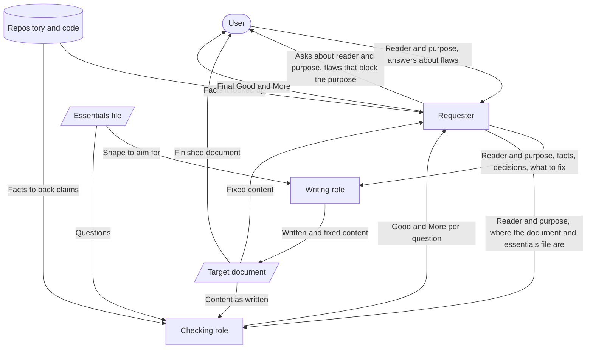
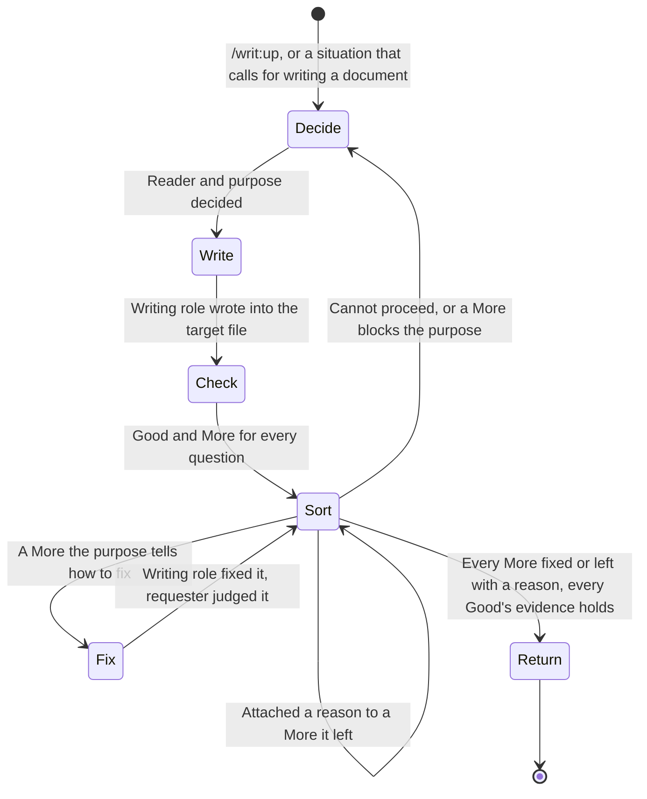
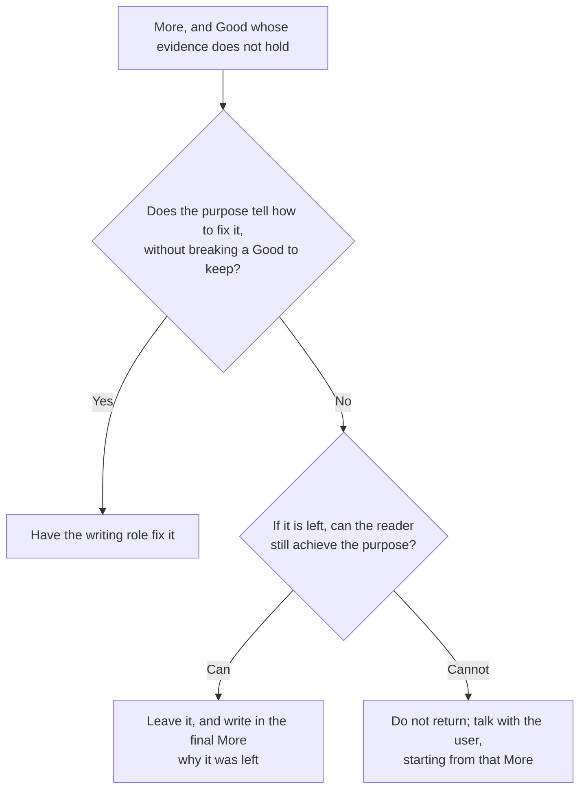
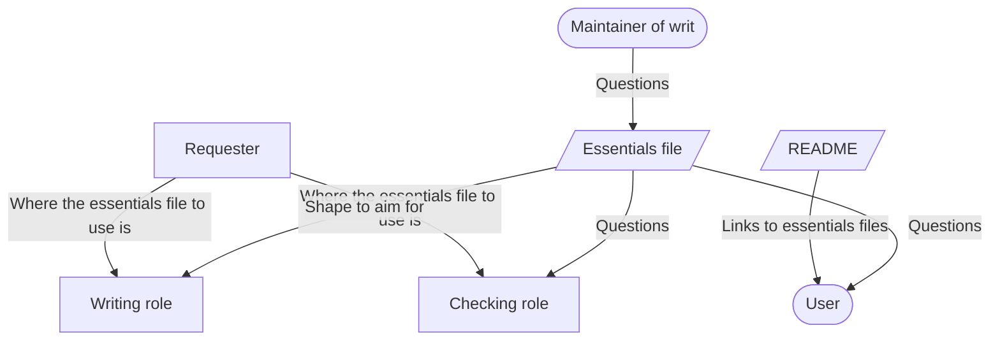

# Design of writ

writ returns documents the user can hand to the reader as they are, without fixing them. To do that, a writing role writes only after the reader and purpose are decided, and a checking role that does not know the discussion checks the document just once. Only Claude Code, the one talking with the user (the requester), decides what to do with the result.

The checking role answers every question in the essentials file with Good and More. An essentials file lists, for one kind of document, what makes a good document, in the form of questions. Good is what serves the purpose and must not be broken when fixing; More is a shortfall and what the reader struggles with because of it.

```mermaid
flowchart TD
  U([User])
  R[Requester]
  S[(Repository and code)]
  W[Writing role]
  E[/Essentials file/]
  F[/Target document/]
  K[Checking role]
  U -->|"Reader and purpose, answers about flaws"| R
  R -->|"Asks about reader and purpose, flaws that block the purpose"| U
  S -->|Facts it looked up| R
  R -->|"Reader and purpose, facts, decisions, what to fix"| W
  E -->|Shape to aim for| W
  W -->|Written and fixed content| F
  R -->|"Reader and purpose, where the document and essentials file are"| K
  F -->|Content as written| K
  E -->|Questions| K
  S -->|Facts to back claims| K
  K -->|Good and More per question| R
  F -->|Fixed content| R
  R -->|Final Good and More| U
  F -->|Finished document| U
```

## The reader and purpose come first, a role that does not know the discussion checks once, only the requester judges, and flaws are not hidden

- Writing does not start until the reader, and what they decide and do when they finish, are decided.

    The quality of a document can only be measured against its reader and purpose. Written without them, the writing role cannot decide what to aim for, nor the requester what to fix against, and the user ends up reading and fixing the document themselves.

- The document is checked by a role that knows neither the discussion nor the reasons behind the writing.

    Whoever wrote it cannot go back to not knowing the discussion. So on rereading, they do not see where a reader who does not know the discussion will stumble, and those places are first found only after the user has handed the document on.

- Only the requester decides whether to fix or leave, and the checking role evaluates once, between deciding the reader and purpose and returning the document.

    When evaluation runs many times, each fix brings new non-essential remarks, it never ends, and the user never receives the document. With one evaluation, all that follows is the requester judging fixes, and the requester can decide itself whether the document is ready to return or further fixes will get nowhere. Ready to return means every More has been fixed or left with a reason, and every Good's evidence holds. So the document always stops in one of two ways: it is returned, or it goes back to the discussion with the user. After the reader or purpose is decided again through discussion, the rewritten document is checked once more. The document's footing has changed and the user's decision comes in between, so remarks do not go on without end.

- Flaws in the content are shown as flaws, not covered up with wording.

    When a document missing content its purpose needs is wrapped in polished sentences, both the user and the reader use it without noticing the flaw, and the reader cannot achieve the purpose.

## The user decides, the requester assigns the work and judges, the writing role writes, and the checking role only answers

### The user decides the reader, the purpose, and what to do about flaws that block the purpose

- The requester asks the user only what the conversation, the document handed over and the repository do not tell it.

    It asks who reads the document, what they decide and do when they finish, and where it goes. Being asked what they already said or what the document shows makes the user answer the same thing again and again. When handed an existing document, the requester shows the reader and purpose it read from it and asks only what it could not read. The same holds when Claude Code uses writ on its own in the middle of its work: if the conversation tells it, it writes without asking.

- Whether the document is read straight through or skimmed, the requester decides from the purpose and where it goes, and asks only when it cannot decide.

    It is a question the user finds hard to answer, and it is mostly decided by the purpose and where the document goes.

- A content flaw serious enough to keep the purpose from being achieved is not filled in by the requester's guesswork but taken back to the user.

    When writ decides what the user or the people around them should decide, a document that differs from the user's intent comes back looking as if it had been decided.

### The requester asks, looks things up, hands off to the writing role, and decides whether to fix

The requester is the Claude Code that is talking with the user. It leaves writing and fixing to a separately started writing role. Because the back-and-forth of writing and fixing stays out of the conversation with the user, that conversation stays short and is less likely to be summarized partway and lose details of what was decided. Having the requester write the document itself was rejected. The requester could then write with the whole discussion at hand, but every round of writing and fixing lengthens the conversation with the user and makes a summary partway more likely.

- Facts for the content are found by looking into the repository and code, not guessed.

    When guessed facts are written, the reader trusts them and judges wrongly.

- The writing role is handed the reader and purpose, the facts it looked up, and what was decided with the user, with nothing missing.

    This is the cost of separating the writing role. The writing role does not know the discussion, so anything not handed to it can only be filled in by guessing, and the document differs from the user's intent. What is handed over is enough, down to the fine details of the reader's situation, for the writing role to write as the user intends without going back to the discussion.

### The writing role writes into and fixes the target file, from what it was handed and the essentials file

- It reads the essentials file as the shape to aim for, and decides the reader, key points, headings, diagrams, sentences and words in that order, earlier ones first.

    The writing role's job is to bring the document closer to a good shape, so it reads each question as a shape the document should take. Later things follow the decisions made for earlier ones, so refining sentences and words before the reader and key points are decided is wasted when the earlier ones change.

- It writes directly into the target file and makes no separate draft.

    A separate draft means what the user checks and what actually gets placed are two things, which come to differ, and it leaves a file in the user's environment for them to clean up. When fixing an existing document, too, it writes into the original file.

- Documents are written in Markdown and diagrams in mermaid, unless the user asks otherwise or where the document goes has its own format.

    The essentials for every document call for diagrams, so the writing role needs a diagram format it can write and fix as text. If where the document goes has a set format, the reader reads it in that format, so that comes first.

### The checking role answers the questions without knowing the discussion, and decides nothing

- In every handoff, all the checking role gets is the target document, the reader and purpose, the essentials file, and the repository and code the document talks about.

    The reader and purpose means who reads it, what they decide and do when they finish, and whether they read it straight through or skim it. The discussion, the reasons behind the writing, earlier versions and diffs against them are not handed over. If even one is, the checking role fills in what the document is missing with the writer's intent as it reads, and misses where the reader stumbles. The same happens if the checking role is started by carrying over the current conversation.

- First, it restates in its own words the reader, what the reader must do, and the document's key points.

    The gap between the writer's intent and this restatement is exactly the difficulty in understanding that the writer cannot see. The requester compares the restatement with what was decided in the discussion, and treats any gap as a More.

- It answers every question in the essentials file it uses with Good, More or both.

    The checking role's job is to report the document's current state, so it reads the essentials file as questions. Skipping the questions from headings onward when the reader or key points have fallen apart was rejected. If a question goes unanswered, the requester does not know which places must not be broken when fixing, and the reply to the user is missing that question's answer.

- It decides neither whether to fix nor what to do next.

    The checking role does not know the discussion, so taking its remarks literally and fixing them rebuilds even the parts that serve the purpose.

## A document moves through deciding, writing, checking, sorting and fixing, and either returns or goes back to the discussion with the user

```mermaid
stateDiagram-v2
  direction TB
  [*] --> Decide: /writ:up, or a situation that calls for writing a document
  Decide --> Write: Reader and purpose decided
  Write --> Check: Writing role wrote into the target file
  Check --> Sort: Good and More for every question
  Sort --> Sort: Attached a reason to a More it left
  Sort --> Fix: A More the purpose tells how to fix
  Fix --> Sort: Writing role fixed it, requester judged it
  Sort --> Return: Every More fixed or left with a reason, every Good's evidence holds
  Sort --> Decide: Cannot proceed, or a More blocks the purpose
  Return --> [*]
```

- After every state, the target file does not blur flaws in its content.

    Because writing goes directly into the target file, the user sees the in-between states too. Even when it cannot proceed and goes back to the discussion, the file holds a document whose flaws are visible.

## Sorting is decided by whether the reader can achieve the purpose

A migration plan with a blank owner column is returned with the blank left, because readers can fill the blank and take on their part. A migration plan without a deadline is not returned but discussed, because readers cannot achieve the purpose of agreeing on a deadline.

```mermaid
flowchart TD
  M[More, and Good whose evidence does not hold]
  Q1{"Does the purpose tell how to fix it,<br/>without breaking a Good to keep?"}
  X[Have the writing role fix it]
  Q2{"If it is left, can the reader<br/>still achieve the purpose?"}
  L["Leave it, and write in the final More<br/>why it was left"]
  B["Do not return; talk with the user,<br/>starting from that More"]
  M --> Q1
  Q1 -->|Yes| X
  Q1 -->|No| Q2
  Q2 -->|Can| L
  Q2 -->|Cannot| B
```

- Each Good's evidence is checked against the document one by one, and any that does not hold is sorted as a More.

    If a Good that does not hold is returned, the user believes a place that is not working is something to keep, and misjudges the next fix.

- The requester judges the fixed result against the reader and purpose, and does not send it back to the checking role.

    The only thing the checking role can do that others cannot is read without knowing the discussion. The requester knows better whether a fix fits the purpose. The cost is that fixes after the evaluation are not seen by a role that does not know the discussion. Even so, the final Good and More carry locations and evidence, so the user can check those places and, if needed, hand the document to writ again. So this limit is accepted.

- While judging fixed results, the requester concludes that it cannot proceed if the same More remains after fixing, each fix brings another More, or a fix requires changing the reader or purpose already decided.

    Each is a sign that more fixing will not bring the document to a state ready to return. If it went on, the user would be left waiting without receiving the document.

## Only the target document and the final Good and More for each question return to the user

- After every state, the only thing writ leaves in the user's environment is the target document.

    Leftover drafts or evaluation records are the user's to clean up, and make it unclear which one is real.

- The reply carries the final Good and More for every question in the essentials file used, and not the remarks along the way or how the fixes went.

    The user approves the final form, so the final Good and More let them decide between approving and requesting fixes without rereading the whole text. If how the fixes went were attached, the user would have to check again where each part applies in the current document.

Each item attached to Good and More is there to help the user judge.

- The name of the essentials lets the user read the question itself in the essentials file.
- The location lets the user look at just that place instead of the whole text.
- The evidence lets the user check writ's judgment instead of trusting it.
- The reader's problem attached to a More lets the user decide, by its effect on the reader, whether to accept a More that was left.
- The reason attached to a More that was left shows that not fixing it was a judgment, not an oversight, and lets the user tell whether it is something they should decide themselves.

## The essentials live in one place only, and the writing role and checking role read the same file

```mermaid
flowchart TD
  M([Maintainer of writ])
  E[/Essentials file/]
  R[Requester]
  W[Writing role]
  K[Checking role]
  D[/README/]
  U([User])
  M -->|Questions| E
  R -->|Where the essentials file to use is| W
  R -->|Where the essentials file to use is| K
  E -->|Shape to aim for| W
  E -->|Questions| K
  D -->|Links to essentials files| U
  E -->|Questions| U
```

The essentials for every document are always used, and for a README, a design doc or a prompt for an AI to read, the essentials for that kind are added on top. The requester decides the kind from where the document goes and its purpose.

- In every handoff, the essentials are passed as the file's location, not as a summary.

    A summary changes the questions to match how the summarizing role read them, and the old summary goes on being used even after the essentials file is refined.

- After every change, the content of the essentials lives only in the essentials files, and is not copied into other documents or writ's instructions.

    Copies drift each time the essentials are refined, and the essentials the user reads from the README come to differ from the ones actually used to write and check.

- The names the user sees are `/writ:up`, Good and More, and the essentials file names (`doc.md`, `readme.md`, `design.md`, `prompt.md`).

    The README uses these names to explain how to use writ and the essentials, so changing them would make what the user learned from the README no longer hold.

## Quality is tested by running writ for each outcome for the user

For each quality, the person who runs writ in the user's position and reads what comes back (the tester) decides pass or fail.

- The user can hand the returned document to the reader as it is, without fixing it.

    This is the first promise of the [README](../README.md); if it is missing, the work of reading and fixing falls back on the user. For each kind of essentials, run writ both to write a new document and to fix an existing one. Have someone who does not know the discussion read the document and say what they decide and do when they finish. It passes if that answer matches the purpose given in the request, and when the tester is asked to list, each with a reason that concerns the reader, the places they would change before handing the document to the reader, they list none.

- The user is not asked what they already said or what the document shows, and does not receive a document written before the reader and purpose were decided.

    These are the [README](../README.md)'s promises "just answer what it asks" and "asks only when it does not know"; if they are missing, the user answers the same thing again and again or receives a document with no clear aim. Run it in a situation where the user asks for a document without saying who the reader is, a situation where a document from which the reader and purpose can be read is handed over, and a situation where Claude Code writes a document on its own after the reader and purpose have been decided in the conversation. It passes if writ asks before writing only in the first situation, and writ starts writing without asking in the other two.

- The user can decide from the reply's Good and More alone whether to approve or request fixes.

    This is the [README](../README.md)'s promise about Good and More; if it is missing, the user rereads the whole text. The tester makes a judgment from the reply alone, then reads the whole text. It passes if the judgment does not change, every location and piece of evidence matches the document, and every question in the essentials file used has an answer.

- When a content flaw keeps the purpose from being achieved, the user receives a discussion about that flaw, not a document that covers it up.

    This is the [README](../README.md)'s promise in the deadline example; if it is missing, a document that does not let the reader achieve the purpose comes back looking finished. Run it with a request missing content the purpose needs, like a migration plan with no deadline set, and with a request where something missing can be left blank, like the owners. It passes if in the first situation the document is not returned as finished and the discussion starts from the missing content, and in the second the document is returned with a More that gives the reason it was left.

- The user always receives either the document or a discussion about the flaw blocking it, and is never left waiting without end.

    This is the [README](../README.md)'s promise that answering what it asks brings a document back; if it is missing, the user keeps waiting and receives nothing. Run it in every situation above, plus a request where something is missing that cannot be fixed without changing the reader and purpose already decided. It passes if every situation ends either with the document and Good and More coming back or with a discussion starting from why it cannot proceed.

- Nothing but the target document remains in the user's environment.

    If this is missing, the user has to clean up. Compare the working directory before and after running; it passes if only the target file changed.

Testing covers only the combinations of kinds and situations listed above. It does not test every kind of document or reader, and relies on the essentials files being written as questions that hold for any kind. Two things are not tested by running writ: that the essentials read from the README do not differ from those actually used, and that the names the user sees do not change. Both break when writ is changed and are hard to spot in what comes back from a run, so whoever changes writ keeps them by comparing the essentials files and the README at every change.
