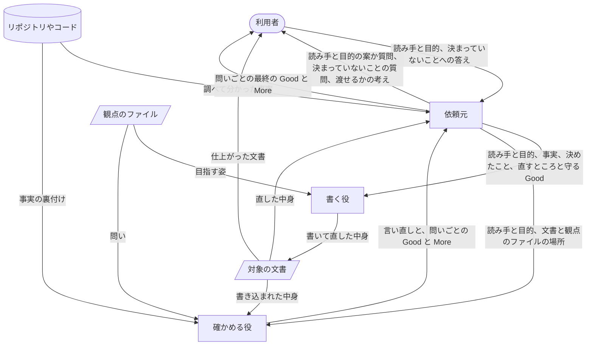
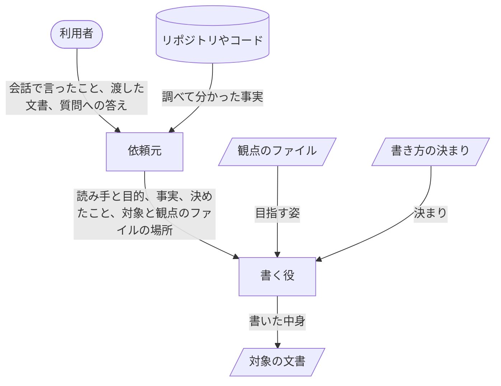
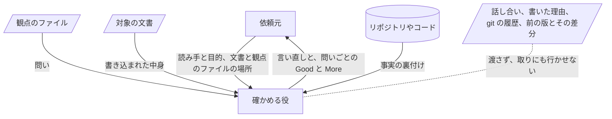
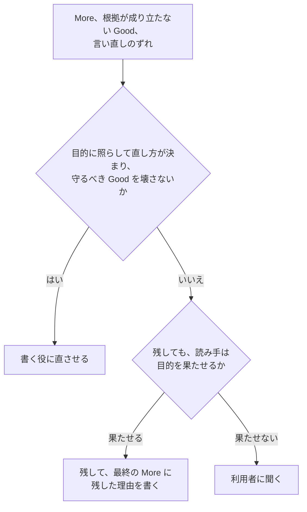

# writ の設計

writ は、[README](../README.md) の冒頭に挙げた4つの利点を、6つの機能で利用者に届けます。利用者と話している Claude Code を依頼元と呼びます。どの機能も依頼元だけが判断し、書くことと確かめることを、依頼元が `/writ:up` の中で立てる書く役と確かめる役に任せる形で成り立ちます。観点、Good、More は README と同じ意味で使います。

```mermaid
flowchart TD
  U([利用者])
  R[依頼元]
  S[(リポジトリやコード)]
  E[/観点のファイル/]
  W[書く役]
  F[/対象の文書/]
  K[確かめる役]
  U -->|読み手と目的、決まっていないことへの答え| R
  R -->|読み手と目的の案か質問、決まっていないことの質問、渡せるかの考え| U
  S -->|調べて分かった事実| R
  R -->|読み手と目的、事実、決めたこと、直すところと守る Good| W
  E -->|目指す姿| W
  W -->|書いて直した中身| F
  R -->|読み手と目的、文書と観点のファイルの場所| K
  F -->|書き込まれた中身| K
  E -->|問い| K
  S -->|事実の裏付け| K
  K -->|言い直しと、問いごとの Good と More| R
  F -->|直した中身| R
  R -->|問いごとの最終の Good と More| U
  F -->|仕上がった文書| U
```

## 6つの機能が、4つの利点をそれぞれ届けます

利点は、README の冒頭の言葉で「一度読めば分かる」「そのまま渡せる」「報告を見るだけで判断できる」「ごまかさずに聞いてくれる」と呼び、機能が働く段は README の図の言葉で示します。

- 読み手と目的を決めてから書かせる。

    利点「一度読めば分かる」と「そのまま渡せる」のための機能で、利用者が「読み手と目的の案か質問」に答える段で働きます。

- 話し合いを知らない役に、利用者と決めた内容ごとに1回だけ確かめさせる。

    利点「一度読めば分かる」と「そのまま渡せる」のための機能で、利用者が答えてから「仕上がった文書」を受け取るまでの間に働きます。

- 直せる欠けは直し、残せる欠けは理由を付けて残す。

    利点「そのまま渡せる」と「報告を見るだけで判断できる」のための機能で、利用者が「仕上がった文書」を受け取る前に働きます。

- 目的を妨げる欠けは、取り繕わずに利用者に聞く。

    利点「ごまかさずに聞いてくれる」のための機能で、利用者が「決まっていないことの質問」に答える段で働きます。

- 問いごとの最終の Good と More を返す。

    利点「報告を見るだけで判断できる」のための機能で、利用者が「承認するか、直しを頼むかを決める」段で働きます。

- 作業の途中で文書を書く場面でも、同じ流れで仕上げる。

    4つの利点すべてを、利用者が `/writ:up` を呼ばない文書にも届けるための機能で、README の「作業の途中で Claude Code が文書を書くとき」に働きます。

## どの機能にも通じる方針

- 直すか残すか、次に何をするかは、依頼元だけが決めます。

    判断が書く役や確かめる役に散ると、話し合いを知らない役の判断で目的に役立っている部分が作り直され、利用者はそのまま渡せる文書を受け取れません。

- 書く役と確かめる役は、`/writ:up` の中で依頼元が立てるときにだけ動きます。

    `/writ:up` は、それぞれの役をサブエージェントとして立て、その役の指示を書いたファイルの場所を渡します。指示のファイルは writ が動くときにだけ読まれ、役を `/writ:up` の外から呼ぶ入り口はありません。外から呼べると、読み手と目的が決まらないまま書く役が書き、話し合いを渡された確かめる役が確かめることが起こり、利用者はそのまま渡せる文書を受け取れません。役をプラグインのエージェントとして置く案は採りません。プラグインのエージェントは利用者も Claude Code も直接呼べるので、「`/writ:up` を通して使う」という決まりを守らせることしかできず、形で防げないからです。

- 観点の中身は観点のファイルにだけ置き、どの受け渡しでも要約せずファイルの場所で渡します。

    どの変更のあとでも、観点の中身はほかの文書にも writ の指示にも写されていない状態を保ちます。写しや要約は、観点を磨くたびにずれていき、書く役が目指す姿と確かめる役が問う姿が食い違って、利用者はそのまま渡せる文書を受け取れなくなります。README はこのファイルへリンクしているので、利用者は Good と More がどの問いに答えたものかを、問いそのものを読んで確かめられます。

- 利用者の環境に writ が残すのは、対象の文書だけです。

    どの操作のあとでも、下書きや確かめた記録のファイルはありません。残ると利用者が片付けることになり、どれが本物の文書かにも迷います。

## 読み手と目的を決めてから書かせる

```mermaid
flowchart TD
  U([利用者])
  R[依頼元]
  S[(リポジトリやコード)]
  W[書く役]
  E[/観点のファイル/]
  C[/書き方の決まり/]
  F[/対象の文書/]
  U -->|会話で言ったこと、渡した文書、質問への答え| R
  S -->|調べて分かった事実| R
  R -->|読み手と目的、事実、決めたこと、対象と観点のファイルの場所| W
  E -->|目指す姿| W
  C -->|決まり| W
  W -->|書いた中身| F
```

決まらないまま書くと、書く役は何を目指すかを、依頼元は何を基準に直すかを決められません。

- 読み手と、読み終えて何を決め何をするかが決まるまで、書き始めません。
- 依頼元が利用者に聞くのは、会話、渡された文書、リポジトリから分からないことだけで、推し量れることは案にしてよいかを聞き、1回に1つずつ聞きます。

    聞くのは、誰が読むか、読み終えて何を決め何をするか、どこに置くかです。すでに言ったことや文書から分かることを聞かれると、利用者は同じことを何度も答えることになります。推し量れることまで答えを一から書かせると、利用者は writ が既に持っている手がかりを自分で言葉にし直すことになり、案にすれば、推し量りが外れていても書き始める前に分かります。まとめて聞くと、前の答えで要らなくなった問いにまで答えさせることになるので、1つ聞いては答えで分かったことを除いてから次を聞きます。

- 通して読むか拾い読むかは、目的と置き場所から依頼元が決め、決められないときだけ聞きます。

    利用者には答えにくい問いで、しかも多くは目的と置き場所から決まるからです。

- 書く中身の事実は、推し量らず、リポジトリやコードを調べて得ます。

    推し量った事実を書くと、読み手はそれを信じて誤った判断をします。

- 書く役には、読み手と目的、調べて分かった事実、利用者と決めたことを、欠けなく渡します。

    書く役は話し合いを知らないので、渡されなかったことは推し量って埋めるしかなく、利用者の意図と違う文書になります。渡すのは、読み手の細かな事情まで含め、書く役が話し合いに戻らなくても利用者の意図どおりに書けるだけのものです。これが、書くのを依頼元から分ける代償です。依頼元が自分で書く案は採りません。話し合いのすべてを手元に置いて書けますが、書いて直すたびに利用者との会話が長くなり、途中で要約されて決めたことの細部が落ちやすくなるからです。

- 書く役は、観点のファイルを目指す姿として読み、読み手、要点、見出し、図、文、言葉の順に、前のものから決めます。

    後のものは前のものの決定に従うので、読み手や要点が決まる前に文や言葉を磨いても、前のものを変えたときに無駄になります。

- 書く役は、観点に加えて、書き方の決まりに従います。

    決まりは形だけで満たせるので、目的から問う観点とは別のファイルに置きます。観点に混ぜると、観点が決まりの寄せ集めになって目的から判断できなくなります。別にしておけば、決まりは見つかるたびに足せます。決まりごとに理由を添えているので、書く役は、決まりが当てはまらない場面では理由に照らして判断できます。

- 書く役は対象のファイルに直接書き、下書きを別に作りません。

    下書きを別に作ると、利用者が確かめる物と実際に置かれる物が2つになって食い違います。既にある文書を直すときも、元のファイルに書き込みます。

- 文書は Markdown、図は mermaid で書き、利用者の指定や置き場所の形式があればそちらに従います。

    観点が図を求めるので、書く役が文字として書いて直せる図の形式が要ります。置き場所に決まった形式があるなら、読み手はその形式で読むので、そちらを優先します。

## 話し合いを知らない役に、利用者と決めた内容ごとに1回だけ確かめさせる

```mermaid
flowchart TD
  R[依頼元]
  K[確かめる役]
  N[/話し合い、書いた理由、<br/>git の履歴、前の版とその差分/]
  E[/観点のファイル/]
  F[/対象の文書/]
  S[(リポジトリやコード)]
  R -->|読み手と目的、文書と観点のファイルの場所| K
  E -->|問い| K
  F -->|書き込まれた中身| K
  S -->|事実の裏付け| K
  N -.-|渡さず、取りにも行かせない| K
  K -->|言い直しと、問いごとの Good と More| R
```

書いた者は、話し合いを知らなかった状態に戻れません。だから読み返しても、話し合いを知らない読み手がつまずく箇所が見えず、その箇所は利用者が文書を渡した先で初めて見つかります。

- 確かめる役が手にするのは、対象の文書、読み手と目的、観点のファイル、文書が語るリポジトリやコードだけです。

    読み手と目的とは、誰が読むか、読み終えて何を決め何をするか、通して読むか拾い読むかです。1つでも余分に渡ると、確かめる役は書き手の意図で文書の欠けを補って読み、読み手がつまずく箇所を見落とします。今の会話を引き継いで立てた役を確かめる役にしても、同じことが起きます。

- 書き方の決まりは確かめる役に渡さず、スクリプトで判定できる決まりは依頼元がスクリプトで確かめます。

    決まりを渡すと、確かめる役の目が形の確かめに割かれ、読み手が目的を果たせるかという、確かめる役にしかできない判断が薄くなります。

- 確かめる役の指示は、自分で取りに行ってはいけない git の履歴、話し合い、前の版を名指しし、その理由を添えます。

    事実を裏付けるために確かめる役が使う読む道具は、そのままこれらにも届くので、道具を絞っても境界は閉じられません。境界を保てるのは、何を渡すかと、指示が何を名指しするかだけです。理由を知っていれば、確かめる役は名指しされていない別の道筋も避けます。

- 確かめる役は、最初に、読み手、読み手がすべきこと、文書の要点を、自分の言葉で言い直します。

    書き手の意図と言い直しとのずれは、書いた者には見えない分かりにくさそのものです。

- 確かめる役は、使う観点のファイルのすべての問いに、Good と More の一方か両方で答えます。

    答えのない問いがあると、依頼元は直すときに壊してはいけない箇所を知らず、利用者への報告にもその問いの答えが欠けます。読み手や要点が崩れていたら見出しから後の問いに答えない、という案は採りません。確かめるのは1回だけなので、そこで答えなかった問いは、直したあとも話し合いを知らない目を通らないまま返ることになるからです。

- 確かめる役は、判断の大半を、読み手がその文書から得るはずのものを得られるかに使います。

    話し合いを知らずに読めるのは確かめる役だけなので、その目は、読み手が文書を読む理由を果たせるかの判断に使います。

- 確かめる役は、ファイルを1つも変えず、直すかどうかも次に何をするかも決めません。

    確かめる役は話し合いを知らないので、その指摘を字面どおりに受けて直すと、目的に役立っている部分まで作り直すことになります。確かめる役が自分で文書を直すと、依頼元が判断していない直しが対象の文書に入ります。

- 確かめるのは、読み手と目的や話し合いで決めたことが変わらない限り1回だけで、その後の直しは依頼元が判断します。

    直すたびに確かめ直すと、本質的でない指摘が新しく出続けて終わらず、利用者はいつまでも文書を受け取れません。確かめる役にしかできないのは話し合いを知らずに読むことだけで、直しが目的に合うかは依頼元のほうがよく分かります。その代わり、確かめたあとの直しは、話し合いを知らない目を通りません。それでも最終の Good と More には場所と根拠が付くので、利用者はその箇所を確かめられ、必要なら writ にもう一度渡せます。そのため、この限界を受け入れます。話し合いで決めた内容が変わって書き直した文書は、前の確かめが今の文書に当てはまらないので、もう一度確かめます。確かめ直すたびに利用者の決定が間に入るので、確かめ直しは利用者が決め続ける限りでしか続きません。

## 直せる欠けは直し、残せる欠けは理由を付けて残す

```mermaid
stateDiagram-v2
  direction TB
  [*] --> 決める: /writ:up、または文書を書く場面
  決める --> 書く: 読み手と目的が決まった
  書く --> 確かめる: 書く役が対象のファイルに書き込んだ
  確かめる --> 振り分ける: 言い直しと、すべての問いの Good と More
  振り分ける --> 振り分ける: More に残した理由を付けた
  振り分ける --> 直す: 直し方の決まる More がある
  直す --> 振り分ける: 書く役が直し、依頼元が判断した
  振り分ける --> 返す: どの More も直したか理由を付けて残し、どの Good も根拠が成り立つ
  振り分ける --> 決める: 進められない、または目的を妨げる More がある
  返す --> [*]
```

直すか残すかは、1つずつ次の順に問うて決めます。

```mermaid
flowchart TD
  M[More、根拠が成り立たない Good、<br/>言い直しのずれ]
  Q1{目的に照らして直し方が決まり、<br/>守るべき Good を壊さないか}
  X[書く役に直させる]
  Q2{残しても、読み手は<br/>目的を果たせるか}
  L[残して、最終の More に<br/>残した理由を書く]
  B[利用者に聞く]
  M --> Q1
  Q1 -->|はい| X
  Q1 -->|いいえ| Q2
  Q2 -->|果たせる| L
  Q2 -->|果たせない| B
```

- 確かめる役の言い直しが話し合いで決めたこととずれていれば、そのずれを More として振り分けます。
- Good は1つずつ根拠を文書と照らし、成り立たないものは More として振り分けます。

    成り立たない Good を返すと、利用者は効いていない箇所を守るべきところと信じ、次の直しで判断を誤ります。

- More は、文を足す前に根から直します。

    More の多くは「〜が欠けている」の形で返るので、足して直すたびに文書が伸び、同じことが二か所に書かれ、読み手は要らない文を読むことになります。依頼元は、同じことが既にどこかで言われていないか、既にある文を置き換えれば済まないかを先に見て、書く役にもそう直させます。

- 書く役に直させるときは、直すところと一緒に、守るべき Good を渡します。

    書く役は確かめた結果を知らないので、守るべき Good を渡されないと、直すついでに目的に役立っている箇所を壊し、直すたびに別の欠けが生まれます。

## 目的を妨げる欠けは、取り繕わずに利用者に聞く

- 目的を果たせないほどの中身の欠けは、依頼元が推し量って埋めず、利用者に戻します。

    利用者やその周りの人が決めることを writ が決めると、利用者の意図と違う文書が、決まったことのような顔をして返ります。欠けた文書を上手な文で包むと、利用者も読み手も欠けに気づかないまま使い、読み手は目的を果たせません。

- 直しても同じ More が残る、直すたびに別の More が生まれる、決めた読み手や目的を変えないと直せない、のどれかに当たったら、依頼元は進められないと判断して利用者に戻します。

    どれも、直しを重ねても返せる状態にならない兆しです。そのまま続けると、利用者は文書を受け取れないまま待つことになります。直しの繰り返しは、この3つの兆しで止まると見込んでいますが、兆しをいつも見分けられるかは確かめていません。品質の「終わらないまま待たされない」で確かめます。

- どの状態のあとでも、対象のファイルの中身は、中身の欠けをぼかしていません。

    対象のファイルに直接書くので、利用者は途中の状態も目にします。利用者に聞くときも、ファイルにあるのは欠けが見える文書です。

- 話し合いで決まったことが変える段から進め直します。

    観点の種類が変われば観点の選び直しから、事実が変われば調べ直しから、書く役に渡すものだけが変われば書き直しからです。

## 問いごとの最終の Good と More を返す

- 報告には、使った観点のファイルのすべての問いについて、問いをそのまま示し、その最終の Good と More を添えます。

    More を直した問いには、直した今の状態を Good として添え、答えのない問いを残しません。

- 報告は、この文書をこのまま渡せるかについての依頼元の考えから始め、問いごとの答えをその根拠として並べます。

    考えが先にあれば、利用者はそれに賛成するかどうかを決めればよく、問いごとの答えは考えを確かめたいところだけ読めば済みます。答えだけを並べると、渡せるかどうかを利用者が答えを集めて組み立てることになります。

- 途中の指摘や直しの経緯は添えません。

    経緯を添えると、それが今の文書のどこに当てはまるかを、利用者が確かめ直すことになります。

Good と More に付く項目は、それぞれ利用者の判断を助けるためにあります。

- 観点のファイルの名前は、利用者がそのファイルで問いの前後を読めるようにします。
- 場所は、利用者が全文でなくその箇所だけを見れば済むようにします。
- 根拠は、利用者が writ の判断を信じる代わりに確かめられるようにします。
- Good に付く読み手が得ることは、直すときに失ってはいけないものを、読み手への効き目で分かるようにします。
- More に付く読み手が困ることは、残した More を受け入れるかを、読み手への影響で決められるようにします。
- More に付く残した理由は、直さなかったのが見落としでなく判断だと示し、利用者が自分で決めるべきことかを見分けられるようにします。

利用者に見える名前は、`/writ:up`、Good と More、観点のファイルの名前 `doc.md`、`readme.md`、`design.md`、`prompt.md`、`essentials.md` です。README がこれらの名前で使い方と観点を伝えているので、変えると利用者が README で覚えたことが通じなくなります。

## 作業の途中で文書を書く場面でも、同じ流れで仕上げる

- Claude Code が作業の途中で文書を書く、または書き直す場面に来たら、依頼元として `/writ:up` と同じ流れで進みます。

    利用者が呼び忘れた文書は、writ なしで書いたときの仕上がりのまま渡され、4つの利点のどれも届きません。

- この場面で writ が使われるのは、writ のスキルの説明を Claude Code が読み、今の場面に当てはまると判断したときです。

    スキルの説明には、利用者に頼まれたときに加えて、Claude Code が作業の途中で文書を書こうとするときにも使うことを書きます。Claude Code がこの説明を当てはめるかはその場の判断なので、毎回選ばれるとは限りません。選ばれなかった文書は writ なしの仕上がりのまま渡されるので、README では、Good と More が添えられていなければ `/writ:up` を呼ぶよう利用者に伝えます。ファイルを書く操作で動くフックの案は採りません。フックが動くのは Claude Code が中身を作り終えてファイルに書く時点なので、読み手と目的を決める前に中身ができてしまい、しかも読み手に向けた文書か作業用のメモかを問わず、ファイルを書くたびに動くからです。利用者の CLAUDE.md に「文書は writ で書く」と書き足す案も採りません。writ が利用者の環境に対象の文書以外のものを残すことになり、それを保つ手間も利用者に移るからです。

- 会話から読み手と目的が分かれば、聞かずに書きます。

    作業の途中では、読み手と目的はすでに会話で決まっていることが多く、そこで聞き直すと利用者の作業が止まります。分からないときだけ聞くのは、呼ばれたときと同じです。

## 品質は、writ なしで Claude Code に頼むときと比べて確かめます

利用者が writ の代わりに使うのは、writ なしで Claude Code に同じ文書を頼むことです。だから品質は、まず4つの利点を、その代わりのものと比べて、利用者と読み手が感じるとおりに確かめます。どの利点も、利点がなければ目に見えて損をする場面で走らせます。writ なしの Claude Code でも損をしない場面では、その利点を測れていないので、場面を変えて走らせ直します。利点が合格するまでは、利用者が当たり前と思っていることの失敗を先に直しません。当たり前のことの失敗は目につきやすいので、見えたものから直していくとそれだけを直し続け、利点はいつまでも測られないからです。

どの品質も、利用者の立場で writ を走らせ、返ってきたものを読む人が、試す人として合否を決めます。どの場面も1回だけ走らせます。writ の結果は走らせるたびに変わりえますが、走らせるには時間と費用がかかるので、何回も走らせてばらつきを測ることはしません。その代わりに、指示を書いていない人が、指示を観点と設計書に照らして読み、どの役が何を書き、それを誰が読むかを端から端までたどります。走らせても通りにくい分かれ道も、読んで確かめます。

### 利点

- 読み手は、文書を一度読めば分かり、読み終えたら何をすればいいかが分かる。

    利点「一度読めば分かる」のための品質で、欠けると、読み手は読み返したり書いた人に聞き返したりすることになります。最初の言葉では読み手も目的も言わず、リポジトリからは読み取れない決定を会話の中でした依頼で、writ と、writ なしの Claude Code の両方を走らせます。観点の種類ごとに、新しく書く場面と既にある文書を直す場面で行います。話し合いを知らない人に、両方の文書を上から一度だけ読ませ、読み返したくなった箇所に印を付けさせてから、読み終えて何を決め何をするかを言わせます。writ の文書では、答えが依頼したときの目的と一致し、印が1つもなく、writ なしの文書では答えがずれるか印があれば合格です。

- 利用者は、返ってきた文書を自分で読んで直さずに、そのまま読み手へ渡せる。

    利点「そのまま渡せる」のための品質で、欠けると、読んで直す手間が利用者に戻ります。1つ目の品質と同じ走らせ方で、試す人が利用者として、読み手に渡す前に変えたい箇所を、読み手に関わる理由つきで挙げます。writ の文書には挙がる箇所が1つもなく、writ なしの文書には挙がる箇所があれば合格です。

- 利用者は、全文を読み直さなくても、報告を見るだけで仕上がりを判断できる。

    利点「報告を見るだけで判断できる」のための品質で、欠けると、利用者は全文を読み直すことになります。担当が決まっていない移行計画のように、残した More が承認の判断を左右する依頼で走らせます。試す人は報告だけを読んで、承認するか、どこの直しを求めるかを決め、そのあと全文を読みます。判断が変わらず、どの Good と More がどの問いへの答えかを報告だけで言えれば合格です。writ なしの Claude Code の報告では、同じ判断に全文を読むことが要るはずで、そうならない依頼なら依頼を変えます。

- 決まっていないことがあるとき、利用者はそれをごまかした文書でなく、それについての質問を受け取る。

    利点「ごまかさずに聞いてくれる」のための品質で、欠けると、読み手が目的を果たせない文書がそれらしく返り、利用者は穴に気づかないまま渡します。any を使ってよいかが決まっていない型の決まりのように、writ なしの Claude Code ならぼかすか推し量って書いてしまう依頼と、担当のように決まっていないまま残せる欠けがある依頼で走らせます。前者では文書を仕上がったものとして返さずに決まっていないことから聞き始め、対象のファイルでも欠けが見え、後者では残した理由つきの More とともに返せば合格です。後者があるのは、何でも聞き返せば前者だけは合格してしまうからです。

- 作業の途中で Claude Code が書く文書にも、4つの利点が届く。

    作業の途中で文書を書く場面の機能のための品質で、欠けると、利用者が呼び忘れた文書は writ なしの仕上がりのまま渡されます。会話で読み手と目的が決まったあと、利用者が `/writ:up` を呼ばずに Claude Code に README を書かせる場面で走らせます。毎回選ばれることは設計でも約束しておらず、選ばれなかったときの手だては README が伝えているので、確かめるのは選ばれたときに利点が届くかです。writ が選ばれ、質問なしに書き始め、問いごとの Good と More が報告に添えられ、その文書が1つ目と2つ目の品質の合格の基準を満たせば合格です。選ばれなかったときは、選ばれるまで走らせ直します。

### 利用者が当たり前と思っていること

スクリプトで決められることは、スクリプトで確かめます。速く、毎回同じ答えを返し、試す人の注意を利点の判断に残せるからです。

- 走らせる前と後で作業ディレクトリを比べ、変わったのが対象のファイルだけである。
- README から観点のファイルへのリンクがすべて実在するファイルに届き、利用者に見える名前が README と writ で一致している。
- 報告に、使った観点のファイルのすべての問いへの答えがある。

スクリプトでは決められないことは、試す人が確かめます。

- 利用者は、すでに伝えたことや文書から分かることを聞かれない。

    読み手と目的の読み取れる文書を渡す場面で走らせ、読み取れないことだけを聞き、推し量れることは案にしてよいかを聞けば合格です。

- 利用者は、文書か、それを妨げている欠けについての質問のどちらかを必ず受け取り、終わらないまま待たされない。

    上に挙げたすべての場面に加え、決めた読み手と目的を変えないと直せない欠けを含む依頼で走らせます。どの場面でも、文書と Good と More が返るか、進められない理由から利用者に聞き始めるかのどちらかで終われば合格です。

- 文書に書かれた事実が、リポジトリやコードと合っている。

    試す人が、文書の事実を1つずつリポジトリと照らし、食い違いがなければ合格です。

### 確かめないこと

試すのは、上に挙げた種類と場面の組み合わせまでです。あらゆる種類の文書や読み手は試さず、観点のファイルが種類を問わない問いで書かれていることに頼ります。
