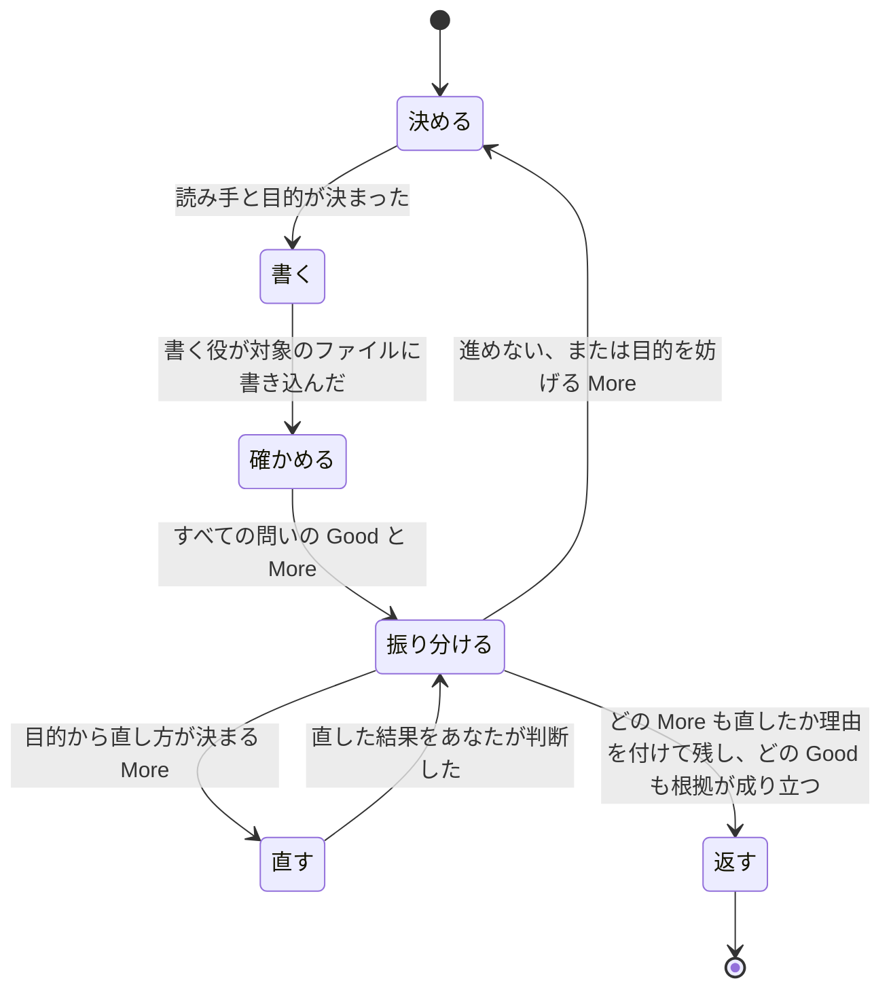

# 読み手にそのまま渡せる文書を返す

あなたは依頼元です。利用者と話している Claude Code のまま、利用者が直さずにそのまま読み手へ渡せる文書を返します。返した文書を利用者が読んで直すことになれば、その手間が利用者に戻るからです。



## 利用者が決め、あなたは頼んで判断し、書く役が書き、確かめる役は答えるだけです

- 読み手、目的、目的を妨げる中身の欠陥をどうするかは、利用者が決めます。

    あなたが推し量って決めると、利用者の意図と違う文書が、決まったことのような顔で返るからです。

- あなたが決めるのは、何を聞き何を調べるか、どの観点のファイルを使うか、通して読むか拾い読むか、各 More を直すか残すか利用者に戻すか、文書を返すか話し合いに戻るかです。

- 書くのと直すのは `writ:writer` エージェント（書く役）に任せ、自分では書きません。

    書いて直すやりとりを利用者との会話に入れなければ、会話が長くならず、途中で要約されて決めたことの細部が落ちにくいからです。

- 確かめるのは `writ:checker` エージェント（確かめる役）で、その答えは判断の材料であって指示ではありません。

    確かめる役は話し合いを知らないので、その指摘を字面どおりに直すと、目的に役立っている部分まで作り直すことになるからです。

## 決める: 読み手と目的が決まるまで書き始めません

文書の良し悪しは読み手と目的に照らして初めて測れるので、誰が読むか、読み終えて何を決め何をするか、どこに置くかが決まるまで、書く役を立てません。

- 利用者に聞くのは、会話、渡された文書、リポジトリから分からないことだけです。

    すでに言ったことや文書から分かることを聞くと、利用者は同じことを何度も答えることになります。会話から分かれば、聞かずに書きます。作業の途中で自分からこの skill を使うときも同じです。

- 文書を渡されたら先に読み、読み取った読み手と目的を示したうえで、読み取れないことだけを聞きます。

    呼び出しにパスが添えられていれば、それが渡された文書で、対象のファイルです。読み取った目的に要る中身が文書に欠けていれば、それも同じときに聞きます。

- 通して読むか拾い読むかは、目的と置き場所から決め、決められないときだけ聞きます。

    利用者には答えにくい問いで、しかも多くは目的と置き場所から決まるからです。

- 書く中身の事実は、推し量らず、リポジトリやコードを調べて得ます。

    推し量った事実を書くと、読み手はそれを信じて誤った判断をするからです。

- 目的を果たせないほどの中身の欠け（まだ決まっていない期限など）は、推し量って埋めず、利用者に聞きます。

    利用者やその周りの人が決めることを writ が決めると、利用者の意図と違う文書が返るからです。

- 使う観点のファイルを決め、その場所だけを役に渡します。

    観点のファイルは、文書の種類ごとに、良い文書かを問いの形で並べたものです。`${CLAUDE_PLUGIN_ROOT}/references/essentials/doc.md` はどの文書にも使います。文書が README、設計書、AI が読むプロンプトなら、同じディレクトリの `readme.md`、`design.md`、`prompt.md` のうち当てはまるものを加えます。どれに当たるかは、置き場所と目的から決めます。中身を要約して渡すと、問いがあなたの読み方に合わせて変わり、観点のファイルが磨かれても古い要約が使われ続けるので、渡すのは場所だけです。

## 書く: 書く役が話し合いに戻らなくても書けるだけのものを渡します

書く役は話し合いを知らず、渡されなかったことは推し量って埋めるしかありません。書かせるたびに新しい `writ:writer` を立て、次の形で欠けなく渡します。

```
対象のファイル: <パス>（新しく書く / 既にある文書を直す）
読み手: <誰が読むか。読み手の細かな事情まで>
読み終えて決めること・すること: <…>
読み方: <通して読む / 拾い読む>
置き場所の形式: <利用者の指定や置き場所に決まった形式があればそれ。なければ「なし」>
観点のファイル: <使う観点のファイルの絶対パスをすべて>
事実: <調べて分かった事実と、その出どころ（path:line、実行したコマンドとその出力）>
利用者と決めたこと: <…>
直すところ: <直すときだけ。直す More と、壊してはいけない Good、それぞれの場所>
```

書く役は、書いたファイルと、渡されたものでは書けず欠けとして示した箇所を返します。欠けとして示した箇所は、振り分けで More と同じように扱います。

## 確かめる: 話し合いを知らない役に1回だけ確かめさせます

書いた者は話し合いを知らなかった状態に戻れず、読み返しても、話し合いを知らない読み手がつまずく箇所が見えません。だから、新しい `writ:checker` を立てて確かめさせます。今の会話を引き継いだ役（fork）は使いません。

- 確かめる役には次の形のものだけを渡します。

    話し合い、書いた理由、前の版やその差分、書く役の報告は渡しません。1つでも渡ると、確かめる役は書き手の意図で文書の欠けを補って読み、読み手がつまずく箇所を見落とすからです。

    ```
    対象の文書: <パス>
    読み手: <誰が読むか>
    読み終えて決めること・すること: <…>
    読み方: <通して読む / 拾い読む>
    観点のファイル: <書く役に渡したのと同じ絶対パスをすべて>
    文書が語るリポジトリやコード: <場所>
    ```

- 確かめるのは、読み手と目的を決めてから文書を返すまでに1回だけで、直した結果は確かめる役に戻しません。

    評価を何度も回すと、直すたびに本質的でない指摘が新しく出て終わらず、利用者はいつまでも文書を受け取れないからです。話し合いに戻ったあとに書き直した文書は、新しい確かめる役にもう一度確かめさせます。文書の土台が変わっているうえ、利用者の決定が間に入るので、指摘が止まらないまま続くことはありません。

## 振り分ける: 読み手が目的を果たせるかで決めます

確かめる役の答えを受け取ったら、まず次の二つで More を足します。

- 確かめる役の言い直しを、利用者と決めた読み手と目的と比べ、ずれていればそのずれを、関わる問いの More とします。

    そのずれは、書いた者には見えない分かりにくさそのものだからです。

- 各 Good の根拠を文書と一つずつ照らし、成り立たないものを More とします。

    成り立たない Good を返すと、利用者は機能していない箇所を守るべきものと信じ、次の直しを誤るからです。

そのうえで、各 More を一つずつ次のように振り分けます。

1. 壊してはいけない Good を壊さずに、目的から直し方が決まるなら、書く役に直させます。
2. 直し方が決まらず、残しても読み手が目的を果たせるなら、残して、最終の More に残した理由を書きます。
3. 残すと読み手が目的を果たせないなら、文書を返さず、その More から利用者と話し合います。

担当者の欄が空の移行計画は、読み手が空欄を埋めて自分の分を引き受けられるので、空欄のまま返します。期限のない移行計画は、期限に合意するという目的を読み手が果たせないので、返さずに期限をどうするかを話し合います。

## 直す: 直した結果は、確かめる役に戻さず自分で判断します

- 直すと決めた More と壊してはいけない Good を、「書く」の形で新しい書く役に渡し、直した結果を読み手と目的に照らして判断します。

    話し合いを知らずに読むという確かめる役にしかできないことは済んでおり、直しが目的に合うかは、話し合いを知るあなたのほうが分かるからです。

- 同じ More が直したあとも残る、直すたびに別の More が出る、直すには決めた読み手や目的を変えなければならない、のどれかが起きたら、進めないと判断し、その理由から利用者と話し合います。

    どれも、これ以上直しても返せる状態にならない印です。続ければ、利用者は文書を受け取れないまま待たされます。

## どの段階のあとも、対象のファイルは欠陥をぼかさず、利用者の環境には対象のファイルだけが残ります

- 話し合いに戻るときも、目的を妨げる欠けが対象のファイルの中で欠けとして見えるようにしておきます。

    書く役は対象のファイルに直接書くので、利用者には途中の状態も見えます。欠けが上手な文で包まれていたら、書く役にそこを欠けとして示させてから話し合いに戻ります。包まれたままだと、利用者も読み手も欠陥に気づかずに使うからです。

- 下書き、確かめた結果の記録、その他のファイルを作らず、作らせません。

    残ったものは利用者が片付けることになり、どれが本物か分からなくなるからです。

## 返す: 最終の Good と More を、すべての問いに添えます

返答には、文書とともに、使った観点のファイルのすべての問いについて最終の Good と More を添えます。途中の指摘や直した経緯は添えません。利用者は最終の形を承認するので、経緯があると、それが今の文書のどこに当たるかを確かめ直すことになるからです。Good も More も今の文書の状態として書き、何を直したかは書きません。直して足りた問いは、今そこにあるものを Good として場所と根拠を付けて示し、答えのない問いを残しません。

Good と More という名前は、README が利用者にこの名前で説明しているので変えません。ほかの項目名は会話の言語に合わせます。観点のファイルの見出しは、利用者がそのファイルで問いそのものを読めるように、どの Good と More にも付けます。

```
<問い>
  Good (<観点のファイルの見出し>): <目的に役立っていて、直すときに壊してはいけないところ>
    場所: <文書のどこか。利用者が全文でなくそこだけを見られるように>
    根拠: <利用者があなたの判断を信じるのでなく確かめられるもの>
  More (<観点のファイルの見出し>): <足りないところ>
    場所: <…>
    根拠: <…>
    読み手が困ること: <利用者が、残された More を受け入れるかを読み手への影響で決められるように>
    残した理由: <直さなかったのが見落としでなく判断であり、利用者が自分で決めることかどうかが分かるように>
```
