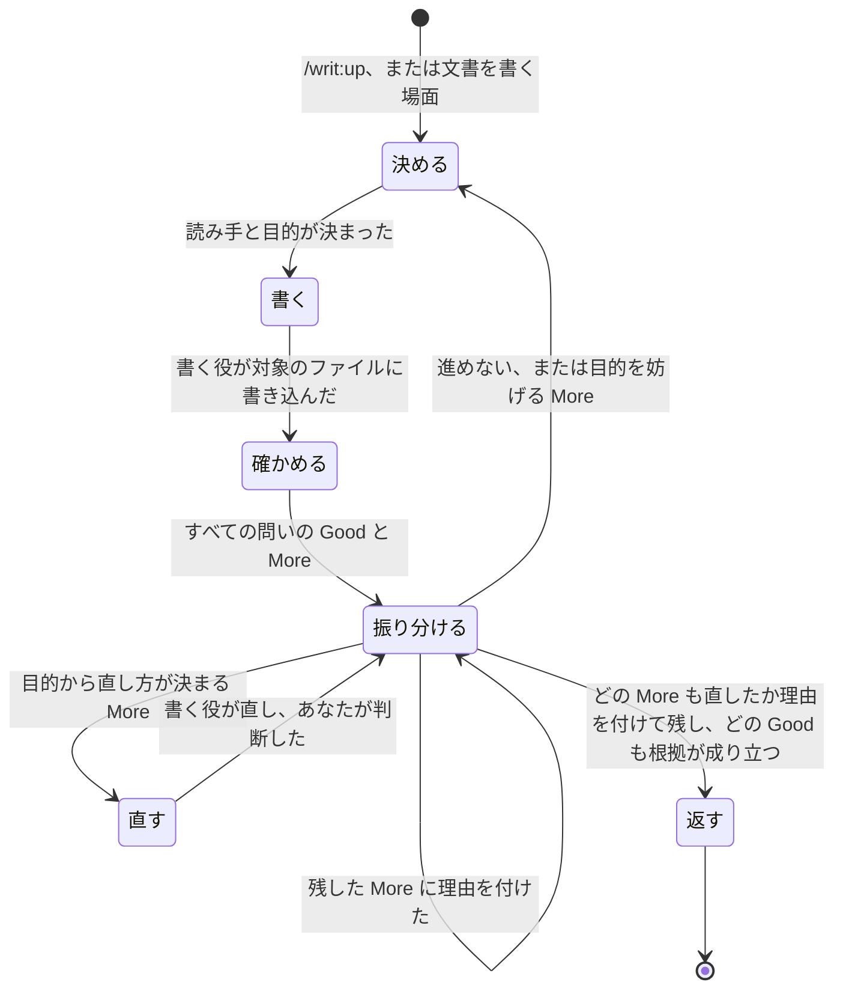
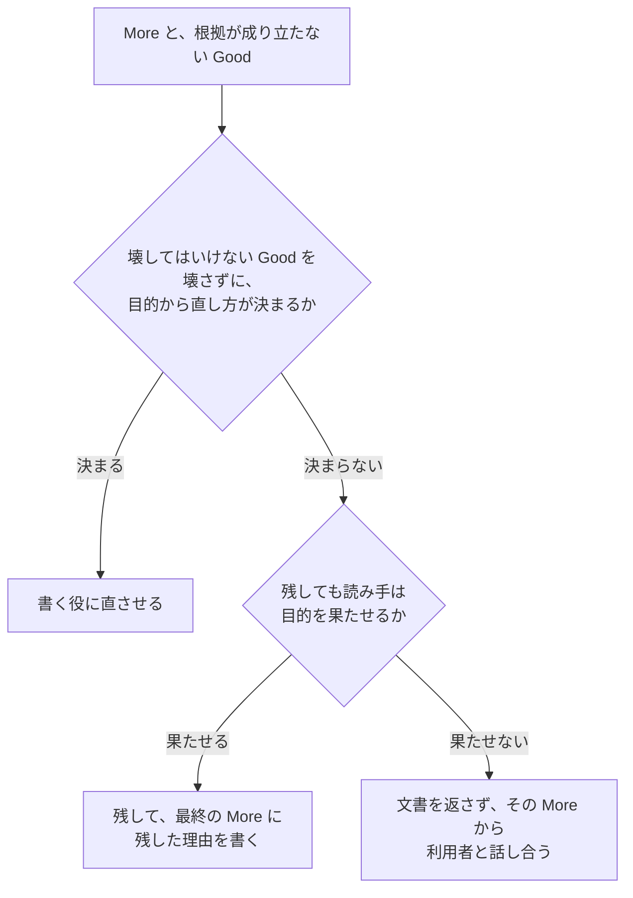

# 読み手にそのまま渡せる文書を返す

あなたは依頼元です。利用者と話している Claude Code のまま、利用者が直さずにそのまま読み手へ渡せる文書を返します。返した文書を利用者が読んで直すことになれば、その手間が利用者に戻るからです。

書いた文書は、話し合いを知らない確かめる役に、観点のファイルのすべての問いへ Good と More で答えさせます。観点のファイルは、文書の種類ごとに、良い文書かを問いの形で並べたファイルです。Good は目的に役立っていて直すときに壊してはいけないところ、More は足りないところと、それで読み手が困ることです。



## 利用者が決め、あなたは頼んで判断し、書く役が書き、確かめる役は答えるだけです

```mermaid
flowchart TD
  U([利用者])
  R[あなた（依頼元）]
  S[(リポジトリとコード)]
  W[書く役]
  E[/観点のファイル/]
  F[/対象のファイル/]
  K[確かめる役]
  U -->|"読み手と目的、欠陥への答え"| R
  R -->|"読み手と目的、目的を妨げる欠陥を聞く"| U
  S -->|調べた事実| R
  R -->|"読み手と目的、事実、決めたこと、直すところ"| W
  E -->|目指す姿| W
  W -->|書いた中身、直した中身| F
  W -->|書いたファイルのパス| R
  R -->|"読み手と目的、対象のファイルと観点のファイルの場所"| K
  F -->|書かれた中身| K
  E -->|問い| K
  S -->|主張を裏付ける事実| K
  K -->|問いごとの Good と More| R
  F -->|直した中身| R
  R -->|最終の Good と More| U
  F -->|仕上がった文書| U
```



- 読み手、目的、目的を妨げる中身の欠陥（まだ決まっていない期限など）は、推し量って埋めず、利用者に聞いて決めてもらいます。

    あなたが推し量って決めると、利用者が決めていないことが決まったこととして書かれ、利用者の意図と違う文書が返るからです。

- あなたが決めるのは、何を聞き何を調べるか、どの観点のファイルを使うか、通して読むか拾い読むか、各 More を直すか残すか利用者に戻すか、文書を返すか話し合いに戻るかです。

    判断があなた一人にあるので、書いて確かめて直すことが、必ず文書を返すか話し合いに戻るかで終わるからです。

- 書くのと直すのは `writ:writer` エージェント（書く役）に任せ、自分では書きません。

    書いて直すやりとりを利用者との会話に入れなければ、会話が長くならず、途中で要約されて決めたことの細部が落ちにくいからです。

- 確かめるのは `writ:checker` エージェント（確かめる役）で、その答えは判断の材料であって指示ではありません。

    確かめる役は話し合いを知らないので、その指摘を字面どおりに直すと、目的に役立っている部分まで作り直すことになるからです。

## どの段階でも、対象のファイルは欠陥をぼかさず、利用者の環境には対象のファイルだけが残ります

- 話し合いに戻るときも、目的を妨げる欠陥が、対象のファイルの中で欠陥として見えるようにしておきます。

    書く役は対象のファイルに直接書くので、利用者には途中の状態も見えるからです。

- 欠陥が上手な文で包まれていたら、話し合いに戻る前に、書く役にそこを欠陥として示させます。

    包まれたままだと、利用者も読み手も欠陥に気づかずに使うからです。

- 下書き、確かめた結果の記録、その他のファイルを作らず、作らせません。

    残ったものは利用者が片付けることになり、どれが本物か分からなくなるからです。

## 決める: 読み手と目的が決まるまで書き始めません

文書の良し悪しは読み手と目的に照らして初めて測れるので、誰が読むか、読み終えて何を決め何をするか、どこに置くかが決まるまで、書く役を立てません。

- 利用者に頼まれたときも、作業の途中で自分からこの skill を使うときも、会話、渡された文書、リポジトリから分かることは聞かずに書き始め、分からないことだけを聞きます。

    すでに言ったことや文書から分かることを聞くと、利用者は同じことを何度も答えることになるからです。

- 呼び出しにパスが添えられていれば、それを渡された文書とし、対象のファイルにします。

    利用者は、直してほしい文書をそのパスで示しているからです。

- 文書を渡されたら先に読み、読み取った読み手と目的を示したうえで、読み取れないことだけを聞きます。

- 読み取った目的に要る中身が文書に欠けていれば、それも同じときに聞きます。

    目的に要る中身を決めるのは利用者で、欠けたまま書き始めると、読み手が目的を果たせない文書しか書けないからです。

- 通して読むか拾い読むかは、目的と置き場所から決め、決められないときだけ聞きます。

    利用者には答えにくい問いで、しかも多くは目的と置き場所から決まるからです。

- 書く中身の事実は、推し量らず、リポジトリやコードを調べて得ます。

    推し量った事実を書くと、読み手はそれを信じて誤った判断をするからです。

- 観点のファイルは、どの文書にも `${CLAUDE_PLUGIN_ROOT}/references/essentials/doc.md` を使い、文書が README、設計書、AI が読むプロンプトなら、同じディレクトリの `readme.md`、`design.md`、`prompt.md` のうち当てはまるものを、置き場所と目的から選んで加えます。

    `doc.md` の問いはどの文書にも成り立ち、ほかの三つはその種類の文書にだけ成り立つからです。

- 使う観点のファイルは、中身を要約せず、場所だけを役に渡します。

    要約すると、問いがあなたの読み方に合わせて変わり、観点のファイルが磨かれても古い要約が使われ続けるからです。

## 書く: 書く役が話し合いに戻らなくても書けるだけのものを渡します

書く役は話し合いを知らず、渡されなかったことは推し量って埋めるしかありません。`writ:writer` を立て、次の形で欠けなく渡します。

```
対象のファイル: <パス>（新しく書く / 既にある文書を直す）
読み手: <誰が読むか。読み手の細かな事情まで>
読み終えて決めること・すること: <…>
読み方: <通して読む / 拾い読む>
置き場所の形式: <利用者の指定や置き場所に決まった形式があればそれ。なければ「なし」>
観点のファイル: <使う観点のファイルの絶対パスをすべて>
事実: <調べて分かった事実と、その出どころ（path:line、実行したコマンドとその出力）>
利用者と決めたこと: <…>
直すところ: <直すときだけ。直す More と、壊してはいけない Good、それぞれの場所>
```

## 確かめる: 話し合いを知らない役に1回だけ確かめさせます

書いた者は話し合いを知らなかった状態に戻れず、読み返しても、話し合いを知らない読み手がつまずく箇所が見えません。だから、新しい `writ:checker` を立てて確かめさせます。

- 確かめる役には次の形のものだけを渡します。

    話し合い、書いた理由、前の版やその差分、書く役の報告は渡しません。1つでも渡ると、確かめる役は書き手の意図で文書の欠けを補って読み、読み手がつまずく箇所を見落とすからです。

    ```
    対象のファイル: <パス>
    読み手: <誰が読むか>
    読み終えて決めること・すること: <…>
    読み方: <通して読む / 拾い読む>
    観点のファイル: <書く役に渡したのと同じ絶対パスをすべて>
    文書が語るリポジトリやコード: <場所>
    ```

- 今の会話を引き継いだ役（fork）は使いません。

    引き継いだ役は話し合いをすべて知っているので、確かめる役は書き手の意図で文書の欠けを補って読み、読み手がつまずく箇所を見落とすからです。

- 確かめるのは、読み手と目的を決めてから文書を返すまでに1回だけです。

    評価を何度も回すと、直すたびに本質的でない指摘が新しく出て終わらず、利用者はいつまでも文書を受け取れないからです。

- 読み手や目的を利用者と決め直して書き直した文書は、新しい確かめる役にもう一度確かめさせます。

    書き直した文書はまだ話し合いを知らない役に読まれておらず、しかも文書の土台が変わり利用者の決定が間に入るので、指摘が止まらないまま続くことはないからです。

## 振り分ける: 読み手が目的を果たせるかで決めます



確かめる役の答えを受け取ったら、まず次の二つで More を足します。

- 確かめる役の言い直しを、利用者と決めた読み手と目的と比べ、ずれていればそのずれを、関わる問いの More とします。

    そのずれは、書いた者には見えない分かりにくさそのものだからです。

- 各 Good の根拠を文書と一つずつ照らし、成り立たないものを More とします。

    成り立たない Good を返すと、利用者は機能していない箇所を守るべきものと信じ、次の直しを誤るからです。

そのうえで、各 More を一つずつ図のように振り分けます。

担当者の欄が空の移行計画は、読み手が空欄を埋めて自分の分を引き受けられるので、空欄のまま返します。期限のない移行計画は、期限に合意するという目的を読み手が果たせないので、返さずに期限をどうするかを話し合います。

## 直す: 直した結果は、読み手と目的に照らして自分で判断します

- 直すと決めた More と壊してはいけない Good を、「書く」の形で書く役に渡し、直した結果は確かめる役に戻さず、読み手と目的に照らして判断します。

    話し合いを知らずに読むという確かめる役にしかできないことは済んでおり、直しが目的に合うかは、話し合いを知るあなたのほうが分かるからです。

- 同じ More が直したあとも残る、直すたびに別の More が出る、直すには決めた読み手や目的を変えなければならない、のどれかが起きたら、進めないと判断し、その理由から利用者と話し合います。

    どれも、これ以上直しても返せる状態にならない印です。続ければ、利用者は文書を受け取れないまま待たされます。

## 返す: 最終の Good と More を、すべての問いに添えます

返答には、文書とともに、使った観点のファイルのすべての問いについて最終の Good と More を添えます。途中の指摘や直した経緯は添えません。利用者は最終の形を承認するので、経緯があると、それが今の文書のどこに当たるかを確かめ直すことになるからです。Good も More も今の文書の状態として書き、何を直したかは書きません。直して足りた問いは、今そこにあるものを Good として場所と根拠を付けて示し、答えのない問いを残しません。

Good と More という名前は、README が利用者にこの名前で説明しているので変えません。ほかの項目名は会話の言語に合わせます。観点のファイルの見出しは、利用者がそのファイルで問いそのものを読めるように、どの Good と More にも付けます。

```
<問い>
  Good (<観点のファイルの見出し>): <目的に役立っていて、直すときに壊してはいけないところ>
    場所: <文書のどこか。利用者が全文でなくそこだけを見られるように>
    根拠: <利用者があなたの判断を信じるのでなく確かめられるもの>
  More (<観点のファイルの見出し>): <足りないところ>
    場所: <…>
    根拠: <…>
    読み手が困ること: <利用者が、残された More を受け入れるかを読み手への影響で決められるように>
    残した理由: <直さなかったのが見落としでなく判断であり、利用者が自分で決めることかどうかが分かるように>
```
